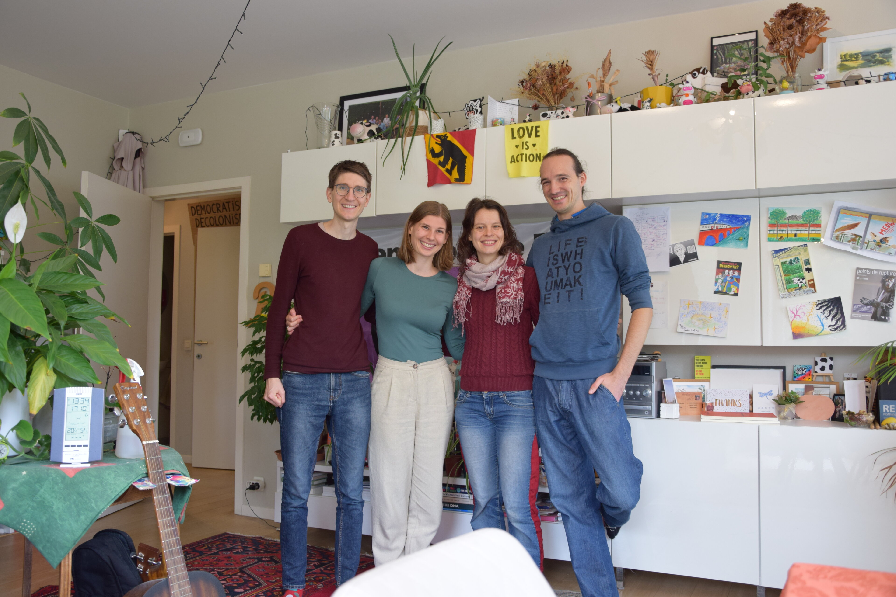

## Wie alles begann
Es war das Jahr 2020: Kaum hatten wir unsere neue Wohnung für die nächsten fünf Jahre in Lausanne eingerichtet, als - Corona zum Trotz - die ersen Ideen für eine längere Reise aufkam. Doch wohin sollte es gehen?

## Going East 
Schnell war klar: Richtung __Osten__ im weitesten Sinne - von Osteuropa bis Asien. Sowohl die vielfältige Natur und Kultur, als auch der einfache Zugang über den Landweg, ohne dafür in ein Flugzeug steigen zu müssen, weckten unser Interesse. Die niedrige Visaschwelle machte das vage Ziel perfekt.
Zunächst einmal nur eine Idee, begannen wir im Frühjahr 2024, Russisch zu lernen. Zwar war der Plan, auch Russland zu besuchen, angesichts der politschen Lage zunächsteinmal _on hold_, doch es schien uns ein guter Ausgangspunkt um mit Einheimischen in Austausch zu kommen.
Bis September 2025 hieß es dann noch, "schnell" unsere Projekte abzuschließen, die Wohnung aufzulösen und unsere Reisedokumente zu erneuern.

... und ehe wir uns versahen, saßen wir schon mit unseren sieben Sachen im Zug.

## Unsere ersten Länder...
Der Zug brachte uns zunächst nach Mannheim - **Deutschland**, hier warteten breits ein paar praktische Ausrüstungsgegenstände wie ein portabler Wasserfilter und Insektenrepellent auf uns. Aber vorallem verbrachten wir einen schönen Abend mit Felix's Brüdern.

Am kommenden Mittag nahemn wir einen Flixbus und durchquerten **Luxemburg** um nach Brüssel - **Belgien** zu reisen. Hier hießen uns Barbara und Boon herzlich willkommen. Wir hatten die beiden über eine Couchsurfing Platform gefunden. Bisher, waren wir hier nur als Gastgeber aktiv, aber wir hätten uns keine besseren ersten Hosts wünschen können.

Unsere Reise ist somit gestartet und wir sind auf dem Weg nach Osten... naja fast!

<!--

-->
