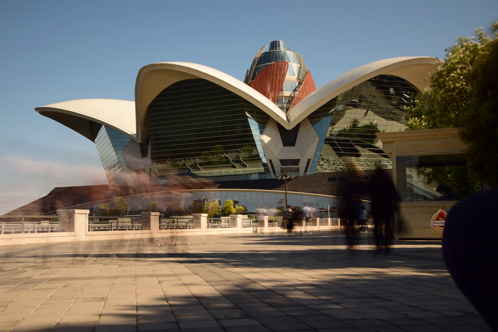
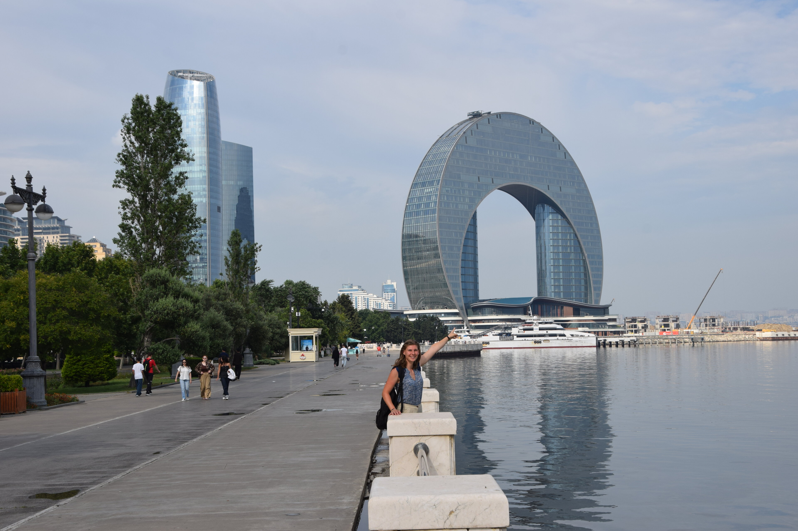
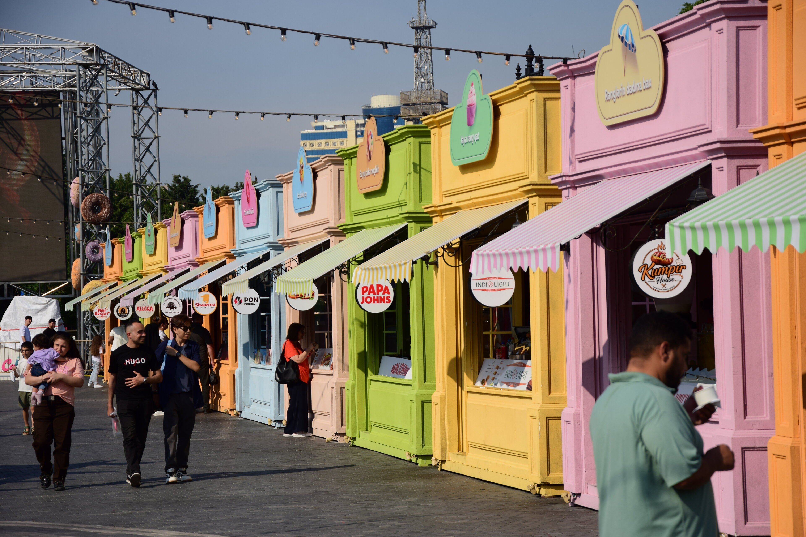
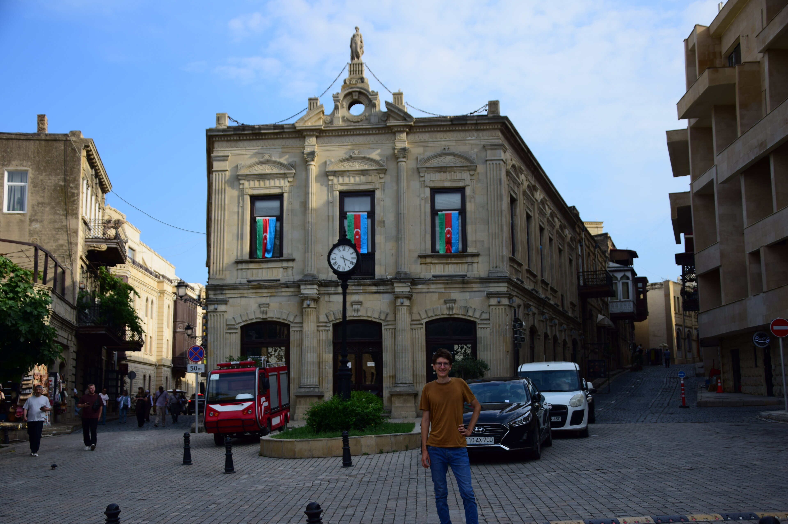
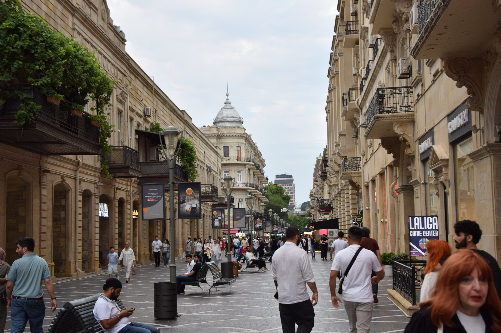
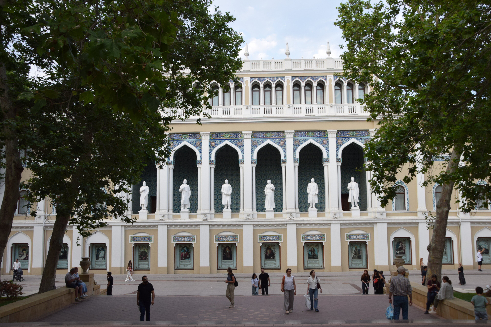
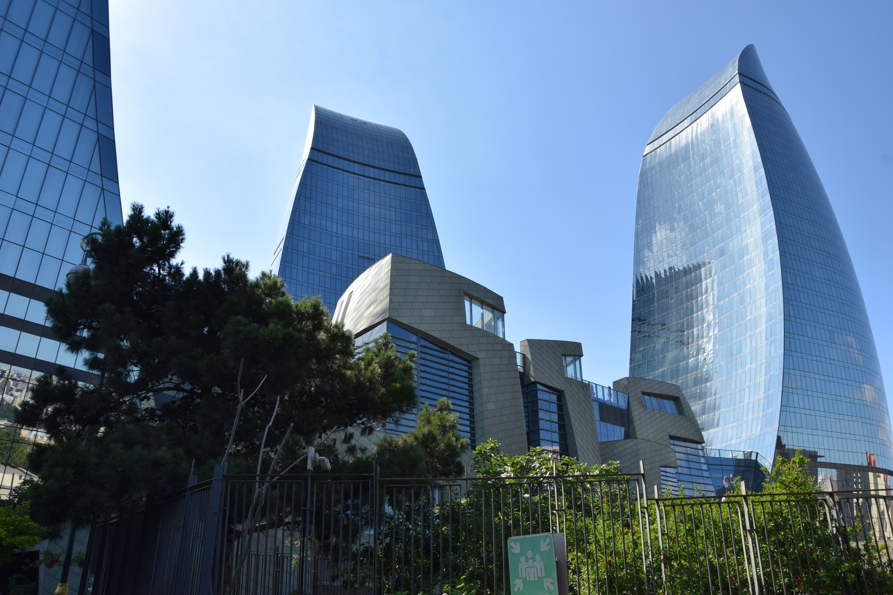
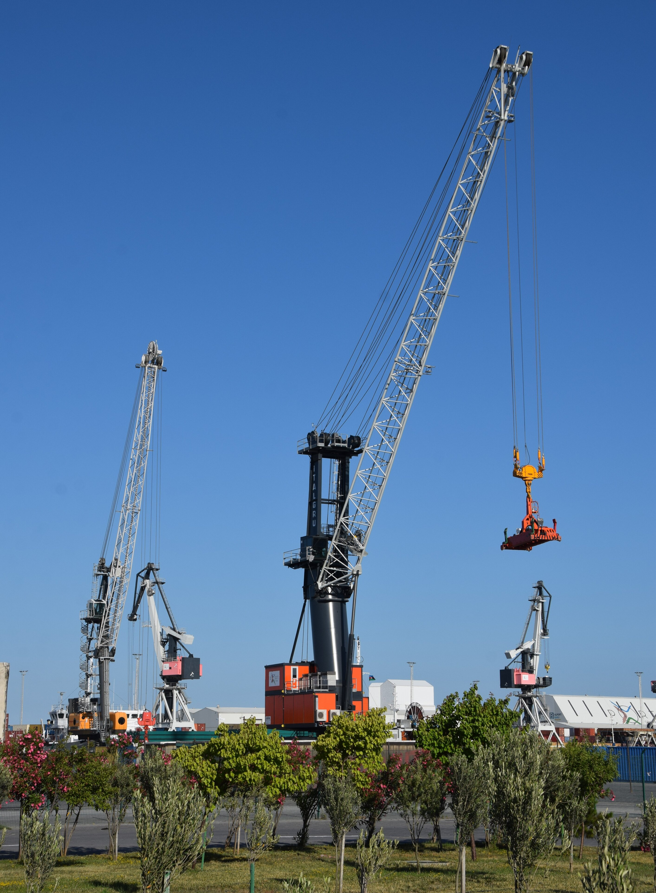
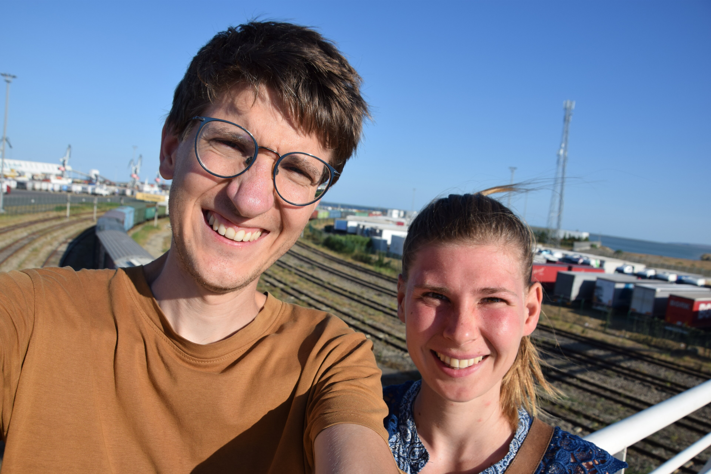
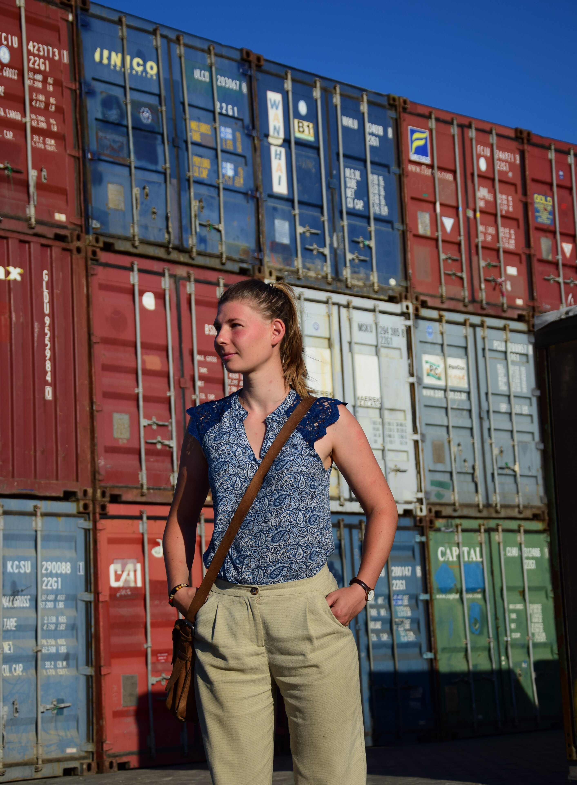

## Vom Land in die Stadt
Nach Abschluss unserer Zeit in Aserbaidschan war der Plan, weiter in Richtung Kasachstan zu gelangen. Da für uns aufgrund der aktuellen geopolitischen Lage leider weder Russland noch der Iran so richtig bereisbar sind, blieb nur der Weg über das Kaspische Meer. Der Fährhafen um per Schiff nach Kuryk überzusetzen, befindet sich etwa 70 km südlich der aserbaidschanischen Hauptstadt Baku (auf Aserbaidschanisch _Bakı_). Somit hatten wir vor der Abfahrt noch einige Tage Zeit, um uns die Stadt anzusehen.

​Vom Süden Aserbaidschans ging es per Anhalter also an der Küste entlang Richtung Norden. Hierbei fiel uns auf, dass das Land praktisch auf der gesamten Strecke – im Vergleich zur Region um Länkäran, die extrem grün, lieblich und fruchtbar ist – auffällig flach, karg und allem voran trocken ist. Das änderte sich, als wir am Abend durch das Zentrum Bakus fuhren, dessen in das goldene Licht der Abendsonne getauchte, üppig grüne Promenade am Meer uns doch unerwartet beeindruckte. Und das umso mehr, da wir vorab von so ziemlich allen Bekanntschaften aus Baku "vorgewarnt" worden waren, dass Baku nun wahrlich nicht schön und wenig sehenswert sei. Positiv überrascht kamen wir an diesem Abend also in Safalis Wohnung an – der Freundin von [Pakiza](/posts/azerbaijan/2026-06-20_Lankaran), die uns mit Marius trotz ihrer eigenen Abwesenheit in den nächsten zwei Tagen liebenswürdigerweise in ihrer Wohnung wohnen ließ.


  
  


### Beachtliche Fassade, doch was steckt dahinter?
​Vorab hörten und lasen wir, dass Baku die Prestigeinvestition eines Autokraten ist, und nachdem wir ein paar Tage lang durch die Stadt gestreunt waren, kamen wir zu der Erkenntnis: Genauso fühlt sich die Stadt auch an. Wie erwähnt, waren wir bei unserer Ankunft doch vom beachtlichen Flair und _Vibe_ der Stadt beeindruckt: Hier treffen äußerst schicke, hochmoderne Signatur-Glasgebäude wie etwa die _Flame Towers_ mit äußerst schicken Prachtbauten im klassischen Pariser Stil zusammen. Hinzu kommt eine üppig ausgebaute und bestens in Schuss gehaltene Promenade, bei der selbst die frisch gepflanzten Blumen in den Beeten fein säuberlich in Reih und Glied angeordnet sind.


  
  
  
  
  
  
  
  


​Doch schon beim zweiten Hinsehen fällt auf, dass viele der neuen, altertümlich wirkenden Prachtbauten leer zu sein scheinen. Die Gebäude, besonders in der Baku White City (_Ağ Şəhər_), sahen irgendwie nach zu perfekten, zwanzigfach kopierten Pariser Häusern aus, sodass es dann letztlich doch sehr künstlich und seelenlos wie eine aus dem Boden gestanzte Kulisse aus dem Europa-Park wirkte. Und sobald man sich vom zugegebenermaßen recht großen Zentrum entfernte, glichen die Viertel wieder eher dem, was man sich unter normal bewohnten Stadtteilen vorstellt und, siehe da, der Glanz war verschwunden - aber hier herrschte Leben!

### Hinter den Kulissen 
Gerade deshalb war es so schön, in Safalis Wohnung in den "normalen" Außenbezirken zu leben. So bekamen wir die Gelegenheit, ein bisschen in das _echte Alltagsleben der Bürger_ einzutauchen; das abends wohl oder übel auch ganz schön viele Mücken miteinschloss. 🦟 ​Besonders nach Safali’s Rückkehr war es schön, gemeinsam mit ihr in das lokale Flair einzutauchen – sei es, wenn wir an den Wasserautomaten, die in regelmäßigen Abständen in den Wohnblöcken stehen, Trinkwasser zapften, uns an den überall stehenden Maulbeerbäumen bedienten, oder wenn wir auf dem Basar um die Ecke einkauften. Überhaupt haben wir die gemeinsamen Momente und Gespräche bei Tee sehr genossen. Da Safali selbst leidenschaftlich gerne reist, sieht man sich später in einem anderen Land hoffentlich mal wieder! 🎒🧑‍🤝‍🧑



### Wenn das Geld aus der Erde sprudelt
​Bei all den Prunkbauten im Zentrum wird schnell deutlich: Hier ist massig Geld im Spiel. Und irgendwoher muss es ja kommen. Wie wir es eigentlich immer machen, erkundeten wir die Stadt nicht punktuell von Sehenswürdigkeit zu Sehenswürdigkeit, sondern vielmehr durch langes Laufen quer durch die unterschiedlichsten Stadtviertel. Dabei stießen wir an so mancher Ecke auf abgesperrte Gebiete voller Pumpen. Eben flanierten wir beispielsweise noch auf der Prachtpromenade, schon landeten wir wenige Kilometer weiter vor den Zäunen einer solchen Zone: Pumpen, Pumpen... und noch mehr Pumpen, soweit das Auge reicht. Wenn man hier steht, versteht man sofort, dass Förderbeschränkungen und die Abkehr von fossilen Energien nicht unbedingt im unmittelbaren Interesse dieses Staates liegen. Da das Geld hier so bequem aus dem Boden sprudelt und die Wirtschaft praktisch ausschließlich darauf basiert, könnte es bei entsprechenden klimapolitischen Abkommen plötzlich wirtschaftlich ganz ungemütlich werden. ​Für uns war es auf jeden Fall spannend, diese Pumpen mal aus der Nähe zu sehen. In die mit Stacheldraht versehenen und von bewaffneten Wachmännern bewachten Sperrzonen kamen wir – Überraschung! – selbst mit höflichem Nachfragen zwar nicht hinein; einige Pumpen waren jedoch frei einsehbar, wenn auch in stählernen Käfigen eingesperrt. <mark> #FreeThePumps </mark>




__​Baku's Öl:__ Aserbaidschan gilt als eine der Wiegen der modernen Ölindustrie. Um das Jahr 1900 herum, während des ersten großen Ölbooms unter den Brüdern Nobel und den Rothschilds, lieferten die Ölfelder rund um Baku mehr als 50% des weltweit geförderten Erdöls. Bis heute machen Öl- und Gasexporte über 90 % der gesamten Exporterlöse des Landes aus.


## Von der Stadt auf die See
### Wer braucht schon Planungssicherheit?
Eigentlich war die Stadt Baku selbst nur ein Nebenschauplatz unseres  Hauptvorhabens: Die Überquerung des Kaspischen Meeres. Dabei hatte es die Planung der Überfahrt ganz schön in sich. Während man es bei uns gewohnt ist, dass feste Abfahrts- und Ankunftszeiten kommuniziert und im Internet veröffentlicht werden, findet man hier lediglich eine Menge Ratlosigkeit nach dem Motto _"Nichts Genaues weiß man nicht"_. ​Da unser Visum uns ein Aufenthatsdauer von maximal 30 Tagen erlaubte, mussten wir spätestens am 1. Juli ausgereist sein. In Foren lasen wir jedoch, dass die Fähren keineswegs täglich, sondern vielleicht nur jeden dritten Tag gehen. Aus diesem Grund halfen uns bereits unsere lieben Gastgeber in [Meshe](/posts/azerbaijan/2026-06-20_Lankaran) dabei, beim Fährbetrieb anzurufen, um Genaueres zu erfahren. Sie erreichten zwar jemanden, aber die _Bottomline_ war: Man müsse näher am gewünschten Abfahrtstag anrufen. Prinzipiell fahre die Fähre zwar jeden Tag, nur eben nicht bei Wind – und der sei wohl recht häufig.

Erschwerend kam hinzu, dass rund um den Fährhafen gähnende Leere herrscht. Man kann dort nicht mal eben so übernachten, und es gibt nicht einmal einen Lebensmittelladen. 
Am 28. Juni riefen wir also erneut an. Leider verstand der Mitarbeiter weder Englisch noch Russisch, sodass uns diesmal Safali freundlicherweise aushalf. Doch auch auf ihre Frage, ob das Schiff __am nächsten Tag__ fahren würde, hieß es nur: Das könne man nicht sagen, man solle __am Vortag__ anrufen. 😳🥴 Wenn ein Schiff gehe, solle man allerdings spätestens um 12 Uhr mittags da sein. Auf gut Glück machten wir uns am nächsten Morgen also auf den Weg zum 70 Kilometer entfernten Fährhafen. Gegen 11 Uhr kamen wir an, kauften die Tickets und nahmen in der Erwartung, dass es bald losginge, im Warteraum Platz. Doch auf Nachfrage beim freundlichen Mitarbeiter stellte sich heraus: Die geplante Boardingzeit war erst um 21 Uhr abends. Ach was. Wie schön! 🙃 Leider funktioniert der Wartesaal aber als Einwegfunktion und den Hafen auch nur temporär zu verlassen - um sich beispielsweise die Zeit bei einem der nahegelegenen Schlammvulkane zu vertreiben - war nicht drin.


  
  
  


### Überquerung des Kaspischen Meeres
​Während der neun Stunden, die wir es uns dann im Warteraum gemütlich machten, gesellten sich Stück für Stück zwei weitere Reisepaare dazu. Als wir gegen Mitternacht endlich auf dem Schiff ankamen, stellte sich heraus, dass wir sechs zusammen die einzigen _Nicht-Trucker-Reisenden_ an Bord sind. Erwartungsgemäß sprach die Besatzung kein Englisch, und schnell entpuppten wir beiden Hübschen uns aufgrund unserer paar Brocken Russisch als die stellvertretenden Ansprechpartner für die gesamte Sechsergruppe – sowohl was das Organisatorische als auch den neugierigen Austausch mit uns fremden Mitreisenden betraf. ​Da sowohl wir als auch zwei der anderen Nicht-Trucker zu geizig für ein Zweierzimmer waren, teilten wir uns nach Geschlechtern getrennt zwei Viererzimmer auf und mussten fortan fleißig zwischen der _Schiffsrezeption_ und unserer Gruppe vermitteln. So bildeten wir exotischen Reisenden eine neue kleine Gemeinschaft, zusammen mit Klara und Dennis aus Deutschland sowie Yuzhi und Junzhe aus China, die beide übrigens perfekt Deutsch sprachen (_Chapeau!_ 🎩). Insgesamt war diese Konstellation sehr lustig und fühlte sich dank der vielen bunten Gesprächsthemen und der zahlreichen Brettspiele, die Junzhe aus seinem Koffer zauberte, ein bisschen wie eine Klassenfahrt an.



​Darüber hinaus kamen wir auch mit dem einen oder anderen Trucker ins Gespräch und wurden sogar zu _all dem guten Zeug_ in einen der unter Deck verladenen LKWs eingeladen – frei nach dem Motto: _Folge niemals einem fremden Mann in sein Auto, wenn er dir Schokolade und Wodka anbietet._ 🤫 Dabei waren wir auf dem Schiff mit drei leckeren Mahlzeiten, einem Nachmittagssnack sowie Tee und Wasser rund um die Uhr ohnehin schon bestens versorgt. Auch das Personal, sichtlich amüsiert über uns, war sehr nett, und in den unterbesetzten Viererzimmern ließ es sich sehr gut leben.

### Vollpension auf unbestimmte Zeit
Da störte dann auch nicht, dass es sich mit der Ankunftszeit wohl ähnlich wie mit der Abfahrtszeit verhielt. Mitten in der zweiten Nacht, in der wir eigentlich in aller Herrgottsfrüh hätten ankommen sollen, gingen mit lauten Rattern die vier Anker auf den Grund einer Bucht nieder, lediglich noch knappe 100 Kilometer südlich vom Ankunftshafen in Kasachstan entfernt. Und da standen wir gut. Denn keiner wusste so recht, warum wir dort Halt machten, geschweige denn, wie lange. Aber wir hatten ja – weise wie wir waren 🤓 – nichts für den Anschluss gebucht und somit keinerlei Druck. Außerdem wurden wir weiterhin zum selben Preis rundum versorgt. Könnte also schlechter sein!



​Nach gut 16 Stunden nahmen wir die Fahrt schließlich wieder auf, sodass wir gegen Mitternacht aus dem Hafen spazieren konnten. Blieb nur noch die Frage, wo wir die Nacht verbringen und wie wir überhaupt in die knapp 100 Kilometer nördlich gelegene Stadt kommen sollten. Denn, ihr ahnt es bereits: Auch auf dieser Seite des Kaspischen Meeres herrschte um den Fährhafen gähnende Leere, und ein Bus fuhr um diese Uhrzeit natürlich längst nicht mehr. ​In unserer Sechserrunde teilten wir uns also eine Bolt-Taxi. Die gesamte Kulisse – die Musik im Auto, die vorbeiziehende, nächtliche Steppenlandschaft und vor allem das Überfahren eines Hasen – erinnerte erstaunlich stark an die Anfangsszene des iranischen Films "_It was just an accident_", den wir in [Göreme](/posts/turkey/2026-03-16_Kapadokya) gesehen hatten, und an dieser Stelle nur wärmstens empfehlen können. Um zwei Uhr morgens erreichten wir schließlich das Stadtzentrum von Aktau, wo Klara und Dennis so lieb waren, ihre spontan gebuchte Wohnung mit uns zu teilen. So torkelten wir, aufgrund gewisser _reverse Kinetose,_ bald ins Bett und vielen in einen tiefen Schlaf.
