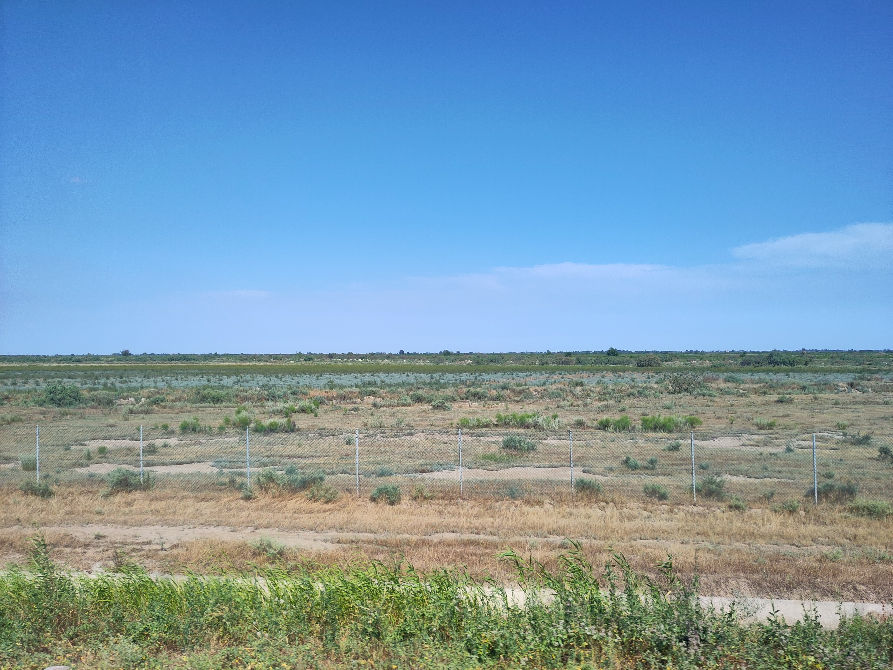
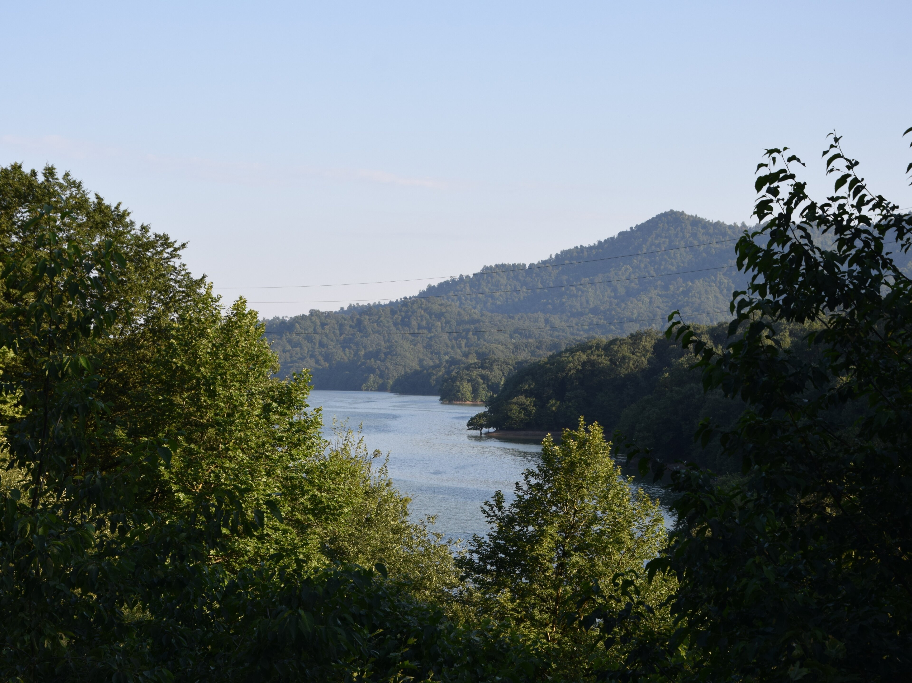
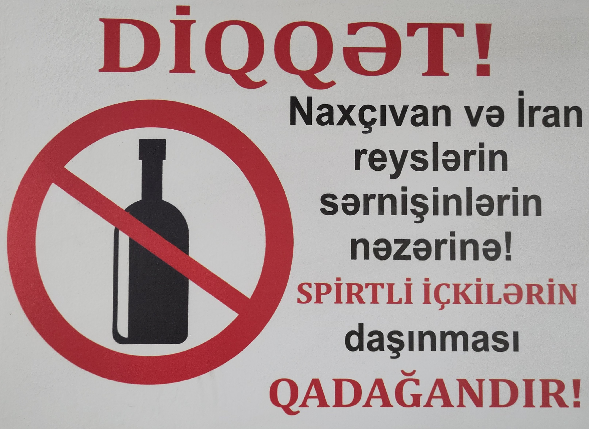
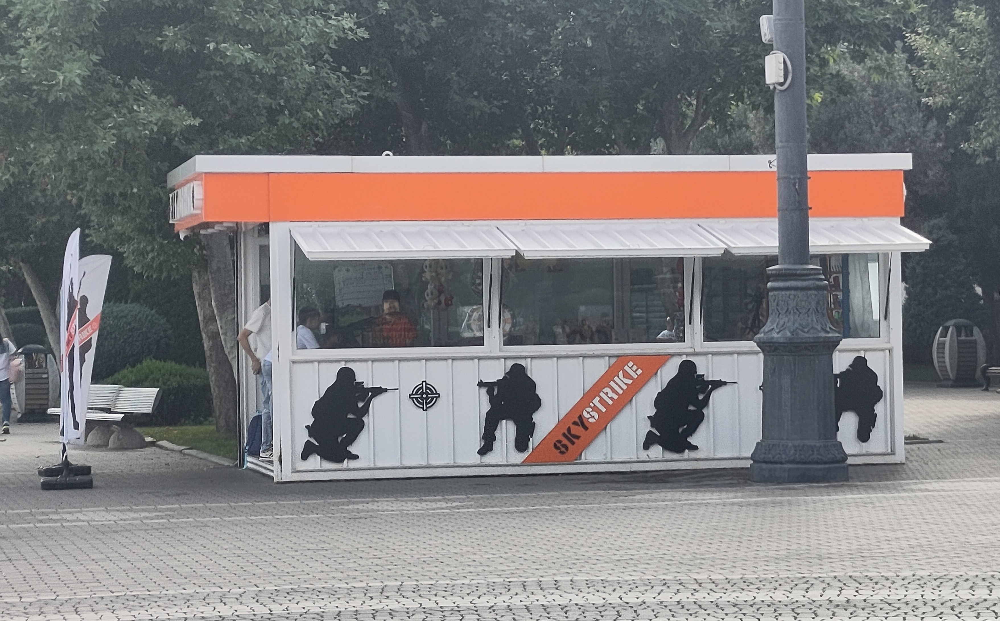

​Da wir auf unserer Reise durch Azerbaidschan nur an zwei Orten Halt gemacht haben, können wir natürlich nicht auf die allergrößte Bandbreite an unterschiedlichen Eindrücken für diese Reflexion zurückgreifen. Entlang der Küste zwischen Länkäran und Baku schienen wir – abgesehen von trockenem Flachland – landschaftlich nicht allzu viel verpasst zu haben (mit Außnahme von Matschvulkanen), während die gesamte Bergregion an der Ost- und Südgrenze des Landes, sicherlich nicht uninteressant gewesen wäre. Dort gibt es auch noch einige abgelegene Dörfer, die nach wie vor nur zu Fuß erreichbar sind. Die punktuellen Einblicke, die wir in Meshe und im krassen Kontrast dazu in Baku gewinnen konnten, waren dafür allerdings umso intensiver.


  
  


## Sprachliche Brücken: Türkischer Kern mit russischen Tupfern
​Schon vor unserer Einreise hatten wir von einem ehemaligen Doktorandenkollegen gehört, dass Aserbaidschanisch eine große Schnittmenge mit dem Türkischen hat. Doch wie extrem das tatsächlich der Fall ist, fiel uns nach unseren paar Monaten in der Türkei nun erst vor Ort so richtig auf. Witzig fanden wir dabei vor allem, wie sich hier und da russische Wörter in den Alltag mischen.

Angenehm war, dass wir nach Georgien und Armenien die Sprache hier endlich wieder lesen konnten, da sich das Alphabet zum großen Teil – abgesehen von einigen zusätzlichen eigenen Buchstaben – mit dem Lateinischen deckt. Interessant das hier für __Ö__ und __Ü__, wie bekannt, Trema verwendet werden, aber für das __Ä__ ein gedrehtes __Ə__.  ​Für unsere Alltagskommunikation außerhalb des Projektes war russisch – noch deutlich merklicher als in Georgien und Armenien – allerdings der absolute Retter. Wohlgemerkt zeichnet sich hier gerade ein Generationenwechsel ab: Während die mittlere und ältere Generation noch fließend Russisch spricht, ist das bei den jüngeren Leuten kaum noch der Fall. Hier gewinnt Englisch langsam aber sicher die Oberhand und befindet sich im klaren Aufschwung.

## Gesellschaft im Wandel: Gemeinschaft vs. Individualismus
​Unserem Eindruck und den Gesprächen nach zu urteilen, die wir führten, scheint sich das Land – insbesondere für junge Frauen über den Bildungsweg und vermehrt gesuchte Auslandserfahrungen – erst jetzt so langsam zu öffnen. Die Religion spielt dabei interessanterweise eine eher untergeordnete Rolle; hier hat der sowjetische Einfluss sichtlich seine Spuren hinterlassen - ebenso wie bei den tiefentief liegenden Metrostationen. Viel zentraler sind schlicht traditionelle Wertevorstellungen. Besonders auf dem Land sind diese traditionellen Rollenbilder noch tief verankert. ​Gemeinschaft wird als extrem hohes Gut geschätzt. Das führt einerseits zu einem enormen Zusammenhalt in der Gesellschaft und steht dem im modernen städtischen Westen oft verbreiteten Gefühl von Einsamkeit wohl entgegen – etwas, wovon man sich in Zentraleuropa sicherlich eine Scheibe abschneiden kann. Andererseits wird im Zweifel eben auch erwartet, dass das Individuum im Dorf bleibt und sich den Anforderungen und Erwartungen der Familie fügt, statt vielleicht in die weite Welt hinauszugehen und platt gesagt "_sein eigenes Ding zu machen_". Die Kontakte, die wir persönlich mit den Aserbaidschanern hatten, waren auf jeden Fall ausnahmslos von einer tiefen Herzlichkeit geprägt.

## Land of Fire
​Von dem was man hört, leidet die Bevölkerung unter einer fortwährend restriktiven Führung des Landes. Repressionen der Meinungs-, Ausdrucks- und Kunstfreiheit seien verstärkt spürbar. Auch der Dauerkonflikt mit dem Nachbarland Armenien war spürbar: Auf uns wirkte es so, als sei Armenien inzwischen deutlich mehr auf Versöhnungs- und Friedenskurs, während das Militär und der Konflikt in Aserbaidschan präsenter wirken. Insbesondere die Rückeroberung von Bergkarabach in 2018 scheint in der aserbaidschanischen Bevölkerung ein wichtiges Thema zu sein, während in der armenischen Gesellschaft gefühlt eher die Luft raus ist und das Streben nach Frieden zu dominieren scheint. Ein wahrscheinlich wenig beachteter und ggf. auch überinterpretierter Indiz für die Normalität von Waffen in Aserbaidschan, welcher uns beiden allerdings sehr ins Auge stieß, war die Vielzahl an Schießbuden die sich an der Promenade in Baku tümmelten.

​Zu guter Letzt lernten wir noch den offiziellen Slogan des Landes kennen: "_Land of Fire_". Ziemlich _punchy_, nicht? Er beruht wohl auf den (teilweise lokal noch praktizierten) Traditionen rund um den Zoroastrismus, einer alten Weltreligion mit einer besonderern Verehrung von Feuer. Uns wurde dabei bewusst, dass wir in Deutschland eigentlich gar keinen so präsenten staatlichen Leitspruch haben. Am ehesten ließe sich wohl "_Land der Dichter und Denker_" anführen – was im deutschen Alltag aber lange nicht so tief verankert und präsent ist wie das "_Land of Fire_" hier.
