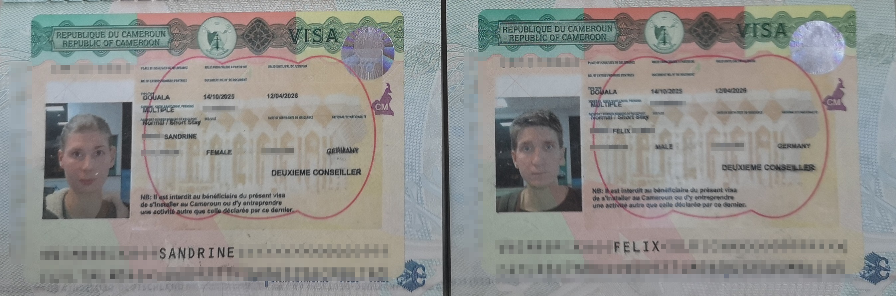
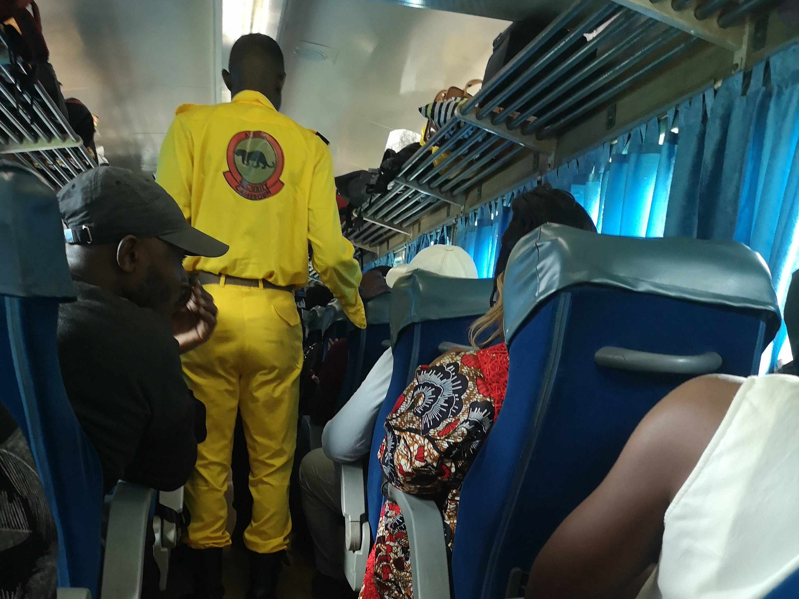
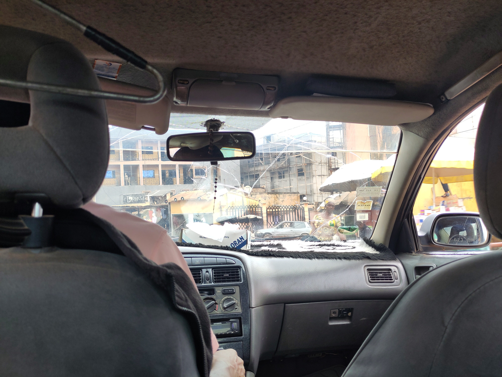
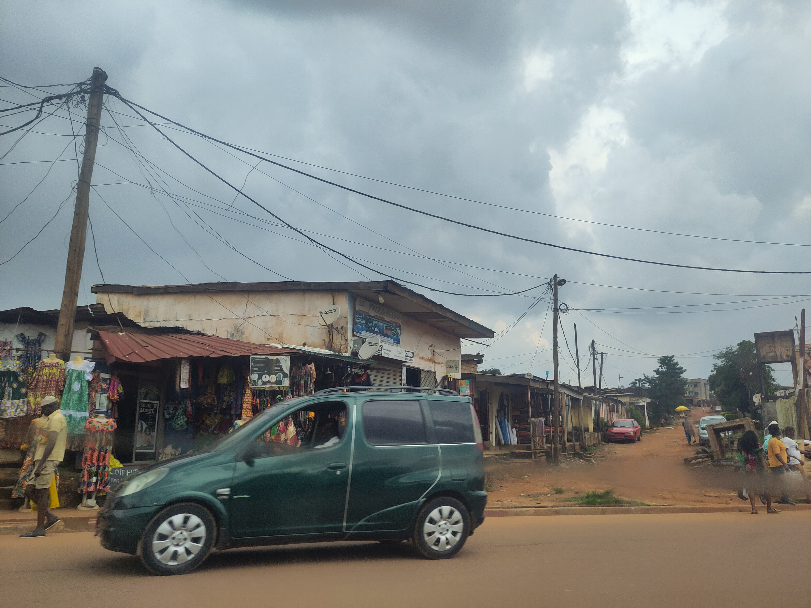

Wie im Artikel [Jetzt geht's los]() erwähnt, legten wir bis Oktober alle Aufgaben, Verantwortlichkeiten und Projekte ab, um uns ganz auf die Reise gen Osten einzulassen. So leicht uns der Abschluss praktisch aller Projekte fiel, so sehr brummte es hingegen bei [Hand on Heart Cameroon](https://handonheartcameroon.com). Hier ging’s gerade richtig rund: Neue Projekte aus bewilligten Anträgen sollten initiiert werden, weitere Anträge standen an, eine neue Webseite befindet sich im Aufbau und im November sollten Partner der Charité Berlin für ein gemeinsames Fortbildungsprojekt kommen. Viele zentrale Projekte, die darüber entscheiden könnten, ob aus dem Verein ein zentraler Player im Bereich der mentalen Gesundheit in Kamerun werden kann, liefen hier gerade zusammen. Es erschien uns wie ein kritisches Zeitfenster.
 
Doch da wir unsere Reise bereits lange "geplant" 😉 hatten, bereitete Sandrine das HoH-Team auf ihre Abwesenheit vor und delegierte Aufgaben. Dennoch nagte das Gefühl an ihr, das Team in dieser entscheidenden Phase nach jahrelanger Aufbauarbeit allein zu lassen.

Hinzu kam das Timing: Der ursprüngliche Plan, spätestens im Sommer bei gutem Wetter zu starten, hatte sich durch unseren Auszug Ende September deutlich verschoben. Damit war klar: Auf dem geplanten Landweg würde es rau werden. Da wir jedoch abgesehen vom groben Ziel __Osten__ völlig flexibel waren, schlug Sandrine vor, (vorübergehend) eine 90°-Wende Richtung __Süden__ einzulegen und unsere Reise zunächst mit ein paar Monaten in Kamerun zu beginnen. Gesagt, getan. An unserem Geburtstag beantragten wir kamerunische Visa – die Entscheidung war gefallen. Unsere Reise gen Osten beginnt, **surprise**,  mit Kamerun.

## Anreise nach Yaoundé, Kamerun
Von Brüssel ging es am Abend des 17. Oktober mit einem Zwischenstopp in Casablanca nach Douala. Nach Einreise, Impfkontrolle und Gepäckabholung nahmen wir um 4 Uhr morgens ein Taxi um quer durch das noch schlafende Douala zum Bahnhof zu fahren. Denn, ja, es gibt eine Zugstrecke in Kamerun, die sich von Kumba über Douala im Westen, Yaundé im Zentrum bis Ngaoundéré im Norden erstreckt.



Pünktlich um 6:30 Uhr ging es in einem etwas altbackenen, laut vor sich hinschleichenden Zug los. Während der Fahrt wurden wir zwar ziemlich durchschuckelt, aber insgesamt war es sehr bequem, sogar mit Wifi wurde geworben.


**Hinweis:** Ab jetzt kommt eine zweite Sandrine ins Spiel!


Um 12:30 Uhr am Bahnhof in Yaundé angekommen bestand die Herausforderung darin, ein Taxi zu finden, das uns in die Nähe der Wohnung unserer kamerunischen Gastgeberin Sandrine bringt; und das zu einem ortsüblichen Preis. Zwar gibt es hier Straßennamen und Adressen doch werden diese nicht genutzt. Das Apartment befindet sich in Mimboman, einem „volkstümlichen“ Stadtviertel im Osten von Yaoundé. Man erreicht es über eine der Hauptachsen, die sich von Westen quer durch das Stadtzentrum nach Osten zieht. Überraschenderweise funktionierte die Taxifahrt recht problemlos, und so landeten wir an der Einmündung unserer Zielstraße.


<!--

  
  
  
  
  
  

-->
Unter neugierigen Blicken stiegen wir die ungeteerte Straße hinab. Dabei hielten wir Ausschau nach drei mit goldenen Schnörkeln verzierten, graublauen Metalltoren, die den Eingang zu einem kleinen zweistöckigen Wohngebäude markieren. Das vorderste Tor war unser Ziel. Dort angekommen, antwortete niemand auf unser Klingeln und Klopfen, also machten wir es uns gemütlich und warteten – sehr zur Belustigung der Nachbarn und vorbeikommenden Passanten.


  
  
  
  


Nach etwa einer halben Stunde des entspannten Wartens begann es zu nieseln, und eine Nachbarin schulg uns vor, auf ihrer Veranda vor dem Regen Schutz zu suchen. Zum Dank boten wir unsere Hilfe bei Haushaltstätigkeiten an, und die erste Aufgabe in Kamerun stand uns bevor: Erdnüsse knacken, viele Erdnüsse… Diese meditative Fingerarbeit nahmen wir sogleich in Angriff und die halbe Stunde bis unsere kamerunische Gastgeberin hereinschneite, verging im Nu. Sandrine hieß uns herzlich bei sich zuhause willkommen, und somit neigte sich unsere Anreise nach ~~Osten~~ Yaoundé dem Ende zu.

