In [Süden statt Osten]() war die Rede vom Verein [Hand on Heart (HoH)](https://handonheartcameroon.com), der uns nach Kamerun verschlagen hat. Aber worum handelt es sich dabei eigentlich und was haben wir damit zu tun?

## Die Vorgeschichte
Wir schreiben das Jahr 2020. Kurz bevor die Covid 19 Pandemie die Welt aufmischte, ging Sandrine im Januar für zwei Monate nach Kamerun. Im Anschluss an ihren Austausch in Australien, war der Plan einige Zeit in einem sehr anderen Land zu leben. Auswahlkriterien waren das Beherrschen der lokalen Sprache, sowie die Möglichkeit, am (Arbeits-) Alltag der Menschne vor Ort teilzuhaben. Über die Plattform Workaway, die uns schon in Südamerika gut genützt hatte, fand Sandrine ein kamerunisches Projekt - Hand on Heart (HoH) - zur Integration psychisch kranker Menschen in Kamerun. Zufälligerweise hieß dessen Gründerin ebenfalls "Sandrine". Unter diesem guten Omen stand die 2020 Reise nach Kamerun schnell fest.

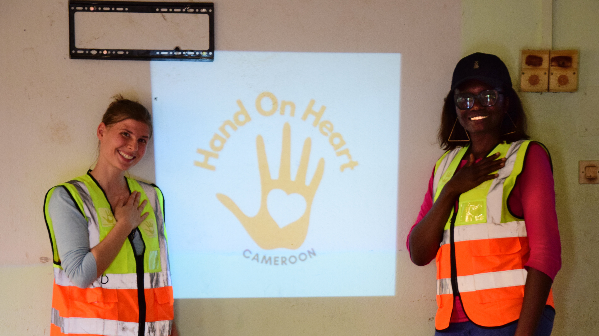

### Erster Besuch in Kamerun 
In Kamerun angekommen stellte sich heraus, dass die Vereinsstrukturen existieren aber noch keine Projekte für mental kranke Menschen umgesetzt werden konnten (mangels Geld, Zeit und Expertise). Es musste also eine Strategie her, um die kamerunische Sandrine zu befähigen künftig an diesem Herzensprojekt zu arbeiten. Hierfür kreierten die beiden Sandrines eine Webseite für Sichtbarkeit nach außen und innen. Diese beinhaltete auch eine Informationsplattform über mentale Gesundheit in Kamerun, entsprechende Hilfeleistungen und ein Forum für Betroffene. Darüber hinaus standen Recherche von bereits bestehenden Strukturen mentaler Gesundheit in Kamerun und erste Anfragen für Kollaborationen mit entsprechenden Akteuren im Mittelpunkt. 


  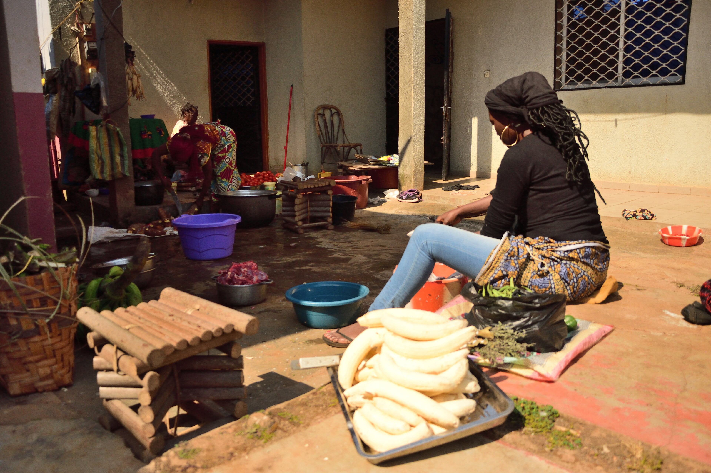
  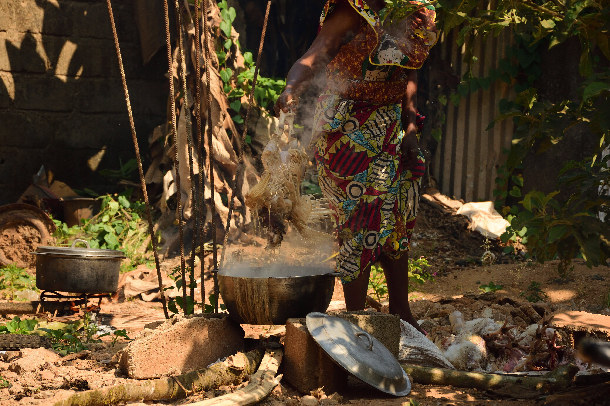
  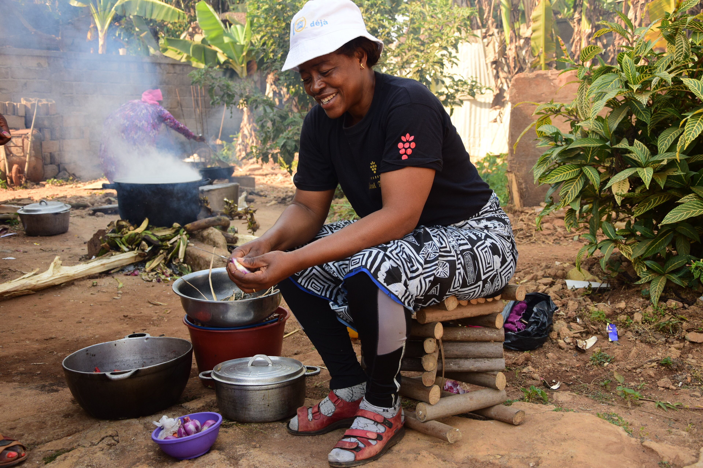
  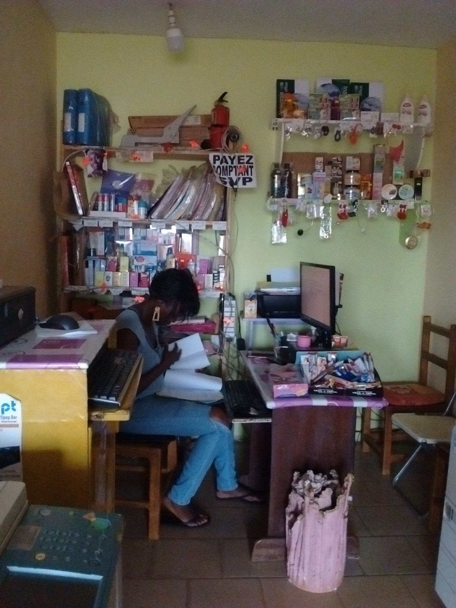
  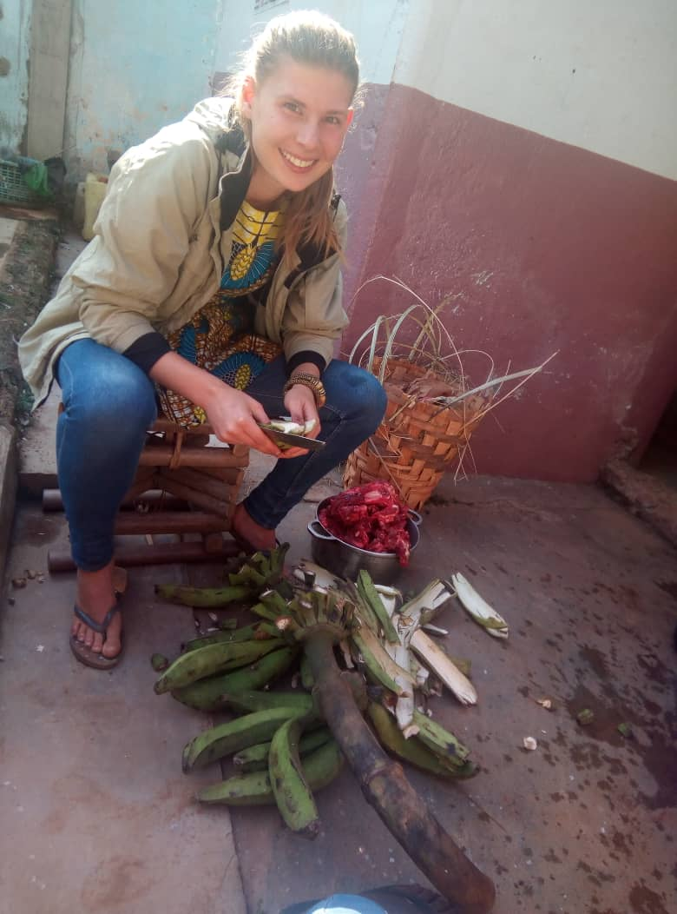
  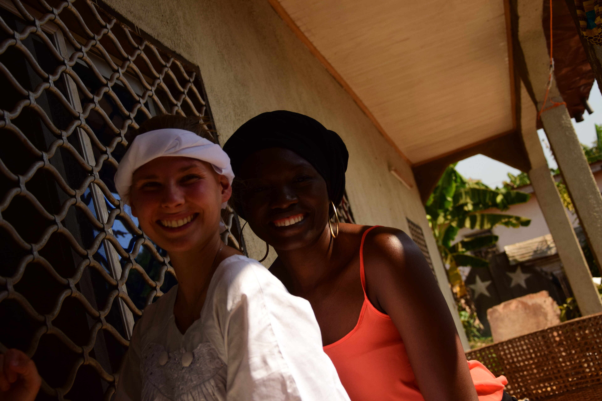
  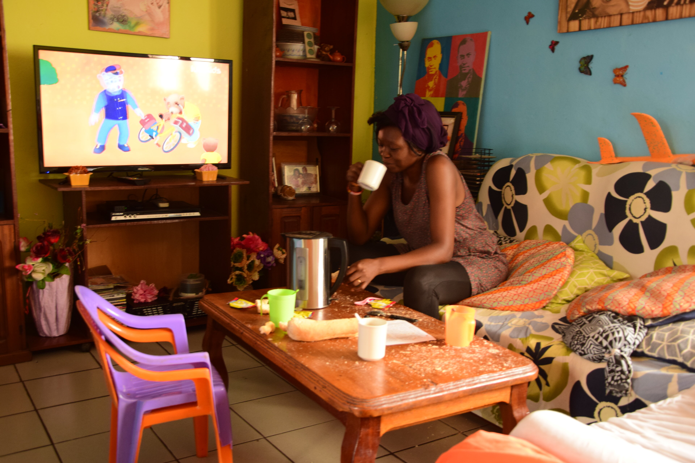
  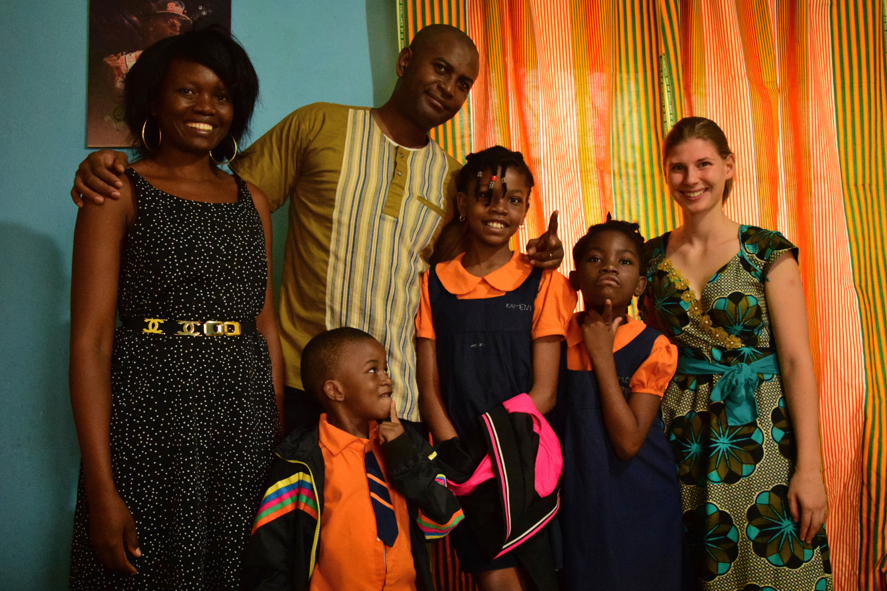


### Langsam kommt der Stein ins Rollen 
Am Ende der Zeit in Kamerun stand die Webeiste, eine wesentliche Komponente bleib jedoch noch offen: die Infrastruktur für Zahlungen von Geldern und Spenden an den Verein. Was leicht klingt war das Werk von 2 bis 3 Jahren Arbeit. Zusammen mit der [Mindful Change Foundation](https://mindful-change.org) als deutscher Partner gelang die Eröffnung des lokalen Bankkontos schließlich. Damit war der wichtige Meilenstein, internationale Gelder zu empfangen erriecht. Paralell dazu fruchtete die neu erlangte Sichtbarkeit des Vereins und HoH erhielt Kollaborationsanfragen, sowie viele Volunteers aus unterschiedlichsten Ländern, die lokal Projekte förderten. Ab 2023 erlaubten erste Fördergelder nach und nach den Aufbau eines lokalen Teams. 

Diese Entwicklungen über all die Jahre aus der Ferne zu begleiten und zu koordinieren war gleichermaßen aufwändig wie auch bereichernd. Nach fünf Jahren wurde es daher Zeit, endlich wieder vor Ort zu sein: zu sehen, wie sich die Arbeit _on the ground_ entwickelt, das Team in Person zu treffen – und nicht zuletzt Felix jenen mittlerweile wichtigen Teil von Sandrines Leben näherzubringen. Und welcher Zeitpunkt wäre dafür besser geeignet als der Beginn unserer Reise _gen Osten_?

## Zu zweit in Kamerun
Zurück zum Jahr 2025: Viel hat sich in den letzten 5 Jahren getan und viel gibt es jetzt zu tun. Doch wie das so ist mit dem Planen in Kamerun, sind die meisten Großprojekte, mit denen wir noch im Oktober rechneten, verschoben oder durch andere ersetzt. Bei einem Projekt hatten wir Glück und die kaskadierten Verschiebungen ermöglichten uns direkt an einer Fortbildungsreihe in Mfou mitzuwirken.

### Fortbildungen in Mfou
Die Ausbildung in der ländlichen Region Mfou ist zugeschnitten auf lokale Pfleger und _Agents de santé communautaires (ASC)_.  


__ASCs__ sind lokale GesundheitsarbeiterInnen aus abgelegenen Dörfern, die die Menschen zu Hause aufsuchen, sie betreuen und bei Bedarf an Gesundheitszentren überweisen. Darüber hinaus informieren und sensibilisieren sie die Bevölkerung zu Gesundheitsthemen im weitesten Sinne.


Die Fortbildung war jeweils für sechs Tage angesetzt. Hier assistierten wir und erhielten interessante Einblicke, wie die Vereinsarbeit _on the ground_ abläuft. Um das gelernte in der Praxis anzuwenden, begleiten die Psychologen des HoH Teams die Ausgebildeten für einen Folgemonat bei ihrer Arbeit.


  
  
  
  
  
  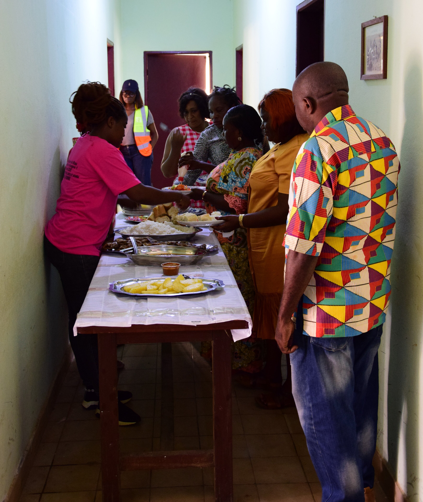
  
  
  
  
  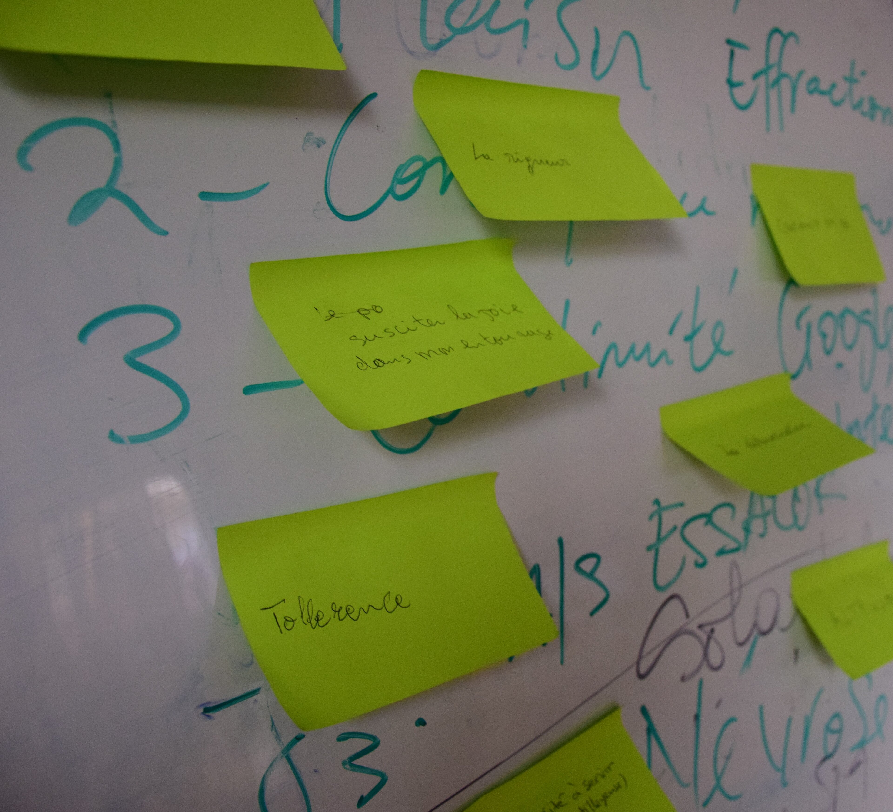
  


### Der Traum von Mbouo
Ein anderes Kollaborationsprojekt mit der Charité wurde aufgrund der in Kamerun aufkommenden Unruhen nach der Verkündung der Wahlergebnisse <mark>( Blogidee )</mark> ins nächste Jahr verschoben. Schade, denn dieses Projekt hätte vorgesehen, dass HoH in Mbouo, einem ländlichen Dorf im Nordwesten Kameruns, ein vergleichbares Mental Health Training durchführt. Für uns wäre dies sowohl eine gute Gelegenheit gewesen, die beteiligten Organisatoren persönlich zu treffen, als auch eine andere Region Kameruns aus dem Alltag heraus kennenzulernen.

### Laufende Aktivitäten
Die bisherige Capacity-Building-Arbeit schafft die Grundlage für das nächste große Vorhaben: Zukünftig möchte HoH die Zentren nicht nur psychosozial, sondern auch in der Erkennung und Betreuung psychiatrischer Fälle stärken. Dieses Anschlussprojekt ist gerade im Aufbau.
Gleichzeitig analysieren wir Interviews von Mitarbeitenden einer Klinik im nördlichen Kamerun. Ziel ist es zu verstehen, welche konkreten Herausforderungen und Bedürfnisse im Bereich psychischer Gesundheit vor Ort bestehen.
Darüber hinaus ist eine aktualisierte Webseite, eine Mental-Health-App, sowie eine Online-Datenbank mit Anlaufstellen für mentalen Gesundheit im Entstehen. Ergänzende Seminare sollen helfen, Wissen rund um mentale Gesundheit breiter zugänglich zu machen. Uns wird nicht langweilig. 🙂
