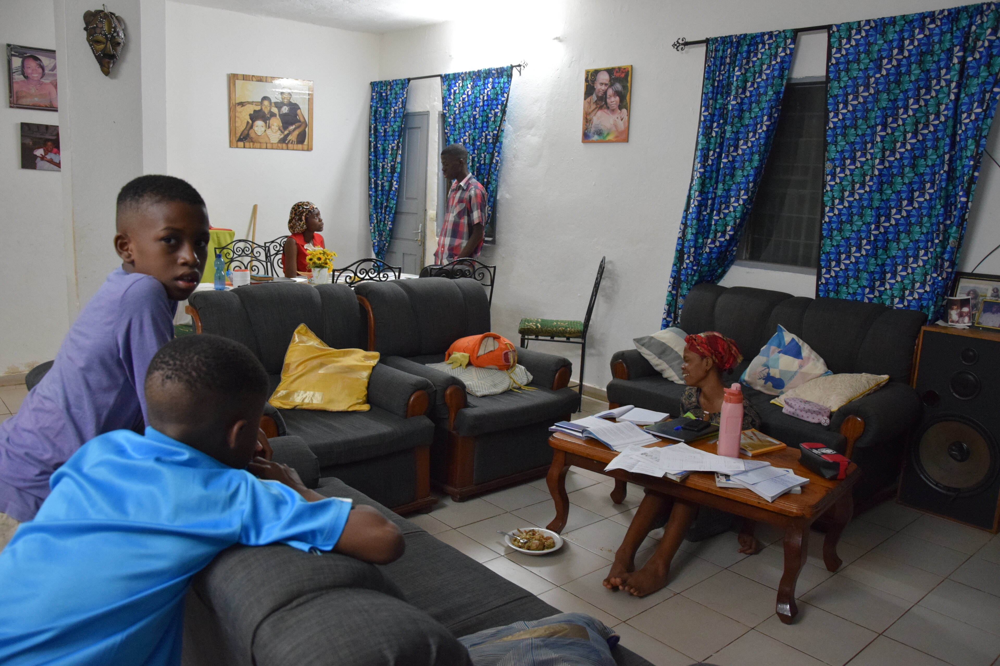
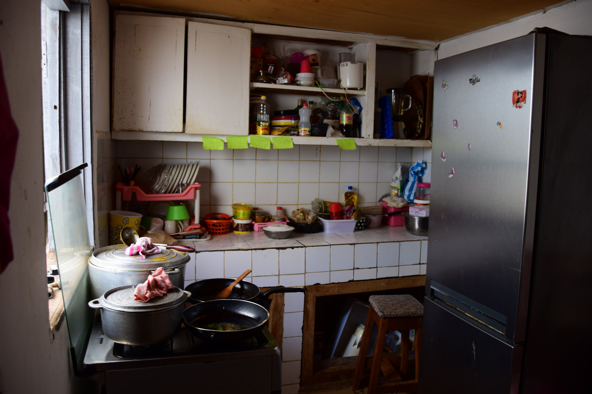
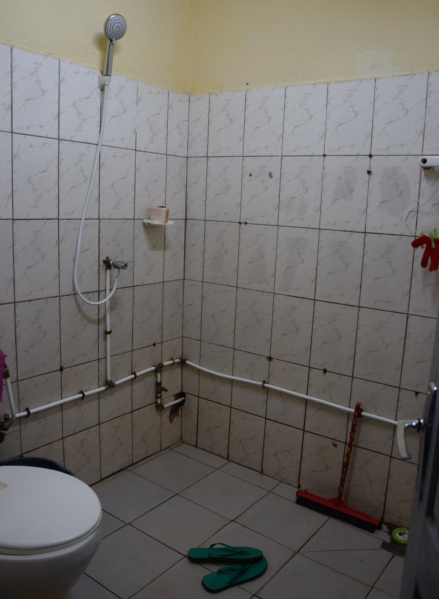
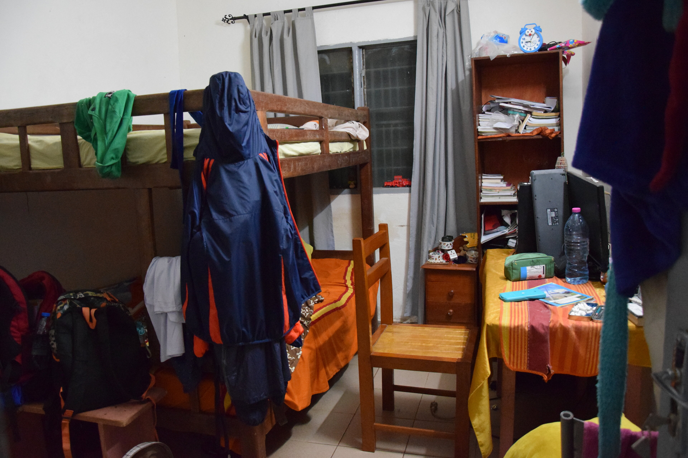
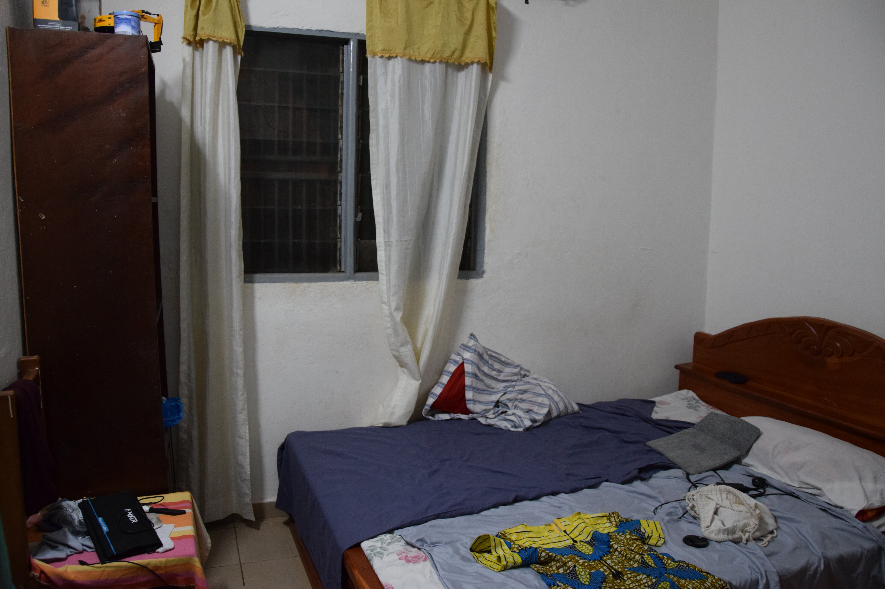
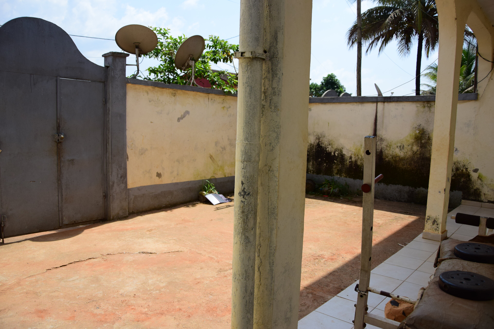
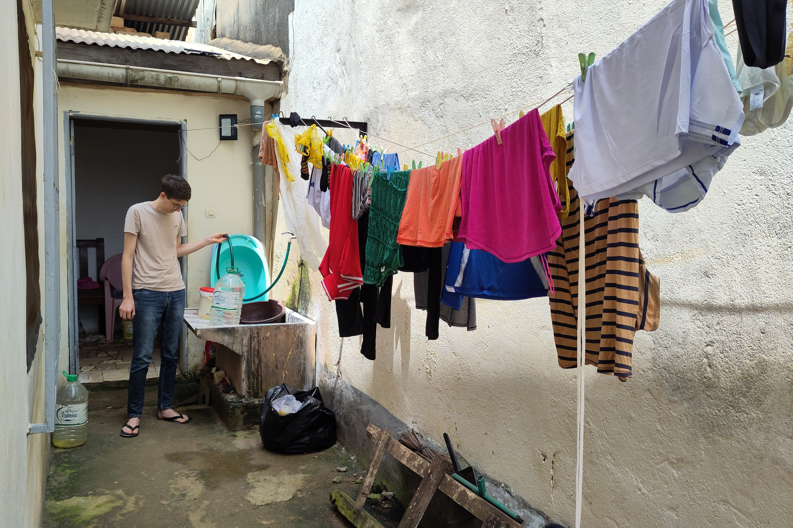

Wir sind mit die ersten, die zu zweit bei der kamerunischen Sandrine unterzukommen. Bis vor einem knappen Jahr, waren die drei Kinder so liebenswürdig ihr Zimmer mit _Volunteers_ zu teilen. Diesmal, zu zweit, wäre das allrdings schwierig geworden. Doch da unsere Hostfamilie umgezogen ist, gibt es ein freies Zimmer für uns beide. Zusammen mit einem Cousin, der aktuell für längere Zeit auch hier wohnt, leben wir also zu acht in der neuen 3-Zimmer Wohnung.
 

  
  
  
  
  
  
  


## Launische Versorgung
Ausgestattet sind wir mit allem, was das Herz begehrt:  
&nbsp; 💧 Fließend Wasser  
&nbsp; ⚡ Strom  
&nbsp; 🌐 Internet

...Zumindest dann, wenn aus diversen diffusen Gründen nicht gerade mal wieder mindestens eines davon ausfällt.

__Wasser__ Zu unserer positiven Überraschung ist die Wasserqualität 1a. Ausgehend von Sandrine's letzter Instantdurchfallerfahrung 💩 in 2020 nach waghalsigen Versuchen, das lokale gelb-trübe Wasser _ungefiltert_ zu trinken, waren wir überrascht, das Wasser diesmal klar und ohne Färbung aus der Leitung sprudeln zu sehen. Trotzdem tasteten wir uns zunächst vorsichtig heran: Erst gab es für uns nur Flaschenwasser, dann kam unser Super-100nm-Filter zum Einsatz, bis wir uns nach einer knappen Woche an das ungefilterte Leitungswasser wagten. ... und tatsächlich verspürten wir noch nicht einmal die kleinste Nebenwirkung - _pathetic_! Kein Vergleich zum letzten Mal, lediglich ein hygienischer Beigeschmack von Chlor! Wie sehr man sich doch über Chlor freuen kann. :-)


__Hinweis:__ Die bessere Wasserqualität könnte mit dem Umzug in Verbindung stehen und innerhalb Yaoundés schwanken.


Doch schon nach wenigen Tagen, der erste Rückschlag als der letzte Tropfen aus dem offenen Hahn rollte. Die Familie hat für solche Dürren vorgesort und ein paar große Eimer, einige 10L Kanister und viele 1.5L Flaschen Wasser auf vorrat. Trotzdem versucht man natürlich möglichst sparsam mit der wertvollen Resource umzugehen. Umso größer war die Erleichterung, als das Wasser nach etwas über 24 Stunden wieder floss; genug Zeit, um beeindruckend hohe Stapel dreckigen Geschirrs zu errichten. Also ran an die Arbeit, die Reserven wieder müssen wieder aufgefüllt, das Geschirr gespült und die Wäsche gewaschen werden. Dann gilt es nur noch zu hoffen das der nächste Ausfall noch etwas auf sich warten lässt. 



__Strom__ kommt wie gewohnt mit 220V @ 50Hz aus der Steckdose. Zumindest in etwa. Potentiell empfindliche Geräte werden mit einem Spannungsglätter geschützt, dieser zweigt ebenfalls die Eingangsspannung an und zwischen 200V und 245V war schon alles dabei. Längere Stromausfälle hatten wir bisher nicht, maximal ein paar Stunden. Jedoch ist es nicht unüblich, dass wir beim frühabendlichen Starkregen für etwa 30 min ohne Strom auskommen zu müssen. Da dieser hier praktisch ausschließlich für Luxus wie Medienkonsum genutzt wird und Solarlampen für Licht zu verfügung stehen, beeinträchtigt der Ausfall das lokale Geschehen nur unwesentlich.

__Internet__ ist hier, das heißt zumindest in der Hauptstadt, mittlerweile selbstverständlich. Wohin man auch schaut wurden dafür 3-Punkt-Masten aufgebaut, denn alles Internt ist hier mobiles Internet. Die erreichten Geschwindigkeiten schwanken im Tagesverlauf stark. Am Morgen können wir mir 1MB/s bequem surfen typischerweise geht am Abend mit 10kB/s sogut wie nichts mehr.

Vor allem die Zuverlässigkeit des Services lässt allerdings zu wünschen übrig. Zu Beginn unseres Aufenthalt - _präziser: in den zwei Wochen um die Auszählung der Wahlen_ - hatten wir etwa 10 Tage gar keinen Internetzugang, sowie auch selektive Blockagen von sozialen Netzwerken. Purer Zufall wohl kaum, aber auch eine knappe Woche später hatten wir wieder einen Ausfall von mehreren Tagen. Die Hypothesen zu den zu den Ausfallgründen kumulieren sich, vom Nachbar hört man dies, auf Social Media kursiert das und der Verkäufer sagt einem wiederum etwas anderes. In kurzen Abständen wird mit felsenfester Überzeugung die neue absolute Wahrheit verteidigt, doch wirklich zu wissen scheint es im Grunde keiner  <mark>( Blogidee: Information )</mark>.

__Zusammenfassend__ Es läuft großteils und Ausnahmen bestätigen ja bekanntlich nur die Regel. Oder wie der Pressesprecher des Päsidenten in einem Stromausfall währen eines Interviews mit dem SPIEGEL sagte: [»Das kann ja nun überall passieren«](https://www.spiegel.de/ausland/paul-biya-in-kamerun-der-alte-mann-und-die-wahl-a-84f09411-b7e0-42d4-b678-84596505cd80?giftToken=4b4e24d6-9f2a-44dd-bd65-0ec2ec586a94) ;-)

