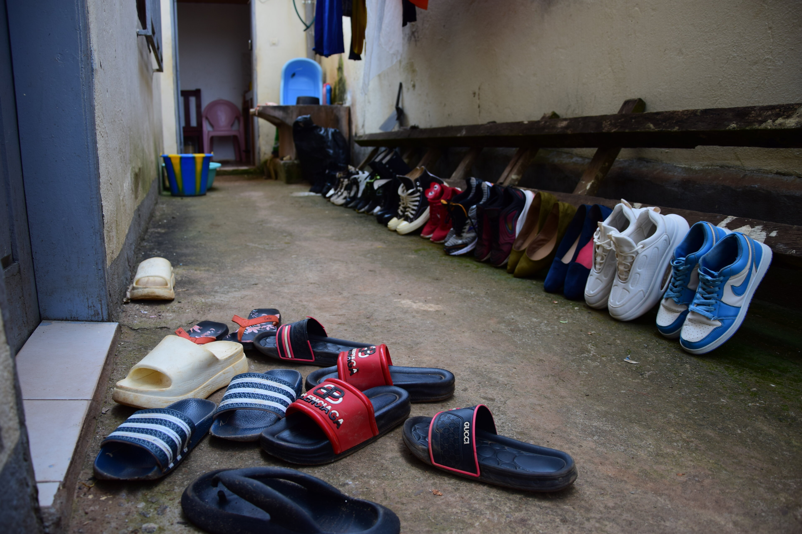
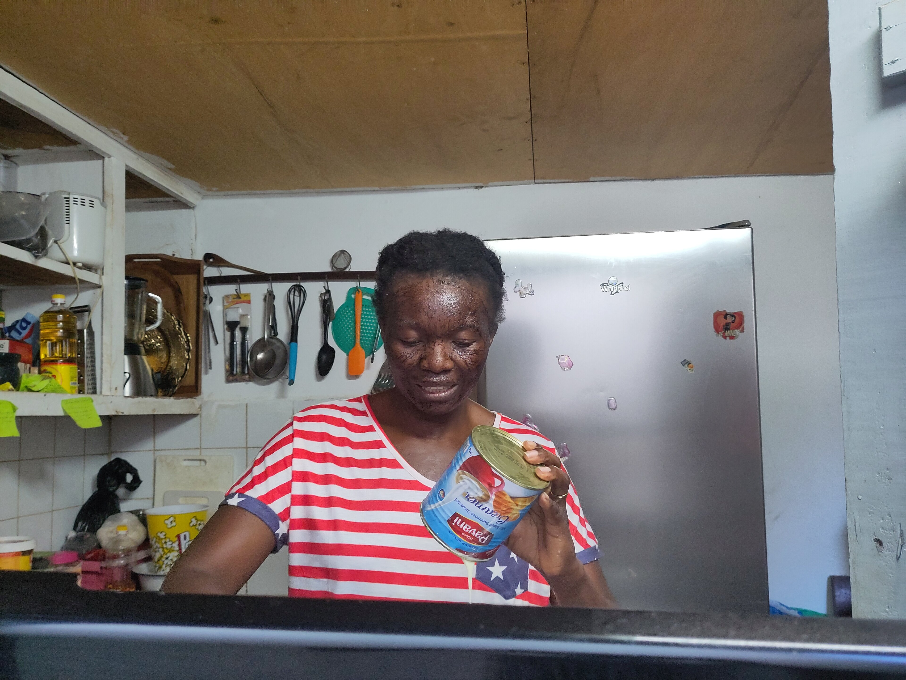
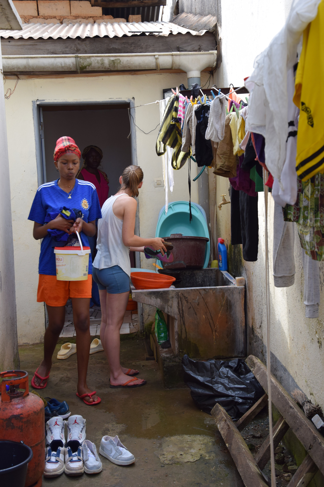
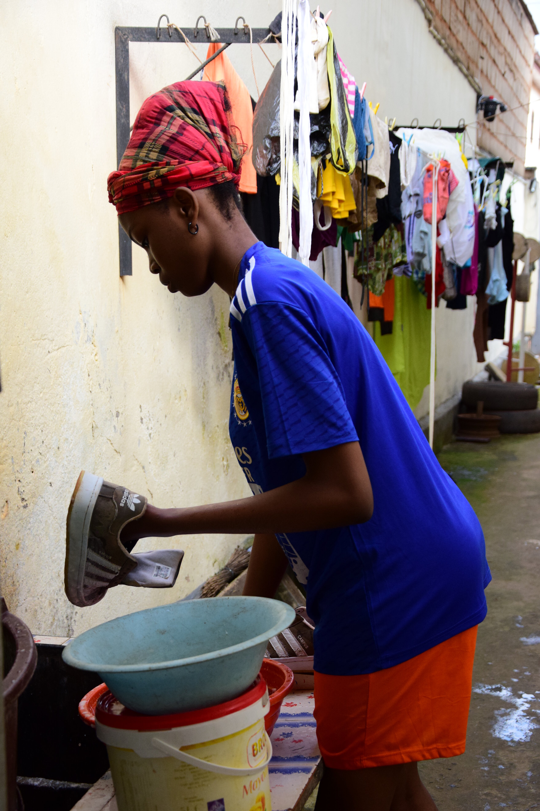
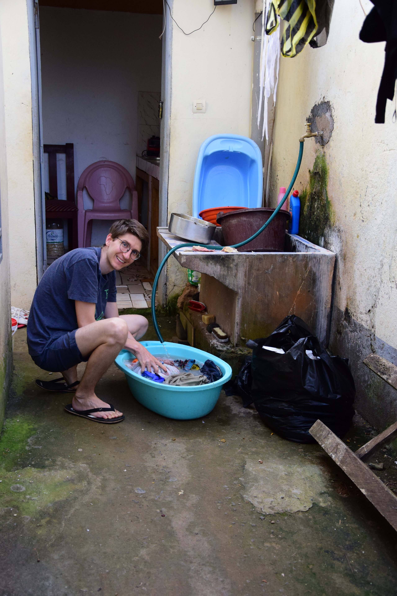
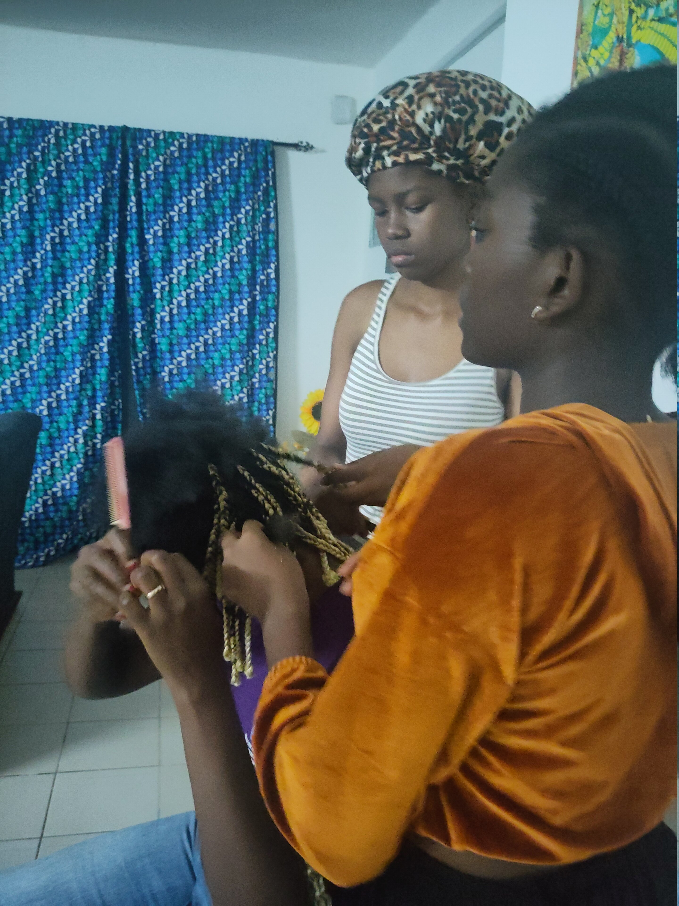
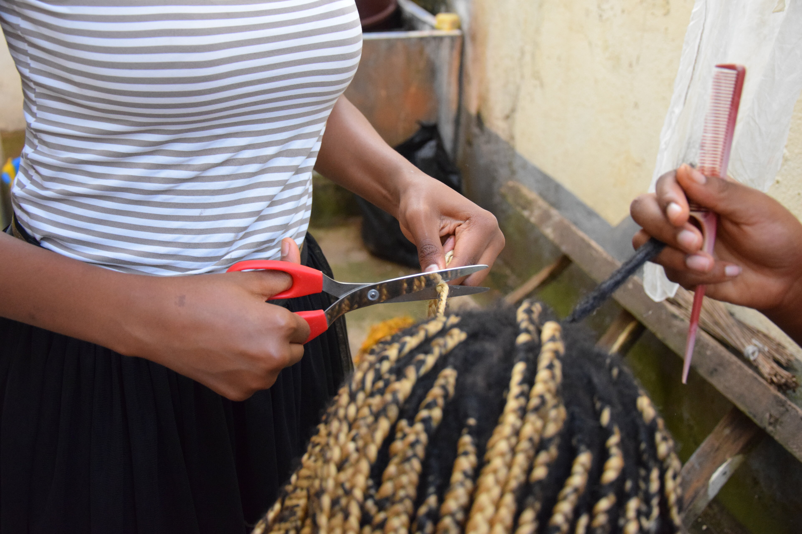
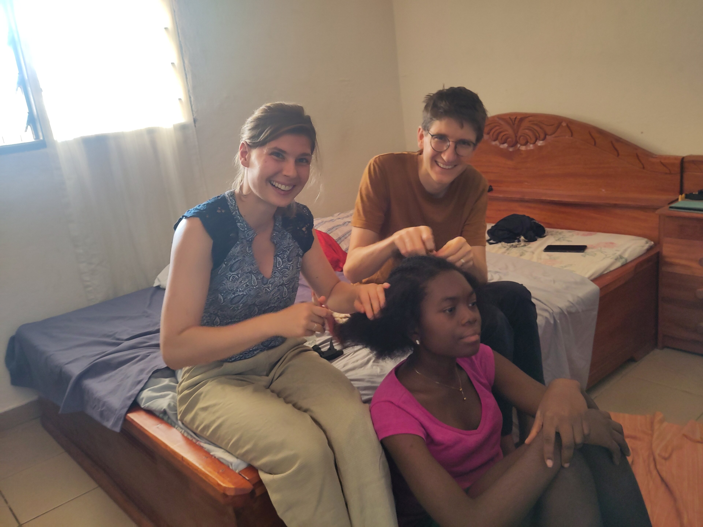

## Ausschlafen? Von wegen!
Unser typischer Wochentag beginnt damit, dass gegen 5 Uhr morgens - gelegentlich auch schon früher, spätestens aber ab 5:30 Uhr - ein Lichtstrahl vom gegenüberligenden Kinderzimmer unter unserer Tür druchschimmert. Damit ist klar, Isabella's und (manchmal) Maureen's Tag hat begonnen; und das mit dem Vorbereiten des Schulstoffes.
Gegen 6:30 werden dann die noch schlummernden kleinen Jungs geweckt und bis diese das Haus gegen 7:30 Uhr Richtung Schule verlassen, geht es meist hoch her, und zwar ganz schön lautstark. Ein wenig zeitversetzt, aber eben so lebhaft, beginnt auch der Alltag in der Nachbarwohnung, in der eine Familie mit immerhin fünf Kindern jüngeren Alters wohnt. Dies Phase unseres Tages findet seinen Höhepunkt wenn die Nachbarskinder die Treppe zum "Carport" vor unserem Zimmerfenster erobern und die Familie kurze Zeit später mit __extrem__ laut aufheulendem Motor den Hof verlässt. Danach - es ist 8:00 Uhr - endlich Stille.

## Morgenroutine
Meist haben wir die Freiheit erst deutlich nach den kindern aufzustehen. Sandrine beginnt meist bereits im Bett sitzend mit den digitalen Aspekten der Arbeit vor Ort. Felix started ein kleines Fittnessprogramm (Bauch - Arme - Seilspringen) und nach einer Dusche geht es für ihn erst einmal in die Küche. Hier steht überlicherweise ein Berg von dreckigem Geschirr von den Mahlzeiten des Vortags bereit. Ansonsten Wohnung fegen, Wäsche waschen, ... irgendwas findet sich immer. Falls die Sonne scheint wird parallel das Handy am Solarpanel im Hof geladen.



Gegen 10 Uhr geht dann die Frühstücksvorbereitung los. Seit einiger Zeit ist Sandrine - angesteckt von Felix' Sporttreiben -, während Felix das Essen vorbereitet, ebenfalls zur Vor-Frühstücks-Workoutlerin geworden. Dann stehen für uns beide gebratene Kochbananen mit Reis, Tapioka, oder Brot mit Guacamole o.Ä. auf dem Frühstücksmenü.



Nach dem Essen geht es mit variablen Arbeiten weiter. Diese sind häufig für den Verein, aber auch persönliche Aufgaben wie etwa Fotossortieren oder Haushaltsaufgaben stehen auf der Tagesordnung.

## Unterbrechnungsreicher Nachmittag
Je nach Tag kommen die Kinder am Nachmittag nach der Schule kurz nach Hause um zu essen. Häufig geht es von der Schule aber auch direkt in ihre zusätzlichen Lernkursen, die ebenfalls im Schulgebäude und teilweise mit denselben Lehrern stattfinden. Nur für die noch jüngeren Jungs gibt es eine etwas längere Pause, häufig die einzige Zeit in der sie sich mit einem recht platten Fußball im 4x3m² Innenhof austoben dürfen. 

Sobald die Kinder eintrudeln, besteht unsere Aufgabe darin dafür zu sorgen, dass direkt etwas geeignetes, warmes Essbares für sie da ist. <mark>( Blogidee: Essen )</mark>
Diese und weitere unerwartete Aufgaben, die dann ganz plötzlich höchste Priorität genießen und sofort erledigt werden müssen, machen jeden Tag einmalig und spannend. Zugleich zerpflücken sie aber auch die Arbeitszeit und wirbeln die besprochene Planung mächtig durcheinander. Wenn dies auch nicht unserer Gewohnheit entspricht, so ist es hier doch fester Bestandteil des Alltäglichen und jeder scheint diese Art der fortgesetzt verschobenen Planung auch gleichermaßen zu praktizieren.


__Merke__: Vieles ist hier sehr spontan und plötzlich dringend. 


Am Nachmittag beginnen wir dann gemeinsam mit Sandrine oder den Mädchen die Essensvorbereitung für den Abend. Standardmäßig bereiten wir relativ große Mengen zu, sodass das Hauptessen für den nächsten Tag noch reicht. Das dauert entsprechend lange.


  
  
  
  
  
  
  
  


## Gemeinsamer Abend
Am Abend kommen die Kinder zwischen 16 Uhr und 19:30 Uhr von den Kursen zurück und haben damit effectiv bis zu zwölf Stunden Schule. Doch damit nicht genug, denn es stehen häufig noch Haushaltsaufgaben an. Zunächst aber erstmal etwas Pause, in der jeder zu beliebigen Zeiten (mehrfach) isst, sich eine _Siesta_ gönnt und sich ansosnten den Haushaltsaufgaben wie Schuheputzen und Wäsche waschen widmet. Das nimmt auch deshalb so viel Zeit ein, da der Schuh- und Wäschedurchsatz sowie der Anspruch an Hochglanz für uns beeindruckend hoch ist. Einnmal die Woche steht auch das erneute Flechten der Haare an. 

Gegen 21 Uhr setzen sich die Kinder dann wieder an ihre schulischen Pflichten. Hierbei helfen wir häufig, wobei das Unterstützungsniveau von moralischem Support bis hin zum Vermitteln von Inhalten reicht. Dabei scheint der Schulstoff in etwa dem Niveau deutscher Gymnasien zu entsprechen.

Auch am Samstag - und für die Älteste sogar sonntags - geht es wieder in die Lernkurse. Spiel- sowie Bildschirmzeit haben die Kinder nur wochenends, wobei vor allem für die Mädchen außerhalb der anfallenden Haushaltsätigkeiten, ohnehin kaum freie Zeit für eigene Aktivitäten bleibt.

Übergreifend lebt und arbeitet man hier doch ziemlich nebeneinander her, wobei der Haushalt maßgeblich den Takt des Tagesverlaufs vorgibt. 
