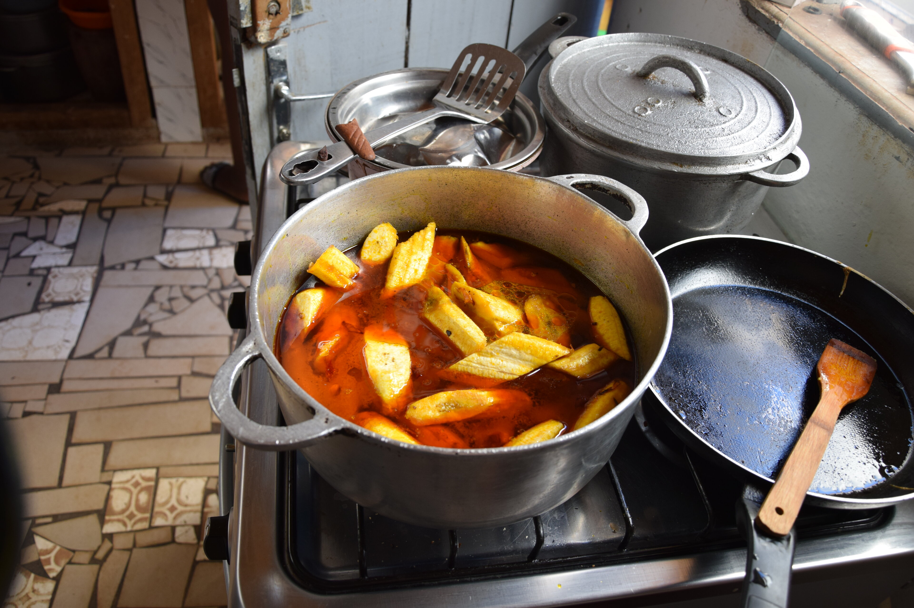



## Gut Ding braucht Vorbereitung
Bevor wir mit dem Kochen starten können müssen wir normalerweise ersteinmal die Zutaten besorgen. Das ist etwas komplizierter als es auf den ersten Blick scheint, da wir hier nicht einfach in den nächsten Supermarkt gehen können, sondern viele Lebensmittel nur auf speziellen Märkten verkauft werden. Die Preise und Verfügbarkeit der Produkte schwanken zudem sehr. Zuletzt sind wir dort auch eine gewisse _Attraktion_ und viele Menschen wollen uns etwas verkaufen oder zumindest etwas mit uns reden. So werden die Marktbesuche nie langweilig.

Für kleinere Besorgungen verkaufen Straßenhändler an jeder Ecke, sowie die Nachbarn auch einzelne Lebensmittel (z.B. Avocados, Eier, Manderinen); allerdings teilweise zu einem (deutlich) höheren Preis.
Zudem haben wir hier nicht alle Maschinen selbst, sondern gehn z.B. für das Mahlen von Erdnüssen zum Nachbarn.



## Kamerunische Küche
Hier ein paar _signatue dishes_ der kamerunischen Küche, die wir häufiger mit unserer Gastfamilie zubereiten und essen haben. Vermutlich gibt es auf Grund unserer Ernährungspräferenzen einen gewissen Bias zu vegetarischen Speisen.

### Koki
Koki ist eine in Bananenblättern gekochte Paste aus weißen Bohnen. Diese werden zunächst über Nacht in Wasser eingeweicht. Nachdem die Schale entfernt wurde, werden die Bohnen mit Chillischoten und __viel__ Salz gemixt und mit abgekochtem _l'huile rouge_ (dt. rotes Öl) vermengt. Mit den Bohnen vermengt verleiht es dem Koki seine gelbe Farbe. Die Mischung wird mit einem traditionellem Mörser _geknetet_ um eine homegene, dickflüssige Masse zu erhalten. Diese wird dann in Banenblättern, oder modern auch Plastiktüten, gekocht und erreicht dabei eine feste Konsistenz!


__L'huile rouge__ ist unverarbeitetes Palmöhl und fester Bestandteil der kamerunischen Küche. Es sticht durch seine leuchtend rote Farbe hervor.




### Okok
Der namensgebende Bestandteil von Okok ist ein Kraut im Aussehen nicht unähnlich zu Gras. Dieses wird fein gehackt in einer Soße zu dampfgegartem Maniok gegessen.

Als Vorbereitung werden frische Erdnüsse leicht geröstet und mit wenig Wasser grießgroß gemahlen. 

Die Soße basiert auf den rot-orangenen _noix de palme_ (dt. Palmfrüchte). Diese werden zunächst gekocht. Für den Geschmack geben wir den Okok in einem perforiertem Beutel dazu. Nach etwa einer Stunde wird der ölreiche Saft der Palmfrüchte mit einem Mörser von den Fasern und Kernen getrennt. Jezt hitzen wir die Soße auf und geben unter Rühren nach und nach die Erdnussmasse sowie den Okok hinzu. Nach weiteren längerem Kochen dickt die Soße merklich ein. 

Daneben wird der Maniok zubereitet: Zunächst die Wurzel schälen, dann in faustgroße Stücke brechen (Maniok ist recht spröde) und diese halbieren. Nun einfach im Dampf garen.



### Pilé de Plantain
Pilé de Plantain (dt. zerstoßene Kochbananen) hat einen sehr treffenden Namen. Deswegen ist die Zubereitung auch schnell beschrieben:  
Als Vorbereitung rote Bohnen am Vorabend einweichen und weich kochen. Die Enden der Kochbanenen abschneiden und die Schalen längs einritzen. Diese dann (ungeschält) eine gute Stunde köcheln lassen. Nun die Kochbanenen einzeln aus dem Topf nehmen und nach dem Schälen direkt mit einem Mörser zerstoßen. Nachdem alle Kochbanenen zu einer dichten Masse verarbeitet wurden, müssen jetzt noch die Bohnen und erhitztes _huile rouge_ untergemischt werden.



### Banane Malaxé
La Banane Malaxé ist eine Art einheimischer Kochbananeneintopf, in der die Kochbananen in einer Erdnusssoße gekocht werden. Soweit so gut, allerdings kommt dann leider noch Fisch hinzu, und da ist uns bei der Gräte hier und dem Fischauge da doch leider ein wenig der Apetit vergangen. 😉

Daneben gibt es natürlich noch viele Gerichte die wir nicht im Detail beschreiben, hier ein paar Beispiele:
- Nudeln mit Tomaten-Fisch Soße
- Weißkohl in Erdnusssoße
- Erdnussmilchreis
- Hächeneintopf
- Reis mit Bohnen
- Gegrillter Fisch
- Gombo: Shrimp-Fisch-Okraschleim 😉
- Sanga: Koki, aber mit Mais



## Unsere Experimente

Sofern die hiesigen Zutaten es zulassen, kochen wir hin und wieder auch nicht-afrikanische Gerichte - etwa Spaghetti mit Tomatensoße, Pizza, Kartoffelpuffer, Okra auf unsere Art, Sojaderivate (Milch bzw. Pudding, Patties, Pfannkuchen), Hefezopf, oder Sauerkraut.

Der Erfolg dieser Kochaktionen bei unseren Gastgebern ist allerdings eher, naja, durchwachsen. 😅 Klappt es bei Gerichten wie Pizza, Pfannkuchen und Patties doch ganz gut, wird unsere Art zu kochen hier in der Tendenz eher kritisch und mit genug Sicherheitsabstand beäugt. Als wir eines Abends Sanga mit Reis (statt mit Maniok) gegessen haben, hat das zu einem belustigt ungläubigen Kulturschock geführt. In Summe scheint die Neugier doch langsam aber sicher mehr und mehr durch und zu unserer Überraschung wurde sogar auch unser Kohl (nach leichter Anpassung) mit Apetit gegessen. Für das aus Deutschland mitgebrachte Sauerkraut reicht die Liebe und Neugier bislang allerings noch nicht.



