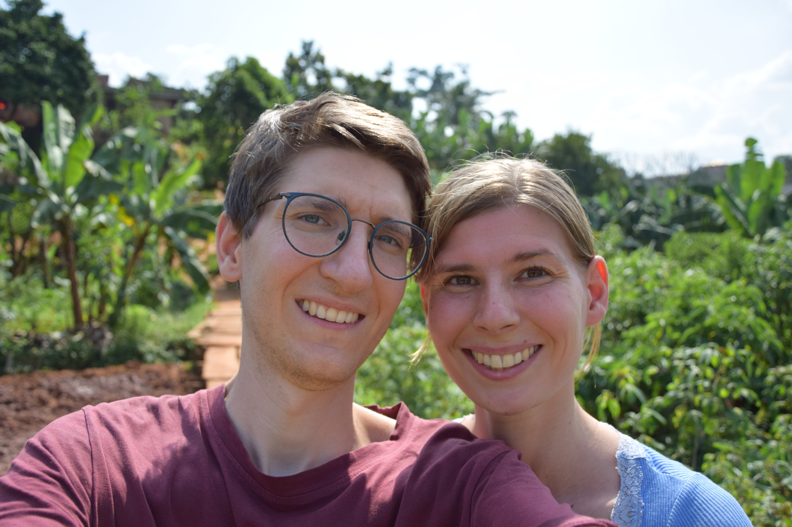
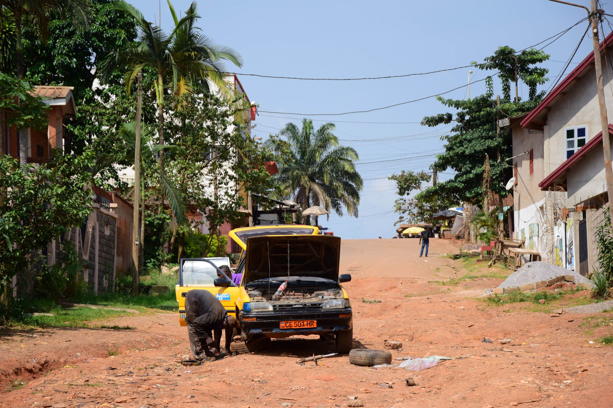
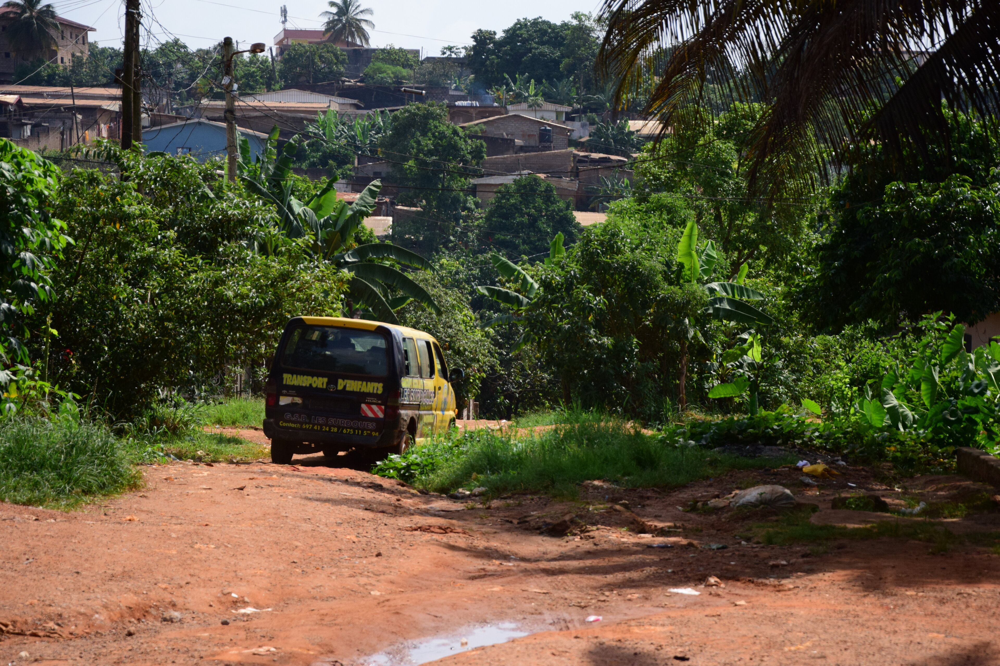
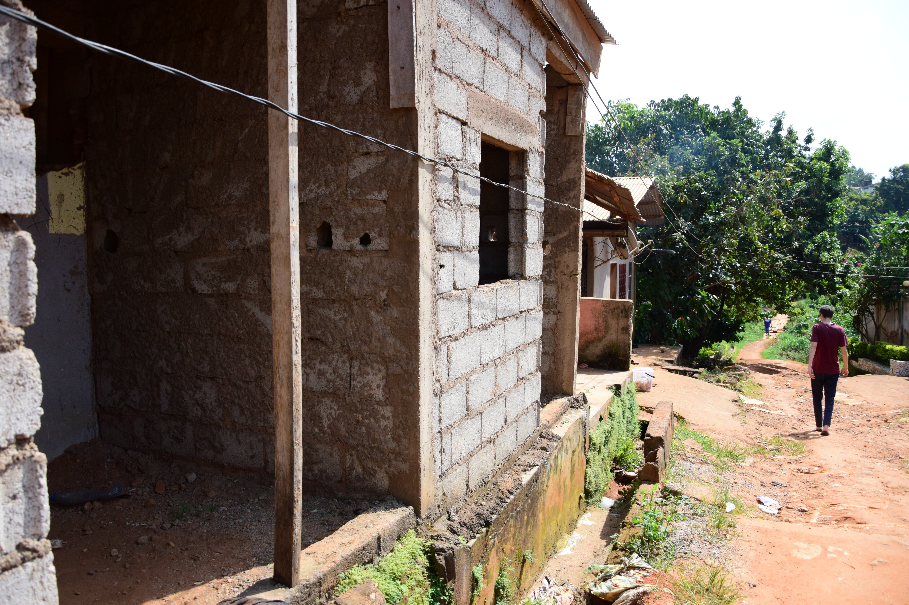
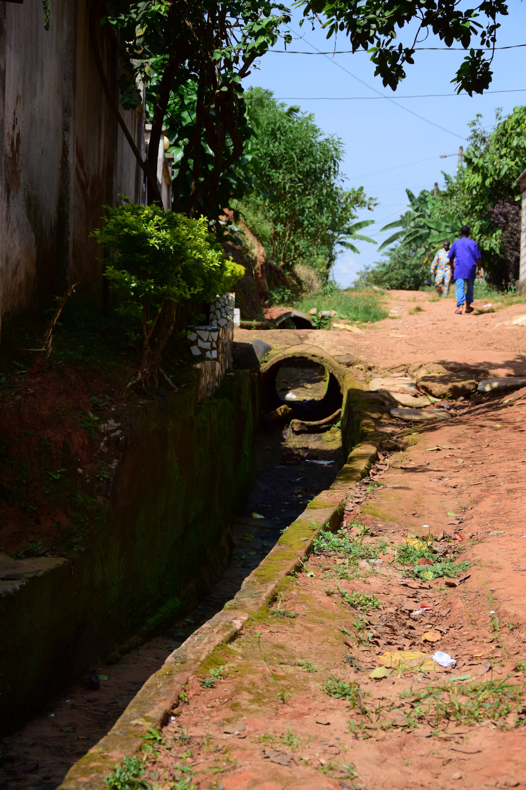
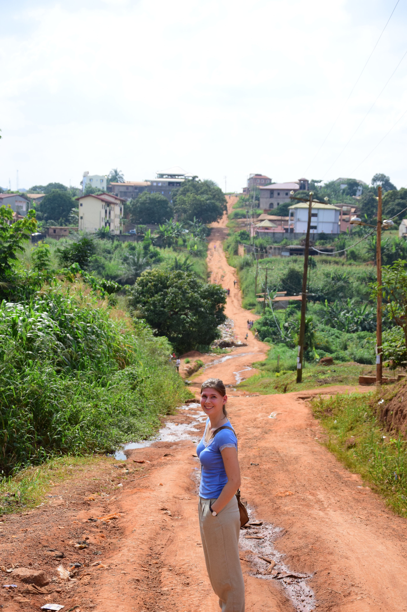
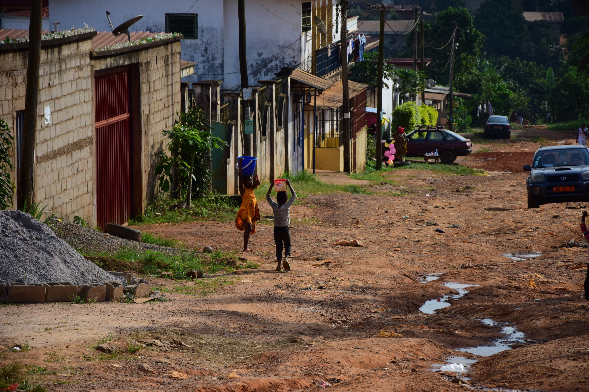
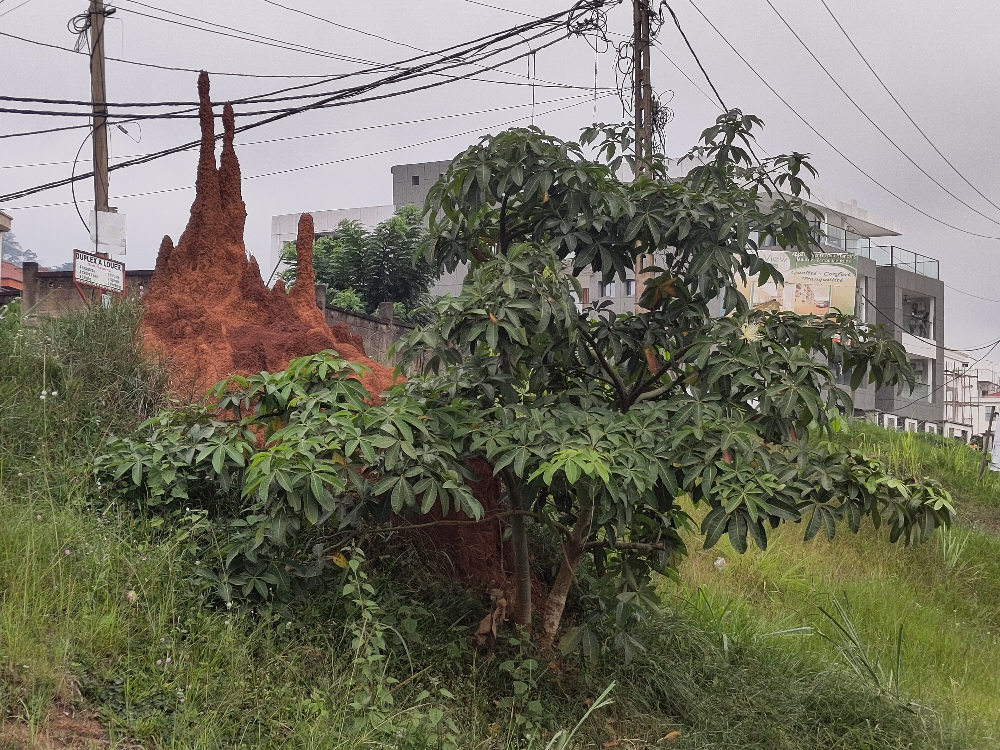

## Kleine Welt
Vor einigen Tagen machten wir unseren ersten gemeinsamen Minispaziergang mit den Kindern. Sandrine regte an, dass uns die Kinder ihr Viertel zeigen sollten, doch zu unserer Überraschung folgte auf unsere Nachfrage an die Kinder, wo es denn hingehen solle, lediglich Ratlosigkeit. Also gaben wir die Richtung vor. Die Runde war denkbar klein, gerade einmal ein Minispaziergang um den Block: Unsere Straße hoch, zwei Parallellstraßen weiter, wenige hundert Meter die zweite Parallelstraße runter, und den Block abschließen um wieder zurückzukommen. Vlt. 15 Minuten hat uns das gerade einmal gekostet. Keine große Sache, dachten wir. 
Umso überraschter waren wir über die Reaktionen der Kinder: Kaum kreuzten wir die erste Paralellstraße manifestierte sich leiser Protest, wir können doch nicht über diese Straße hinausgehen. Kaum 50 m weiter überkam sie dann sichtliches Unbehagen, das Gefühl der Verlorenheit und Unsicherheit, nicht wieder zurückzufinden. Große Erleichterung dann, als der bekannte Kirchturm bei uns um die Ecke wieder in Sicht kam und die positive Überraschung, als man von anderer Seite nun plötzlich wieder bekanntes Terrain erschloss. 

An diesem Tag war es dann erstmal auch genug des Entdeckertums. Doch auf Dauer schien die Neugier zu überwiegen, erkundeten sie die neuen Gebiete ihres Viertels das nächste mal doch mit deutlich mehr Vorfreude und Tatendrang - wenngleich auch immernoch ehrfürchtig. Besondere Überaschung löste besonders die Erkenntnis aus, dass so mancher Klassenkamerad ja hier und dort wohnt.

## Unser Viertel: Mimboman

  
  
  
  
  
  
  

Weit über unseren unmittelbaren Wohnblock hinaus explorieren wir, wenn wir zu zweit sind, wie und wo wir können. Die Straßen, die wir am meisten vorziehen, sind die kleinen, nicht geteerten Straßen am Rande der Hauptachse; fernab des lauten, abgasreichen Verkehrs und kommerziellen Trubels. 
Sichtlich überrascht uns auf diesen Wegen anzutreffen sprechen uns hin und wieder Leute freundlich an, fragen wie es uns geht und wollen Hallo sagen. Das ist etwas angenehmer, als auf der Hauptachse an der wir mehr zum Kauf von diesem oder jenem aufgefordert werden und an der uns tendenziell auch einfach auch mehr hinterhergerufen wird.
Architektonisch halten diese abenteuerlichen Wege für uns auch regelmäßig Überaschungen bereit, wenn sich zwischen bewohnten Rohbauten und Wellblechhütten immer wieder prächtige mit Säulen und Vorgärten verzierte Gebäude, ja fast Villen, auffinden lassen.
Hühner, Ziegen und Hunde gehören hier ebenso so sehr ins Bild, wie die für uns ungewohnt vielen Kinder. In Summe ist es recht ruhig und farblich eine Mischung aus intensivem grün und rot; letzteres aufgrund der intensiven Farbe der roten Erde hier.

## Unterwegs in Yaoundé

Was für unser Viertel gilt, gilt auch für die gesamte Stadt, in der wir uns mittlerweile auch nicht selten herumgetrieben haben. Hier gibt es einige geteerte Hauptachsen - wobei diese im Vergleich zu so mancher überregionalen Straße häufig mit großen Schlaglöchern versehen in erstaunlich schlechtem Zustand sind - und die vielen unbefestigten Nebenstraßen, die den Rest der Stadt füllen. Dazu gesellen sich noch _Raccourcis_ (dt. Abkürzungen), kleine Trampelpfade die es erlauben, über Bretterbrücken durch Bäche getrennte Gebiete effizient zu verbinden. Erwartungsgemäß ist das Netz befestigter Straßen umso dichter je näher man in das Zentrum der Stadt, d.h. dem Regierungsviertel, vordringt. Bei Nacht ist der Unterschied zum Regierungsviertel besonders eindrücklich, da sich die schicken und ordentlich beleuchteten Bauten sehr auf Regierungsgebäude und Ministerien zu beschränken scheinen.

### Berge von Müll
Durch die Stadt hinweg türmen sich an den Straßenrändern in regelmäßigen Abständen Berge von Müll. Dabei handelt es sich teils einfach nur um "spontane" Ansammlungen von Müll, häufig allerdings aber auch um Müllsammelplätze von denen der Müll per LKW abtransportiert wird. Es gibt also offenbar ein _Müllsystem_, wobei dieses nicht auszureichen scheint. So kam zweimal die Woche z.B. auch jemand bei uns zu Hause vorbei, um den Müll abzuholen und uns eine neue Mülltüte zu bringen. Wie das Ganze im Hintergrund organisiert ist, haben wir allerdings nicht erfahren.
In Summe prägt Müll das Stadtbild schon sehr, auch deshalb, weil an keiner Stelle Mülleimer auffindbar sind und jeder seinen Müll einfach direkt fallen lässt, bzw. aus dem Autofenster wirft.
Mülltrennung wird hier natürlich auch nicht betrieben. In den "öffentlichen Müllbergen" haben wir allerdings nicht selten beobachtet, wie Leute Plastikflaschen heraussortieren. Ob organisiert oder auf eigene Faust, keine Ahnung? Das Thema Recycling sei im gesellschaftlichen Diskurs der Stadt, wie man so hört, wohl immerhin zunehmend präsent.



### Taxi driver
Die Stadt ist tatsächlich gar nicht so groß. Zu Fuß erreichen wir das Zentrum von Mimboman aus gut in zwei Stunden. Wie wir gelernt haben, läuft man hier, bis auf wirklich sehr kurze Strecken, allerdings recht wenig. Für den Transport stehen im Wesentlichen zwei Optionen zur Verfügung: Motorrad und Taxi und tatsächlich besteht der überwiegende Teil der Autos in Yaoundé aus Taxis; Privatfahrzeuge sind in der Minderheit. Das "Bestellen" eines solchen Fahrzeugs ist eine Erwähnung wert: Man stelle sich auf die richtige Seite des Straßenrands, hält Ausschau nach verfügbaren Plätzen in vorbeifahrenden Taxis - üblicherweise sehr leicht erkennbare kleine, gelbe und allzu häufig sehr klapprige Toyota-Yaris-Autos - und schreit dem Fahrer durchs Fenster des vorbeifahrenden Autos in voller Inbrunst die Anzahl an Plätzen, Preisvorschlag, Destination und, sollte man das Geld nicht passend haben, den Schein mit dem man Zahlen würde zu. Das gibt dann einen schnell geschrieenen Wortschwall wie "2 Plätze, 200, Eingang Tankstelle Neptun Markt Nkoabang, mit 500". Ist der Fahrer - hier ist nicht-gendern angemessen, denn wir haben noch nie eine Fahrerin gesehen - einverstanden, signalisiert er dies üblicherweise mit einem kurzen Huper. Im Taxi teilt man sich den Vordersitz zu zweit und für Destinationen weiter außerhalb die drei Rücksitze zu viert. Je nachdem, wie kräftig, die Menschen sind, sitzt man dann schon ganz schön, wie in einer Sardinenschachtel.
Regelmäßige Polizeikontrollen, das Liegenbleiben des Taxis und dicke Staus machen die Fahrzeit der häufig doch relativ kurzen Strecken allerdings schwierig abschätzbar.



### Big Business...
...gibt's hier kaum. An den allermeisten Destinationen angekommen springt einem Folgendes ins Auge: Die Straßenseiten der Hauptachsen folgen dem gleichen Muster. Sie sind voll von kleinem Ein-Personen-Unternehmen-Kommerz: jede und jeder ist Verkäufer. Die Straßen werden von immer den gleichen Waren gesäumt. Im Wesentlichen verkaufen die Händler Obst und Gemüse, Automechanik und -wäsche, Tankstellen, Sekretariat, Kleidung, kleine _Epicerie_ (dt. Gemischtwarenladen), Schweißer und Schreiner. Alles andere sind Ausnahmen und hauptsichlich geballt in bestimmten Vierteln zu finden (etwa Elektronikartikel). Besonders für so manches Obst oder Gemüse oder Snacks wie Erdnüsse findet man immer eine Nachbarin die vielleicht zehn Avokados und acht Tomaten zum Verkauf anbietet. Praktisch jeder scheint hier seinen eigenen kleinen Minikommerz zu haben. Möchte man ein bisschen mehr Diversität und größere Mengen zu kleinen Preisen muss man allerdings zum Markt.



### Markt
Der Markt ist ein Erfahrungswert an sich. Hier steppt der Bär. Kein Wunder, schließlich ist das __der__ Ort, um den man nicht herumkommt wenn man sich mit frischen Waren eindecken möchte. Aber auch Kleidung, Schmuck und manchmal sogar Spielsachen sind hier zu finden. Meist schlängeln sich die Märkte auf ungeteerten kleinen Wegen die Hügel entlang. Auf beiden Seiten der ohnehin schon engen Wege breiten die Verkäufer ihre Waren auf Tüchern aus, denn selten reicht der Platz in den kleinen Holzverkaufsständen an den Seiten. Motorradfahrer und junge Männer mit schwerer Ware in Schubkarren trainieren Einen in regelmäßigen Ausweichmanövern. Klanglich ist die Erfahrung eine laute Mischung aus Rufen wie "Meine Schwester, es gibt Tomate!", "Hey, wie isses? (C'est comment?)" oder "Weißer! Ist das deine Schwester?".
Die Waren werden in verschiedenen Einheiten verkauft. Die üblichsten sind: Stück, Haufen (klein, groß), Eimer (klein, mittel, groß). Für andere Güter wie Kochbanenen ist es _regime_ (dt. Staude).  Manchmal steht der Preis dabei, meist muss man allerdings fragen. Häufig sind Preise Verhandlungsbasis, wobei diese pro Produkt recht konsistent sind. Zu unserer Überraschung haben wir, was die Preise betrifft, allerdings selten das Gefühl gehabt, anders behandelt zu werden als Einheimische. Gezahlt wird auf dem Markt, sowie für das Taxi auch, in Bar; wobei bei für Transaktionen von größeren Summen manchmal wohl auch ein mobiles Zahlungssystem verwendet wird. 
So sehr es auf dem Markt zu "Geschäftszeiten" nur so wuselt, so tot ist es nach "Feierabend". Auch wenn es hierfür keine festen Zeiten gibt, so wird doch schnell deutlich, dass ab 16 Uhr abgebaut wird und man Glück  haben muss noch offene Verkaufsstände zu finden.

 für mehr Marktbilder.")

### Bauboom
Eine recht auffällige Änderung des Stadtbildes gegenüber des letzten Kamerunaufenthaltes vor fünf Jahren ist die Ansammlung an Supermärkten die seit kurzem aus dem Boden sprießen wie Pilze. Das scheint im Einklang mit dem beobachtbaren Trend, dass ganz generell hier nun mehr und mehr gebaut wird. (Noch) verkaufen die Supermärkte lediglich abgepackte Produkte und machen den Märkten mit ihrer frischen Ware somit keine Konkurrenz. Doch in Summe scheint das Supermarktkonzept sehr erfolgreich zu sein, zumal diese immer eine Bäckerei, Eisdiele und häufig auch eine Snackbar beinhalten, die die Einheimischen mit wachsendem Interesse in Anspruch nehmen. Zusätzlich zu teuren importierten Produkten (wie etwa Milch) verkaufen diese auch vermehrt industriell gefertigte Produkte aus Kamerunischer Produktion, etwa Öl, Schokolade, Maniokmehl oder Taschentücher.




__NOTE:__ Wer hätte gedacht, dass wir industriell gefertigte Produkte mal derart als Zeichen des Fortschritts sehen würden?! 


## Was fehlt noch?
Yaoundé erstreckt sich über viele Hügel zwischen welchen immer wieder Bäche fließen, die einen - wäre nicht der Müll - mit Wasser versorgen könnten. Insbesondere um diese Bäche, aber auch sonst an allen Ecken und Enden, fällt auf wie reich einen die Natur ohne jegliches menschliches Zutun beschenkt. Die Erde ist fruchtbar und es wachsen unter anderem Papayas, Bananen und Avocados. Daher sieht die Stadt von erhöhten Standpunkten sehr grün aus. Das Klima ist mild und weder heizen noch kühlen ist notwendig.

Insgesamt fühlten wir uns in Yaoundé durchgehend sicher. Als Mensch kaukasischer Herkunft ist man hier, ausßerhalb des Reichenviertels _Bastos_, ein Alien und wird entsprechend viel angesprochen. Ein freundliches Winken oder ein Gruß - bevorzugt in der lokalen Sprache - erfreut das Gegenüber sehr, stößt auf viel Warmherzigkeit und kostet wenig.

