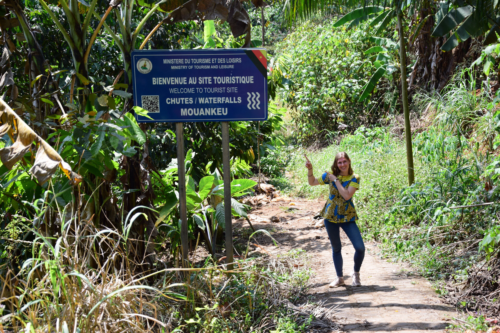
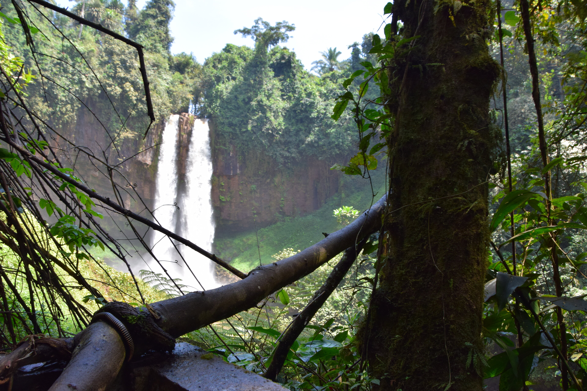
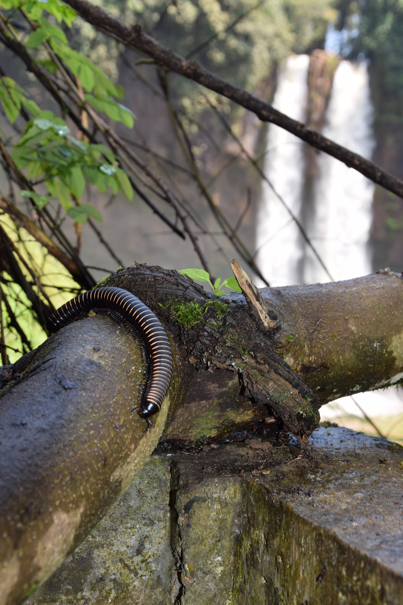
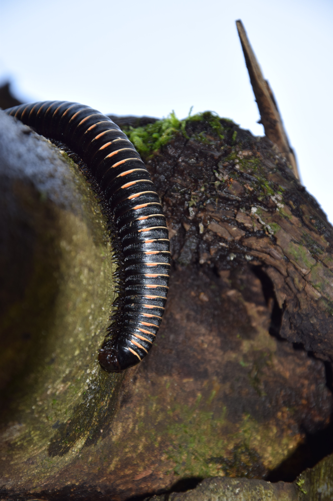
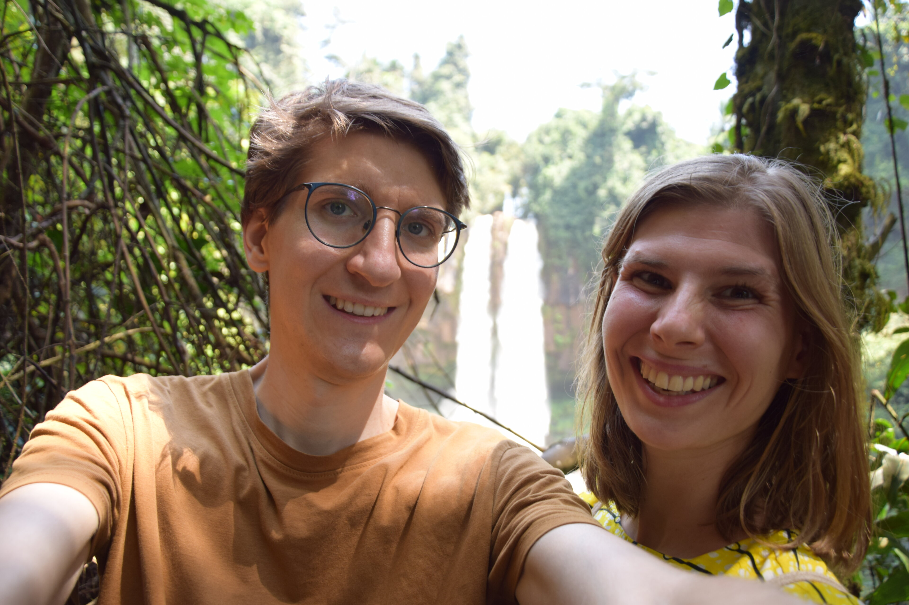
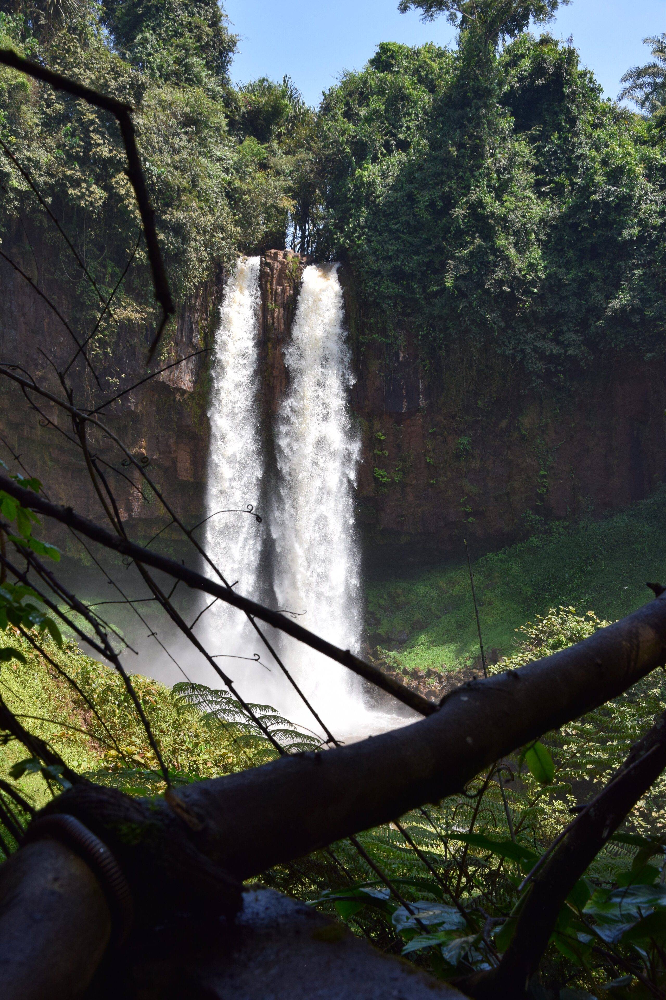
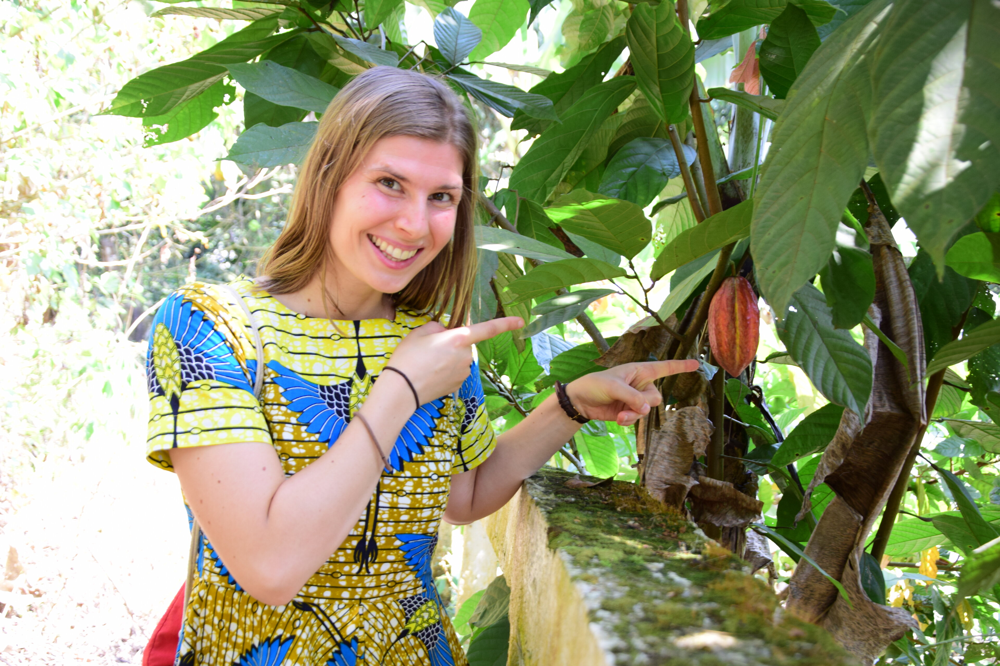
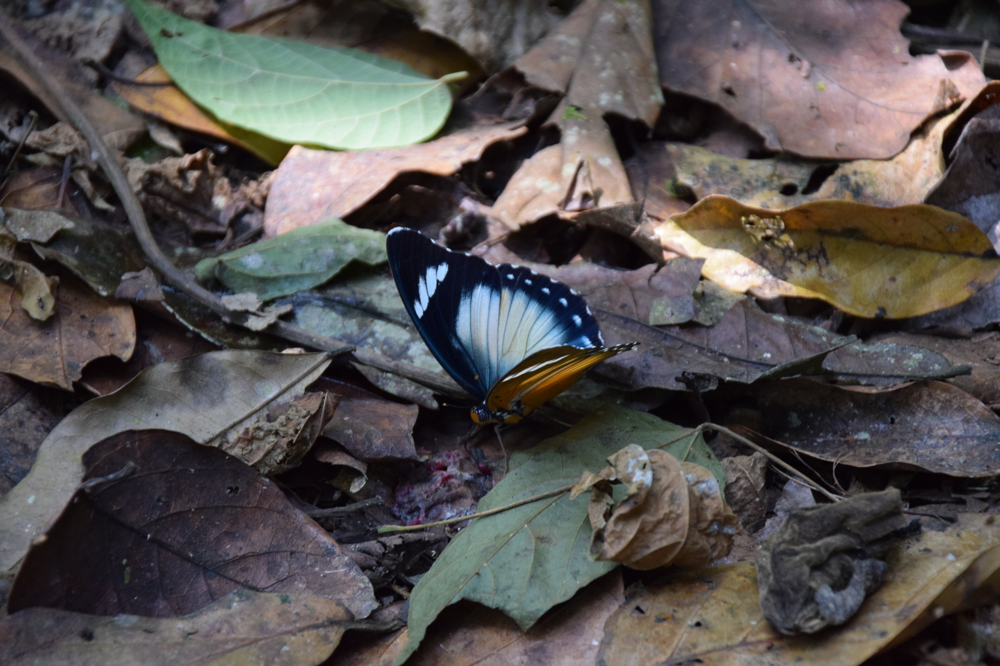
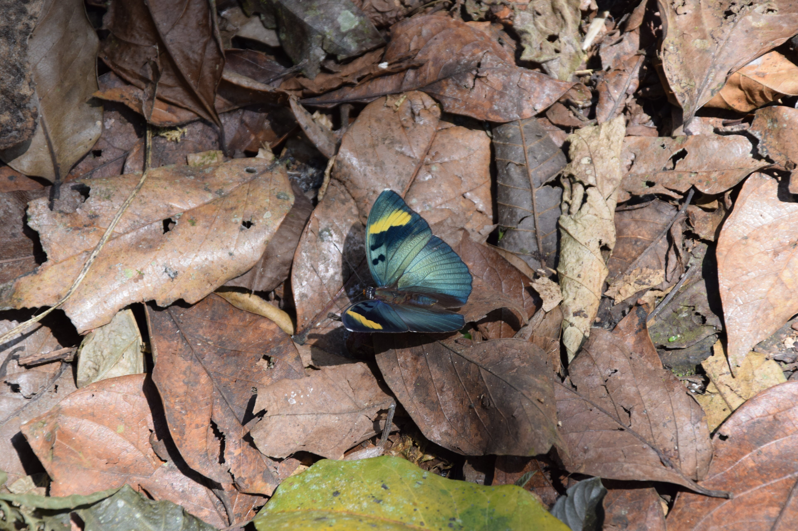

Für ein Klassentreffen unserer Gastgeberin bot sich uns die Gelegenheit in den Heimatort Bafang in West Kamerun mitzukommen. Praktischerweise waren sowohl Unterkunft bei Familie als auch die Hinfahrt über eine Mitfahrgelegenheit bereits geregelt. Und so begann unsere 3-nächtige Exkursion.


**Challenge:** Wer findet den _Schuh des Manitu_?


## Anreise
Um 5 Uhr früh am Samstag waren wir also auf den Beinen und abfahrbereit. Auch ein ehemaliger Mitschüler traf kurz darauf bei uns ein. Doch nun begann ein langes Warten, unsere Mitfahrgelegenheit kam und kam nicht. Zuerst war er nicht erreichbar, dann war das Auto (angeblich) eingeparkt. Gegen 7:30 Uhr fuhren wir dann mit einem Sammeltaxi an eine der Ausfahrtsstraßen Yaoundés. Dort warteten wir dann noch eine weitere Stunde und um 9:30 ging es schlussendlich los: gleich mitten in den Stau, den wir mit der frühen Abfahrt eignelich vermeiden wollten. Nachdem wir aber erst einmal aus der Stadt raus waren, ging es auf einer in bestem Zustand geteerten Straße relativ schnell nach Bafang. Da Fern- und Nahverkehr hier nicht getrennt sind, kommt man alle paar Kilometer durch _Ein-Straßen-Dörfer_. Dort kann man jeweils nur __sehr__ langsam fahren und _Händler_ bieten ihre Ware an. Somit konnten wir unsere Fahrt durch ein paar neue Snacks versüßen.

## Unsere Unterkunft


In Bafang wurden wir sehr herzlich im Elternhaus von Host-Sandrine aufgenommen. Generell ist der Stil des Hauses sehr ähnlich zu unserem Stammsitz in Yaoundé. Allerdings ist die Zuverlässigkeit der Strom- und Wasserversorgung nochmals deutlich reduziert und Wifi gibt es nicht. Dafür kamen wir in den Genuss eines größeren Hofs, mit kleinem Garten (mit Kochbananen, Mais, ...). In diesem verbrachten wir gerne die lauen Abendstunden. Da Bafang bereits auf knapp 1400m Höhe liegt (Yaoundé ~750m), ist es leicht kälter und die Luftfeutigkeit etwas reduziert. Zumindest in der Trockzeit ergibt das für Felix' Geschmack ein perfektes Klima.

## Partyabend
Etwas unerwartet wurden wir am Ankunftsabend vor die vollendete Tatsache gesetzt das es in etwa einer Stunden (23 Uhr) in Dubai, die lokale Disco, gehen wird. Nach anfänglicher Müdigkeitsüberwindung, schließlich waren wir bereits 17 Stunden auf den Beinen, hatten wir einen lustigen Abend zwischen original Afrodance und Ultra-Fight-Club im Hintergrund TV.



## Familiensonntag

**Hinweis:** Hier kann jeder _Verwandter_ sein. Personen einige Jahre älter als man selbst, sind häufig _Mütter_ oder _Väter_, machnmal aber auch _Tanten_ und _Onkel_. Etwa Gleichaltrige sind _Schwestern_ und _Brüder_.


Am Sonntag musste Host-Sandrine bereits zurück nach Yaoundé, aber wir blieben und verbrachten den Tag mit ihren _Schwestern_ (davon 3 tatsächliche Schwestern) und _Müttern_. Zunächst erkundeten wir etwas die Stadt, aber im Wesentlichen saßen wir an der Hauptstraße - eine der wenigen geteerten Straßen - in der Küchennische eines Restaurants (für uns eher Imbiss). Hier unterhielten wir uns gut, auch mit der Inhaberin, die parallel den Betrieb aufrecht erhielt. Neben uns befand sich der Busbahnhof mit Verbindungen zur größten Stadt Douala und entsprechend konnten wir gut dem bunten Treiben zuschauen.

## Rundtour: _Chefferien_ & Natur
Unseren letzten verbleibenden Tag wollten wir nutzen um die Gegend zu erkunden. 

**Chefferien** sind die Sitze der traditionellen Oberhäupter einer Gemeinschaft. Die Chefs bilden zusammen mit den staatlichen Vertretern (z.B. Bürgermeistern) und religiösen Oberhäuptern verschiedene Aspekte der Gesellschaft ab. Alle drei haben Befugnis über gewisse Belange zu entscheiden.


Erster Stopp, die _Chefferie Bafang_ am Westende von Bafang gelegen. Diese hat einen schön verzierten Vorhof und ist bereits von weitem durch spitze Dächer zu erkennen. Dort wurden wir herzlich empfangen und durften auch den inneren Bereich besichtigen, wo seine Majestät gerade tagte.



Zweiter Stopp, nur wenige Minuten weiter der Wasserfall von Mouankeu kurz außerhalb der Stadt. Der Eingang zu einem etwas zugewachsenen Weg war sogar ausgeschildert und ein im Verfall begriffenes Kassenhäuschen gab es auch. Etwas überrascht waren wir dann doch als nach kurzem Spaziergang duch etwas Urwald ein riesiger Wasserfall vor uns auftauchte. Auf der Plattform entdeckten wir bald auch einen großen Tausendfüßler und an einer etwas lichten Stelle schwirrten viele Schmetterlinge. 


  
  
  
  
  
  
  
  
  


Als nächstes erklommen wir auf kleinen Wegen die nördlich gelegenen Hügel. Hier wechselten sich Urwald und kleine Plantagen ab. Wir entdeckten (Koch-) Bananen, Bohnen, Chilli, Kakao, Papaya und Kaffee, haben sicher aber auch manches übersehen oder nicht erkannt. Die bunten Früchte mit den sanften begrünten Hügeln und ab und zu kleinen Bächen boten ein schönes Bild und der Tag fühlte sich an wie im Paradies.
Später kamen wir an der Chefferie Balen vorbei und auf dem Rückweg begegneten wir noch einem Hirten mit seiner Rinderherde.



## Rückfahrt
Am nächsten Tag ging es um sieben Uhr zum Busbahnhof, um noch Tickets nach Yaoundé zu bekommen. Nach einigen Stunden Wartezeit durfte der Kaufreihenfolge nach in den Reisebus eingestiegen werden. Wir bekamen gute Zweierplätze (fünf Plätze pro Reihe) und die Fahrt war solide und bequem. Durch ein paar kürze Stopps, vorallem aber Staus um und in Yaoundé erreichten wir unser zu Hause dann etwas erschöpft aber zufrieden gegen 19 Uhr.

 ging es gemütlich mit dem Bus zurück nach Yaoundé.")

 

