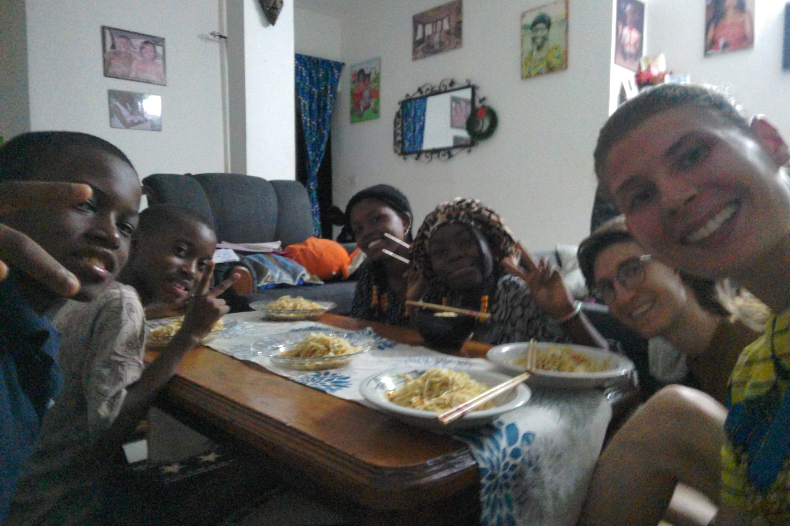



Weihanchten ist hier so ein Ding. Wenn man fragt, scheint es ein größeres Fest zu sein, auf das sich Leute freuen und einstellen. Wie man hört, laufen im Dezember auch viele Aktivitäten nur noch auf Sparflamme, schließlich bereitet man sich auf das besinnliche Fest vor, geht weniger raus und verbringt die Zeit vor Weihanchten lieber im heimeligen Zuhause. Für uns war in der Gesamtatmosphäre der Adventszeit allerdings kaum ein Unterschied spürbar. Wenn überhaupt, dann waren die Straßen - vor allem Abends - kurz vor Weihnachten voller und wuseliger, war es um diese Zeit doch deutlich schwieriger an ein Taxi zu kommen. Auch schien bis kurz vor Weihnachten gar nicht besonders klar, wer eigentlich wann genau frei hat. Während für den Papa angekündigt wurde, dass er sowieso durcharbeiten müsse, schien für Schüler und Studenten selbst bis zum Tag davor nicht richtig klar, wann jetzt genau keine Kurse stattfinden. Doch in Summe wurde das Fest mit Freude antizipiert und gefeiert. Aber der Reihe nach:

## Vorbereitungen
Wenige Tage vor Weihnachten kramten die Kinder in freudiger Vorbereitung den kleinen zusammensteckbaren Tannenbaum aus dem Schrank hervor und hatten sichtlich Freude am Schmücken. Selten haben wir ein so voll behängtes Bäumchen gesehen. Kamerunische Weihanchtsmusik wurde uns gesagt gibt es nicht, also waren kurz französische Weihnachtslieder am Start, dann aber schnell ein Wechsel zu modernem Afrorap. Zwei Adventskränze aus Plastik wurden ebenfalls im Wohnzimmer verteilt und tadaaa, da war sie die Weihnachtsstimmung.



## Schulfeier und Adventszeit
Zum Trimesterende lud die Grundschule der beiden Jungs zu einer Feier ein - und beim Feiern gibt es hier keine halben Sachen. Meine Güte, was für eine Morzstimmung: laute energetische Mucke, Moderator, sogar ein DJ wurde engagiert um die stolzen Eltern (vor allem Mütter) bestens zu unterhalten. Hin und wieder sangen ein paar Schüler Karaoke, im Wesentlichen bestand das Programm aber in Tänzen die jede Klasse vorbereitet hatte. Und bei den Kinderscharen, lasst euch sagen, das waren es eine Menge Tänze. 😅 Während der Tänze kamen von Zeit zu Zeit stolze Mamas und Papas, Tanten und Onkel zu den tanzenden Kindern und ließen Geldscheine auf ihren Schützling fallen, das der Schule als Spende dient.



Im Anschluss wurden für jede Klasse dann noch Auszeichungen an die 5 besten SchülerInnen verliehen, jedes Mal unter nicht weniger späktakulär übersteuerten, fancy DJ-Sounds.🔊



## Heiligabend
Heiligabend verlief im Wesentlichen... unaufgeregt. Bis ca. 17 / 18 Uhr war von weihnachtlicher Stimmung keine Spur. Doch mit der Dämmerung fing dann ganz plötzlich der große Vorbereitungstrubel für den 25. an: Zum einen das groooße Kochen und Backen. Zum anderen die Wohung blitzblank putzen und das Wäschewaschen. Nach dieser Abendlichen Intensiv-Arbeitseinheit ging es dann gegen Mitternacht ins Bett, zumindest für uns. Sandrine war noch bis kurz vor 3 Uhr nachts beschäftigt.



## Weihnachten bei Familie
Der Weihnachtsmorgen begann umso normaler und ruhiger. Die Kinder bereiteten sich für den Tag vor, machten sich schöne Frisuren und warfen sich in Schale, aber alles in sehr gemächlichem Tempo. Am frühen Nachmittag ging dafür dann aber alles wieder schneller. Der Papa kam von der Arbeit und wir fuhren alle zusammen  - warum sollte man sich auch durch einen Fünfsitzer beschränkt fühlen, wenn man zu acht ist? - zu einer Tante am anderen Ende Yaoundés, die unsere Gastfamilie noch nie besucht hatte. Den restlichen Tag verbrachten wir gemeinsam mit einem guten Teil der väterlichen Verwandtschaft, die nach und nach zu uns stießen. Auch hier wurden uns wieder einige Brocken des hiesigen Lokaldialketes vermittelt, es wurde viel gegessen, getrunken und gentanzt. Die Stimmung war sehr herzlich und offen.



## Geschenke
... von Seiten der Familie gab es für die Jungs am Morgen des 25. Wir selbst haben das allerdings erst im Nachhinein mitbekommen, denn der Spielzeug-Helikopter war nicht eingepackt, somit haben die Kinder dieses Geschenk schon entdeckt und genutzt, bevor wir überhaupt aus dem Zimmer kamen. Von unserer Seite haben wir beschlossen, die Geschenke zum Thema Japan zu besorgen. Insgesamt hatten wir viele Geschenkideen, doch nicht wenige davon waren entweder nicht auffindbar oder unverhältnismäßig teuer. Daher waren wir froh, als wir den Kindern, die eine große Begeisterung für Japan hegen Essstäbchen, Sojasoße, Nudeln auftreiben und mit ihnen einen Asiaabend machen konnten. Dazu gab es noch ein paar Kleinigkeiten. Platziert hatten wir die liebevoll verpackten Päckchen unter dem Bäumchen an _Heilignachmittag_. Zum gemeinsamen Auspacken kam es dann am Abend des 25. nach unserer Rückkehr vom Familienfest.

## Zweiter Weihnachtsfeiertag?
Im Kontrast dazu wurde am zweiten Weihnachtsfeiertag dann - alles andere als andächtig - wieder normal gearbeitet. Die Feierlichkeiten waren somit kurz aber intensiv.

