Nachdem wir für etwa 10 Wochen vorwiegend in Yaoundé gelebt haben, wollten wir in den letzten Wochen unsere Kamerun Erfahrung noch etwas diversifizieren. _Zwischen den Jahren_ packten wir also unsere sieben Sachen, verabschiedeten uns schweren Herzens von unserer Gastfamilie und liefen ein letztes Mal unsere liebgewonnene Straße rauf, um mit __"300, 2 Plätze, Terminus Mimboman, geben 500"__ unsere Reise zum Nationalpark Dja zu beginnen.

## Anreise
Der Nationalpark Dja grenzt an eine große Biegung des gleichnamigen Flusses im Süd-Osten Kameruns. Der Haupteingang liegt direkt am Dorf _Somalomo_ und zu unserem Erstaunen gab es sogar Direktverbindungen dorthin - ~250km, Fahrtdauer ~8h . Los sollte es gegen 13-14 Uhr gehen und tatsächlich tauchte gegen 14 Uhr ein etwas klapprig wirkender Kleinbus im Busbahnhof auf.
Eine Weile und eine kleine Gebühr später waren unsere Sachen im _Kofferraum_ und auf dem Dach verstaut und wir hatten in der letzten Reihe noch zwei Plätze reserviert, einer sogar mit Fenster, dafür war die Beinfreiheit durch den Radkasten eingeschränkt.



Beim Einsteigen lernten wir auch schnell unseren Sitznachbarn kennen, er döste weitestgehend betrunken auf unseren _Reservierungstaschen_. Die restliche 5er Reihe wurde schnell durch seine Kumpels aufgefüllt und da der Bus auch sonst weitestgehend mit Dorfbekanntschaften gefüllt war - nicht wenige mindestens angetrunken - starteten wir die Reise heiter mit zweistündiger Verspätung.

.")

### Hält der Bus?
Der erste Abschnitt der Fahrt endete unerwartet früh, als eines der zahlreichen Mängel des Buses akut wurde und wir am Rande der Straße zum Stehen kamen. Zeit und ein Draht konnte das Problem offensichtlich beheben und es ging weiter. 🙂

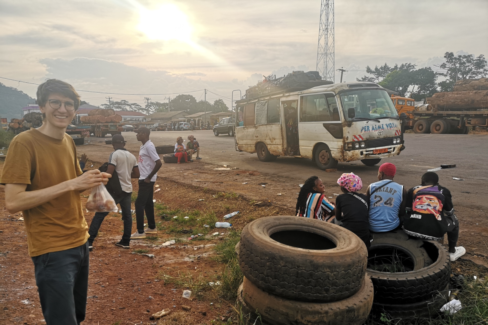

Der Alkohol- und Lautstärkepegel wurde über die Fahrt hinweg durch Hochprozentiges in 50 ml Tütchen gehalten! Insbesondere das Smartphone unseres Nachbarn, welches seine weiter vorne sitzende Schwester aufbewahrte, war ein Dauerthema ("ANGE, GIB MIR MEIN TELEFON!") und wurde von den Kumpels ("Junge, das geht doch nicht, dass du kein Telephon hast?!") stets aufs Neue angefacht.

### Die richtige Straße macht den Unterschied
Gegen 23 Uhr gab es einen weiteren Stopp, der Karte nach nicht weit entfernt von Somalomo; doch zu früh gefreut! Jetzt, mit dem ungeteerten Abschnitt, ging der Spaß erst richtig los. Es wechselten sich dichter Staub bei ca. 20 km/h Fahrtgeschwindigkeit mit durch den Unterboden eintretenden Abgasen beim Stehen ab, dafür wurden unsere Co-Reisenden ruhiger. Kurz vor dem Dorf landeten wir noch 30° seitlich geneigt halb in einem Graben, aber der Motor sprang bald wieder an und ermöglichte unsere wobblige Weiterreise. Um 1h morgens ereichten wir vollends bedeckt von einer beeindruckend klebrig-feuchten Staubschicht Somalomo. 🎉



Zum Glück gestaltete sich die Herbergssuche denkbar einfach: eine Enkelin von _Mama Rose_, der Besitzerin der einzigen Herberge des Dorfs, war mit an Board. Nach kurzem Marsch quer durchs Dorf bekamen wir problemlos ein Zimmer und fielen nach notdürftiger Katzenwäsche direkt ins Bett.
 

## Auberge Terre Promise chez Mama Rose
Erst am nächsten Tag kamen wir in den Genuss des Anblicks unserer kleinen idyllisch gelegenen Herberge. Die Austattung ist einfach, weder Strom noch fließend Wasser, aber der Brunnen ist nicht weit, es gibt saubere Betten mit Mückennetz und in der Rustikalität besteht Charme. Wir waren während der fünf Tage die einzigen Gäste auf acht Zimmer und konnen so in Ruhe dem familieren Treiben zusehen. Mama Rose verbrachte fast den gesamten Tag in der rauchigen Küche, wo von morgens früh bis in die späten Abendstunden für die Familie und uns Mahlzeiten über offenem Feuer zubereitet wurden. 


  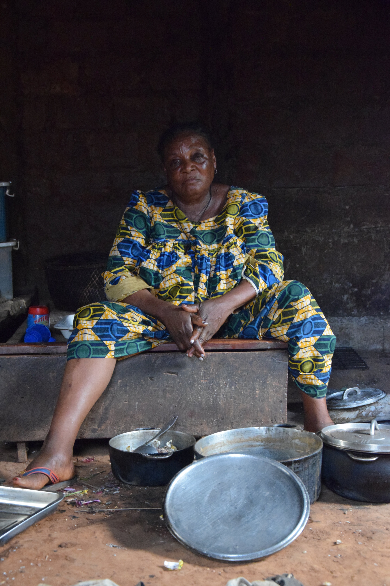
  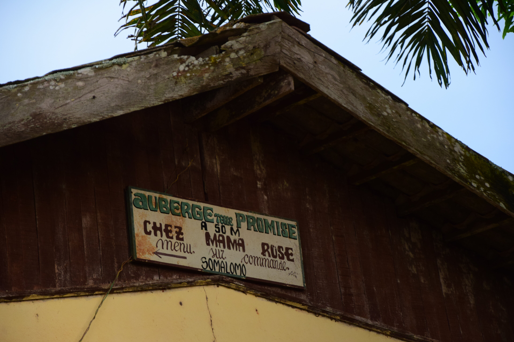
  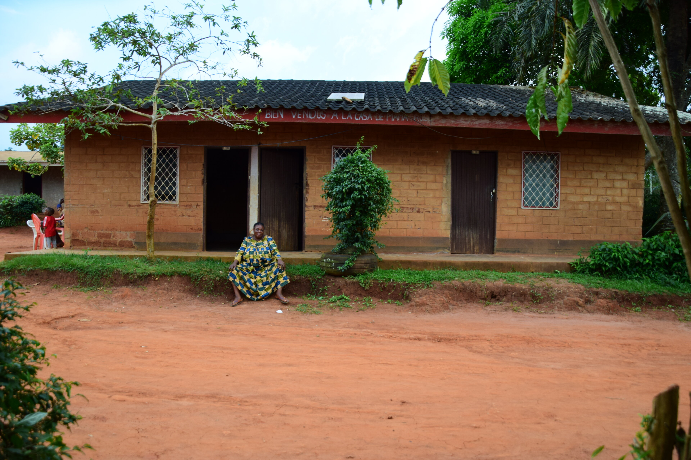
  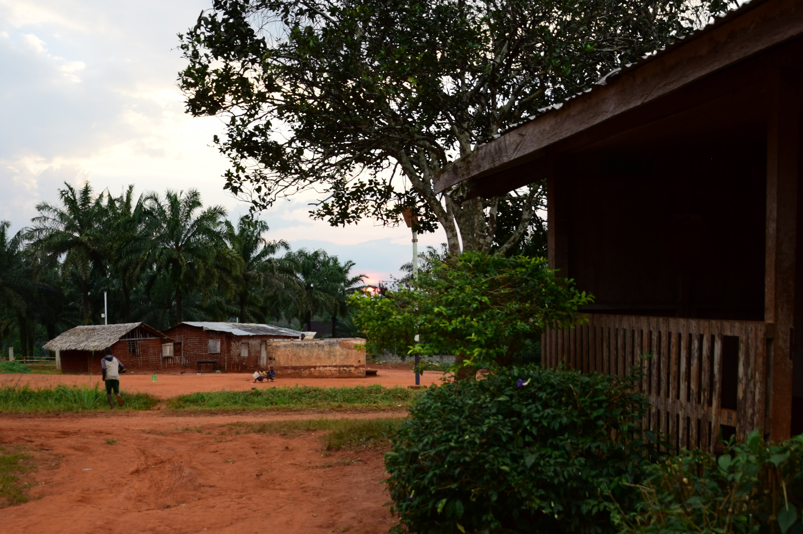
  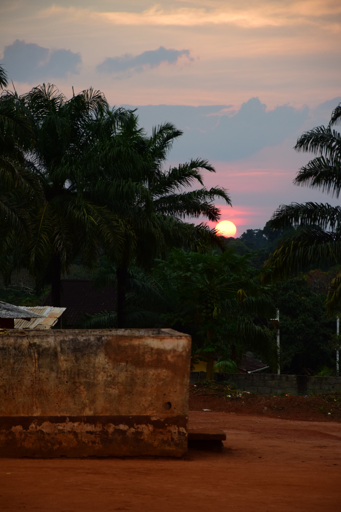
  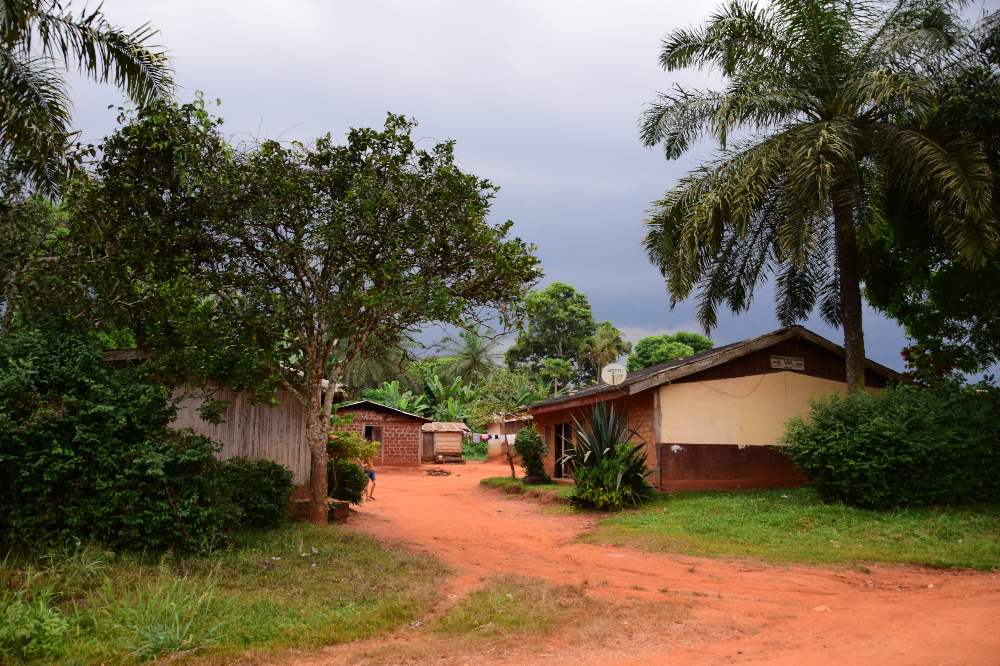
  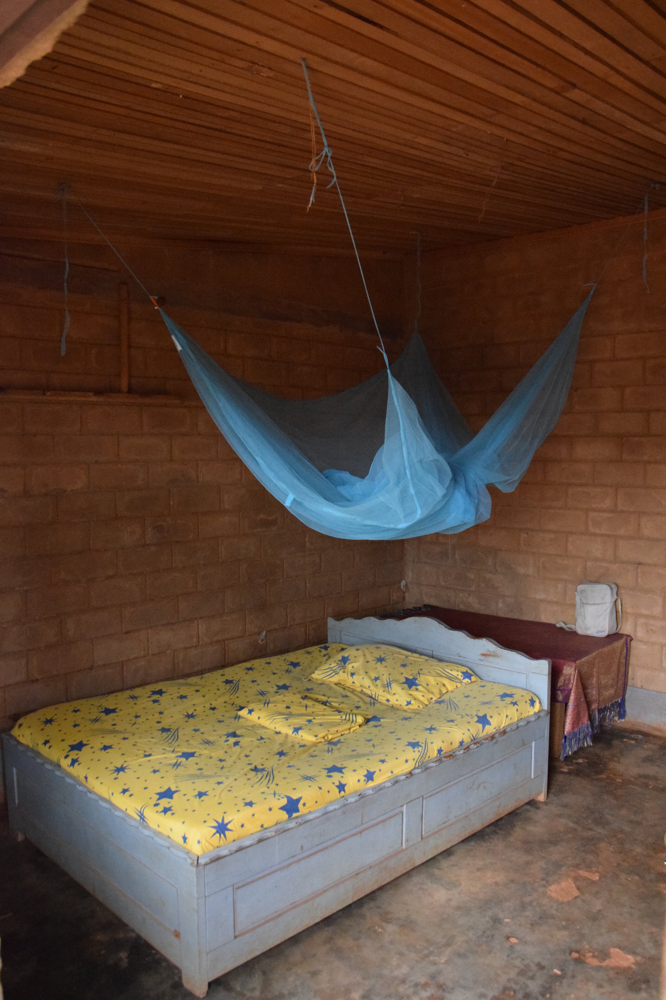
  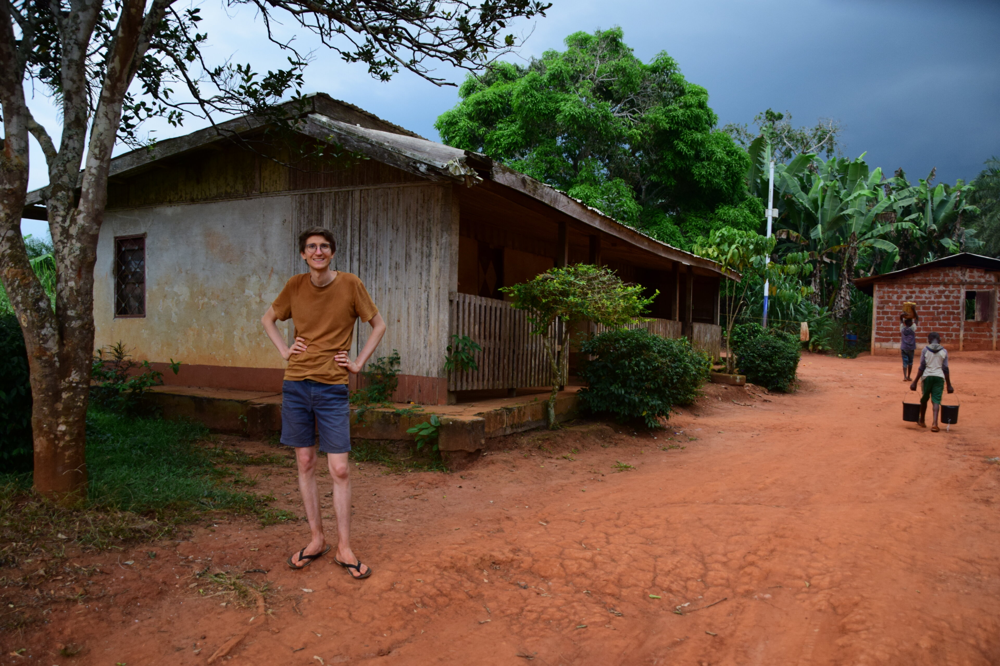
  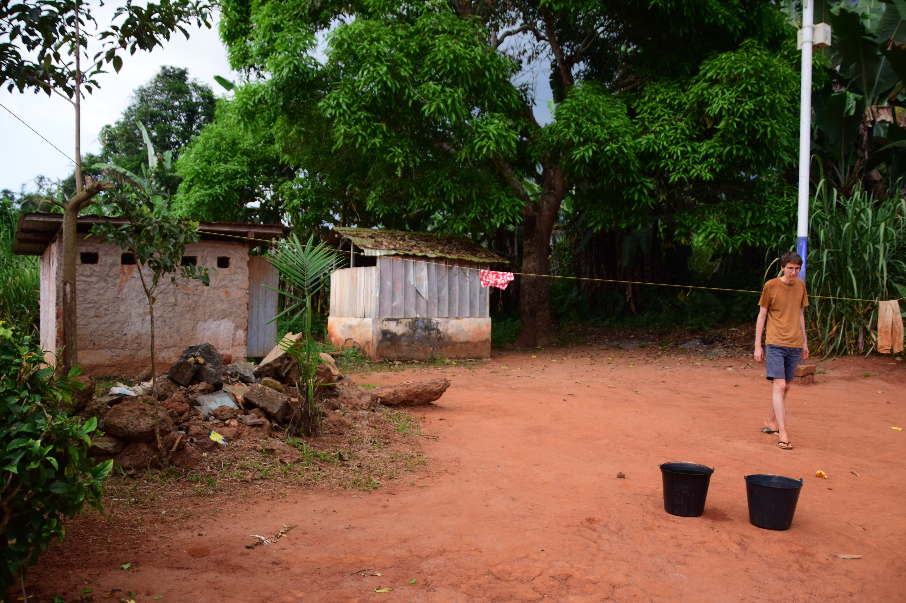
  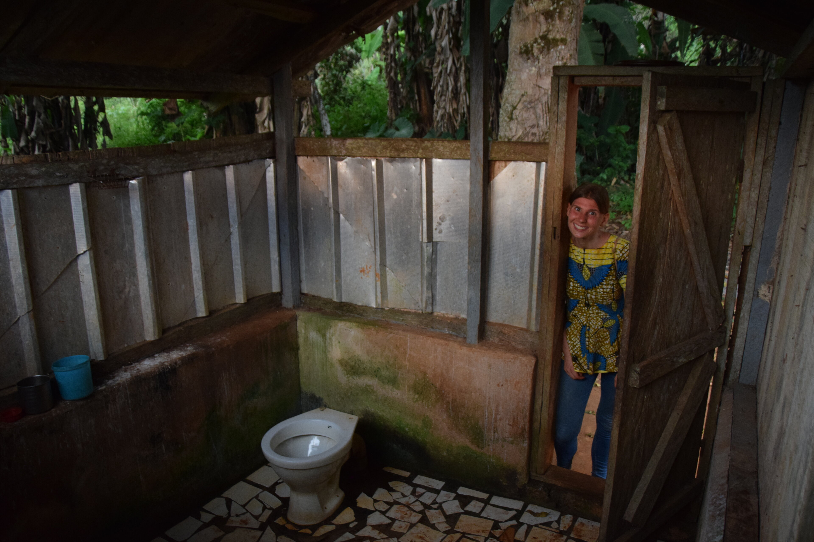
  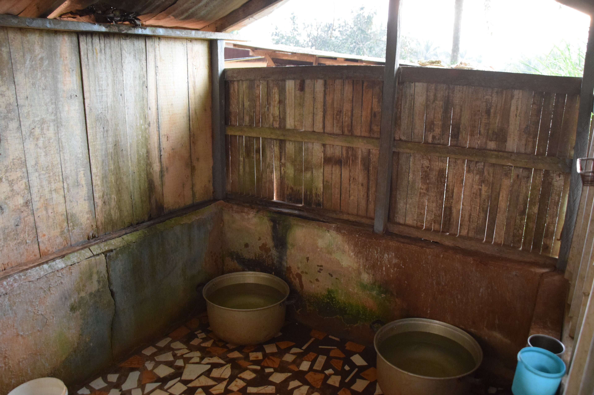
  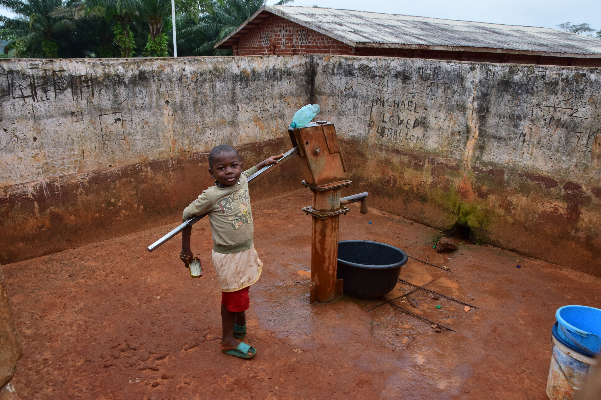
  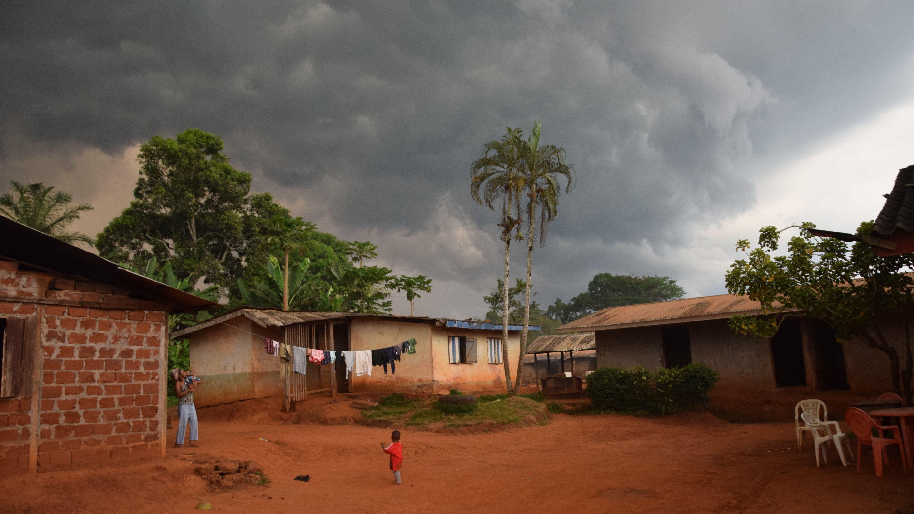
  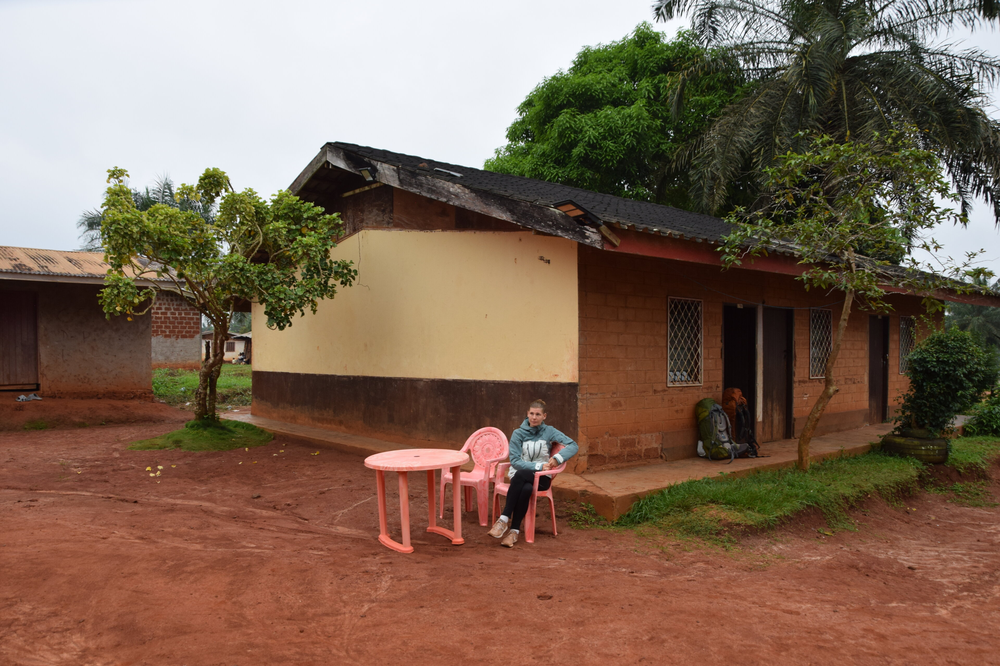


## Expeditionsplanung
Am kommenden Vormittag hatte sich unsere Ankunft bereits herumgesprochen. Waren wir noch nicht einmal auf den Beinen, schon wartete neben unserem (nicht bestellten) Frühstücksomlett eine _Touristendelegation_ auf uns.
i
Nach dem Essen bekamen wir von _Papa Leopold_ ein paar Optionen für die Besichtigung des Reservats vorgestellt. Neben Kosten für den vorgeschriebenen Guide und Parkwächter, Essen und Eintritsgebühren, enthielt die Kostenauflistung auch ein paar dubiosere Punkte. Insbesondere das _Eintragen bei der lokalen Polizeistation_ war  erstaunlich teuer und brauchte zwingend einen Umschlaig. Trotzdem wurde sehr häufig betont, dass wir am Ende für alles Quittungen erhalten würden - Spoiler: haben wir nie gesehen. An anderer Stelle brauchten wir nur ein _Bier_ auszugeben um Schlafpätze in einer Forschungsstation im Dschungle zu erhalten und, um dem Prozess nachzuhelfen, wurde hervorgehoben, dass wir _nicht kompliziert_ seien.



## Somalomo
Am Ende des Nachmittags hatten wir Alles für unsere Urwaldtour organisiert und erkundeten noch ein wenig den losen Zusammenschluss von Häusern, genannt Somalomo. Abends kochte uns Mama Rose noch leckeren Maniok mit _Feuilles_ (dt. Blättern) - gemeint Gemüse - und wir wurden Zeuge vom Regen, der _die Jahre voneinander trennt_... hätte dieser, was unsere staubige Busfahrt betrifft, nicht einen Tag eher kommen können?



