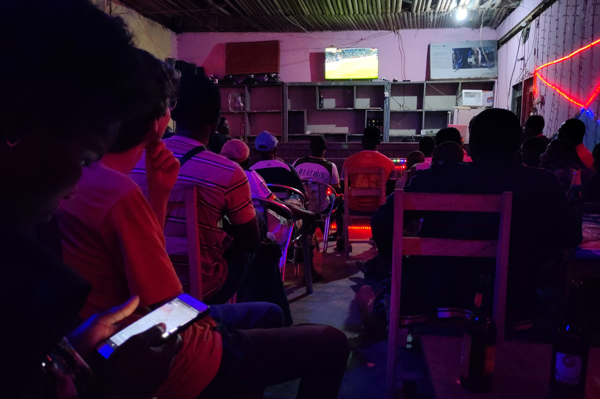

Für die Rückreise wollten wir, statt zurück nach Yaoundé, lieber noch weitere Gegenden erkunden. Daher hatten wir uns bei unserem Touren-Team in Somalomo erkundet welche Alternativen es gibt. Nicht viele, denn es gibt genau drei Wege aus Somalomo: Die bekannte Staubroute Richtung Yaoundé, eine weitere die nach 60 km im Nationalpark endet und eine dritte gen Westen, die allerdings nur für Motoräder geeignet ist.
Ohne nach Yaoundé zurückzufahren -  am geplanten Reisetag ging sowieso kein Bus -, blieb für uns nur die dritte Strecke, welche zudem auch noch Richtung Kribi führt - genau zu unserem auserkorenen Ziel.

Nach der Motoradstrecke, sollte es mit Reisebussen und einem weiteren Stopp in Sangmelima direkt nach Kribi gehen. Die Theorie war also klar und da es keine Option gab an frisches Bargeld zu kommen, hatten wir die genannten Preise (mit Puffer) bereits in unsere Budgetplanung für den Dschungletrip miteinbezogen.

## Aller Anfang ist schwer
Nach einem schnellen Frühstück, soviel Zeit muss sein, verabschiedeten wir uns von unserer Herbergsmutter. Hier gab es ein kleinen _Schluckauf_, da wir die Preise für Essen pro Tag verstanden hatten, diese aber pro Mahlzeit gedacht waren. Somit verkleinerte sich bereits direkt zu Beginn unser Puffer.

Dafür ließ sich unser Guide nicht davon abbringen sicherzustellen, dass wir die erste Etappe gut starten und begleitete uns zu einer Gruppe von Motradfahrern, die an ihren Maschinen schraubten. Schnell stellte sich heraus, dass unser Gepäck doch zu groß war um nur ein Motorad zu nehmen; als hätten wir dies nicht explizit bei der Planung bereits gefragt. Nun gut, wir konnten immerhin einen guten Preis für zwei Motoräder raushandeln, Pufferschrumpfung zum zweiten, und ab ging die Post.



Was zunächst auf einem Feldweg begann, wurde schnell zu einer Fahrt mit bis zu 60 km/h auf einem kleinen Weg, gerade breit genug für die Motoräder. Der Pfad schlängelte sich die Hügel auf und ab, am Rand des Dschungels vorbei, über einfache Holzbrücken und durch kleine Siedlungen. Insgesamt war die vorbeifliegende Natur sehr idyllisch, insbesondere Tunnel aus sich von beiden Seiten überberbeugendem Bambus entzückten uns, sofern wir nicht zu sehr mit festklammern beschäftigt waren.



Das letzte Stück führte noch über die _Nationalstraße N7_, eine etwa 2m breite ungeteerte Straße. Hier gab es auch prompt mehrere Straßenkontrollen. Bei der letzten wurden die Papiere unserer Fahrer erneut kontrolliert, aber diesmal gab es scheinbar ein Problem, denn für eine gute Weile konnten wir nicht weiterfahren. Dann ging es ohne die Papiere weiter und die Fahrer erklärten, dass der Polizist einen erhebllichen Teil der vereinbarten Bezahlung verlangt um ihnen die Papiere zurückzugeben. Kurz darauf kamen wir in Bengbis, einem Dorf mit mehreren Straßenzügen an.

## Ab jetzt wird es einfach
In Bengbis fanden wir schnell einen Busbahnhof und für den selben Tag noch eine Verbindung nach Sangmelima. In der Wartezeit schauten wir uns das Dorf an und kauften uns ein wenig Proviant.
Am frühen Nachmittag kam dann der Bus und gegen eine kleine Gebühr drufte auch unser Gepäck mitkommen. Die Fahrt ging zunächst ungeteert, später aber auf neu aufgetragenem Asphalt, weiter und wir erreichten den _Galaxy-Busbahnhof_ in Sangmelima am frühen Abend.

In Sangmelima erkundeten wir uns nach dem Direktbus nach Kribi (~230 km westlich gelegen), schließlich hatten wir Ambitionen vielleicht noch am selben Tag, oder zumindest in der Nacht, anzukommen. Doch die Leute schienen etwas verwirrt, der einfachste Weg nach Kribi sei mit einem Zwischenstopp über Yaoundé. Nach etwas längerem Fragen fanden wir allerdings auch ein paar Personen die meinten, man könne auch ab Ebolowa (ca. 1/3 der Reststrecke) einen Kleinbus nach Kribi nehmen. Allerdings sei die Straße schlecht und deswegen würde es beschwerlicher und länger dauern. Nach kurzer Überlegung kauften wir also Tickets nach Ebolowa und etwas später waren wir in einem so gut wie modernen Bus wieder unterwegs. Die gesamte Strecke war neu gemacht und trotz monsuartigen Regens erreichten wir am späteren Abend Ebolowa.



Während der Fahrt erfuhren wir durch einen Mitfahrer einige Details über, wie sich herausstellte, die letzten __zwei__ Abschnitte. Denn, 100 km von Kribi entfernt, gab es noch immer keine durchgehende Verbindung! Ein weiterer ungeplanter Zwischenhalt in Akom II war also nötig.

## 🛵(🎒👨🏿👜👩🏼🎒👨🏼🎒)
Da abends sowieso keine Fahrzeuge mehr nach Akom II aufbrachen, war für heute erst einmal Schluss. Wir suchten uns ein Hotel nahe der Abfahrtsstelle nach Akom II und fanden einen mutigen Motroadfahrer der uns, frei nach dem Motto _"für Hund und Katz ist auch noch Platz"_mit all unserem Gepäck dorthin bracht. Die Fahrt war kurz aber intensiv: Vorne Lenker, dann Eastpack Rucksack, gut gelaunter Fahrer, Sandrine mit Handtasche und großem Rucksack, Felix sich an der Jacke des Fahrers festgreifend, Ende der Sitzbank, Felix' Rucksack. Im Hotel fielen wir dann nach einem kurzem Snack schnell ins Bett.

## Ziehen wir's durch!
Am kommenden Morgen waren wir früh an der Abfahrtsstelle nach Akom II und reservierten uns zwei Plätze in einem Pickup. Wie üblich sollte es bald losgehen, aber tatsächlich dauerte es doch bis fast Mittag. In der Wartezeit sahen wir beim _Songo_ spielen zu, welches wir hier im Süden sehr viel sahen.

Schließlich wurde unser Gepäck auf den Überbau eines Pickups geladen und als wir die größere Gruppe Menschen um das Auto stehen sahen wurde uns bewusst, dass wird eng. Zunächst stiegen die älteren ~6 Mitfahrer ins Auto ein. Dann nahmen wir restlichen ~14 auf der mit Plane umbauten und bereits gut bepackten Ladefläche platz, stets vier mit dem Rücken zur Plane, sowie die letzten vier mit baumelden Beinen. Wir hatten einen Bein-Baumel-Platz ergattert und tauschten bei den regelmäßigen Stopps immer wieder die Plätze. Insgesamt fuhren wir so etwa vier Stunden mit ca. 20 km/h die mit Schlaglöchern übersehte Straße entlang.





Kurz vor Akom II kamen wir erneut zum Stehen, aber diesmal nicht für eine normale Pause, sondern weil ein entgegenkommendes Fahrzeug im Matsch (von Waldarbeiten) steckengeblieben war und den Weg blockierte. Die Passagiere des steckgebliebenden Fahrzeugs waren teils bis zu den Knien voll Matsch, da sie seit zwei Studen versucht hatten den Transporter zu befreien. Doch jetzt gab es neue Hoffnung, ein (nicht überladener) Pickup mit Allradantrieb kam zufällig (nicht) vorbei und nach einigen Anläufen mit Ziehen, Schieben, einem Batteriewechsel und etwas Glück war die Stelle wieder _passierbar_.



Nun verkeilte sich nur noch ein dicker Ast in unserem Unterboden, aber das war vorerst auch die letzte Aufregung und am späten Nachmittag kam unser letzter Zwischenstopp in Sicht.



## Toooor, Fußball verbindet!
Da waren wir also in Akom II, mit knappen 20 Stunden nichts im Bauch und doch erstaunlich gut auf den Beinen (ein Hoch auf Adrenalin). Kaum krabbelten wir aus dem Lastwagen heraus, erblickte uns auch schon der Polizist des Dorfes und nahm uns zur Identitätsüberprüfung und Anmeldung unserer Anwesenheit mit auf die Wache - keine 50 m weiter.


**Info:** Akom II als Dorf zu bezeichnen wäre schon gewagt, besteht es doch praktisch ausschließlich aus der Kreuzung zweier kleiner unbefestigter Straßen.


Auf der Wache erhielten wir die Information, dass der Transport nach Kribi noch am selben Abend von der gleichen Straße abfährt und eine junge Frau begleitete uns zum Warten auf die Mitfahrgelegenheit auf die gegenüberligende Straßenseite. Schnell fanden wir heraus, dass auch sie - Marie - auf schnellstem Wege nach Kribi muss. Für die gemeinsame Wartezeit bestand sie, trotz dankbaren Ablehnens da wir schließlich durch die drei ungeplanten extra Etappen echt knapp bei Kasse waren, herzlich und gastfreundlich darauf, uns ein Kaltgetränk zu organisieren.

Da saßen wir also, zwei von diesen _"reichen"_ weißen Touris in Akom II, mit leerem Magen, noch nicht einmal in der Lage, sich ein Getränk zu leisten und dennoch wie die Prinzen empfangen und beschnenkt. Selten war eine kalte _Orangina_ so ein wohltuender Segen. Genussvoll zischten wir sie weg, während wir uns mit Marie austauschten.



Einige Zeit später - gegen 20:00 Uhr - kam unser Fahrer. Auch hier war der Preis wieder höher als zuvor angekündigt und somit reichte unser restliches Bargeld knapp nicht mehr aus, um die Reise für uns beide zu bezahlen. Auch das Schildern unserer Situation und jegliche Verhandlungsversuche blieben erfolglos; es war der genannte Preis oder nichts. Glücklicherweise sprang uns unsere Mitfahrerin Marie zu Hilfe und streckte uns das fehlende Geld vor. Der letzte Teil unserer Reise nach Kribi war somit eingetütet, die Rücksäcke beim Auto abgeladen, jetzt konnte nichts mehr schief gehen.

"_Los gehts_", dachten wir, aber nein, Abfahrt ist erst um 2 Uhr Morgens. Perfekt, denn das CAF AFCON (Afrika-Nationaltunier) Fußballspiel Kamerun gegen Südafrika stand heute Abend an - und wer braucht schon Schlaf? Also führte uns Marie in eine _Public Viewing_ Bar und bestellte uns jeweils ein Bier (hier 0.66 L). Die Stimmung war super, Kamerun gewann und eingelullt in diese Atmosphäre fielen wir gegen 22 Uhr bei Marie’s Familie, die einen Schlafplatz für uns bereitgestellt hatten, in einen friedlichen Schlaf. Leider war das nur ein unerwartet kurzes Vergnügen, denn nach einer knappen Stunde klingelte das Telefon, um uns mitzuteieln, dass die Abfahrtsezit nun doch um drei Stunden vorverlegt wurde. Es ging also __jetzt__ los.

Marie - wie viele andere - hatte uns schon vorgewarnt, dass die Fahrt denkbar unbequem werden würde, doch wir dachten: zu ein bisschen Dösen würde man sicherlich kommen. Besondere Bequemlichkeitsansprüche haben wir ja nicht und schließlich hatten wir ja jetzt auch schon einiges an kamerunischen Fahrtbedingungen kennengelernt. Dass es derart unbequem werden würde, hatten wir jedoch nicht einmal in unseren kühnsten Träumen geahnt. Ein vollbeladener Fünfsitz-Toyota wurde mit - ratet mal wie vielen - Personen gefüllt: 16 (14 Erwachsene und 2 Kinder)! Die Unbequemlichkeitswarnungen der Leute hielten somit wirklich, was sie versprachen. Den Großteil der 5-stündigen Fahrt verbrachten wir einander auf dem Schoß sitzend, von rechts und links, oben und unten gestapelt und gequetscht. Und obwohl wir denkbar langsam fuhren, war die Straße so dermaßen mit Löchern, Wurzeln und tiefen Pfützen versehen, dass wir so sehr geschüttelt wurden, dass wohl nicht einmal die tiefsten Winterschläfer hier dösen könnten. Geschlaucht und erleichtert erreichten wir gegen 04:30 Uhr den Busbahnhof, der das Ende unserer 44-stündigen Odyssee nach Kribi markierte.

