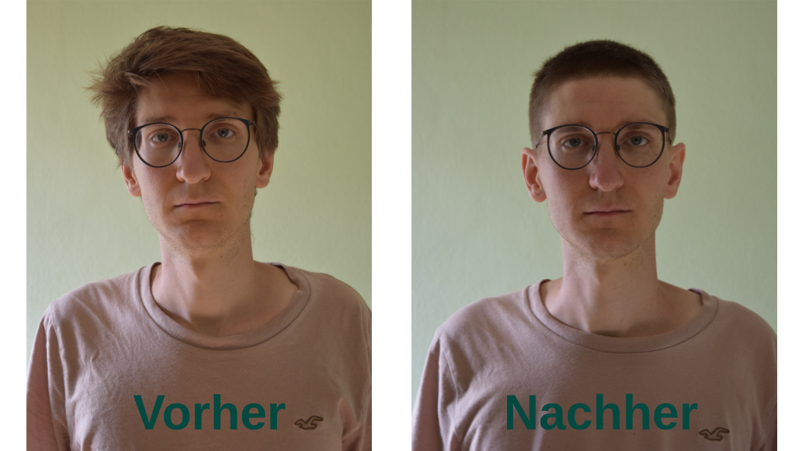
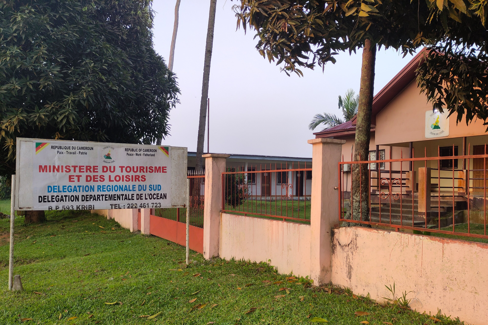
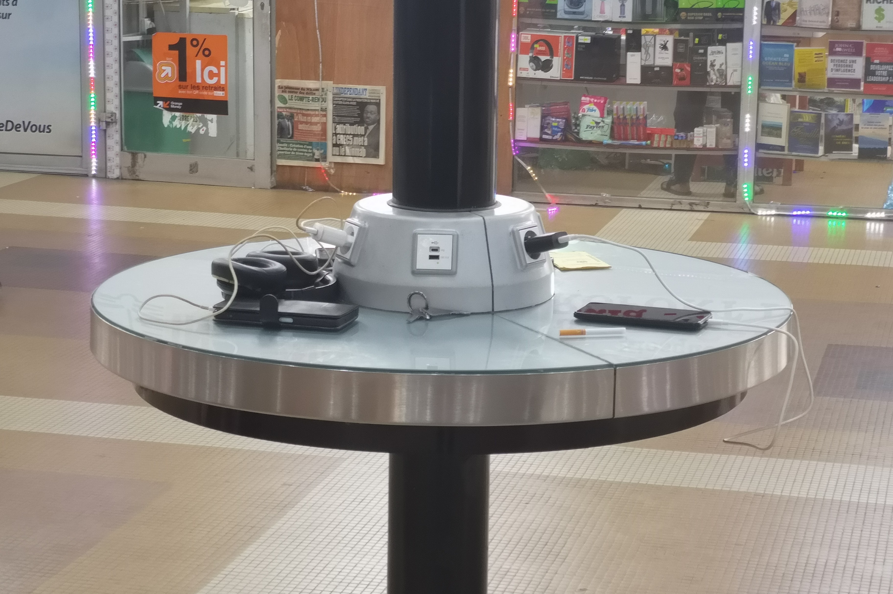

Insgesamt war unser Aufenthalt in Kamerun eine intensive Erfahrung, die man erst einmal verarbeiten und sacken lassen muss. Diesem Post widmen wir deshalb den Raum, um übergreifend über unsere Zeit hier zu reflektieren und Eindrücke und Erfahrungen zu teilen, die in den bisherigen Berichten noch keine Erwähnung fanden.

## Erst die Arbeit...
Was ist eigentlich aus unseren Projekten geworden? Hier ein Update zu einigen der Themen, die wir während unseres Aufenthalts vorangetrieben haben:

- **Workshopreihe**: Um die gesellschaftliche Debatte über mentale Gesundheit anzuregen und Bildungsarbeit zu leisten, veranstalten wir Workshops in unserem Headquarter. Während unserer Zeit vor Ort durfte Sandrine die Reihe zum Thema „Stigma: Wenn Andersartigkeit Angst macht“ mit ihrem Vortrag „Wir sind alle ein bisschen verrückt, nicht? Wie unser Gehirn seine eigene Realität erschafft“ einleiten.
- **Arbeit mit den ASCs**: Im Anschluss an das bereits beschriebene [Training der Agents de Santé Communautaires (ASC) und des Krankenhauspersonals in Mfou]()  haben wir die ASCs bei ihrer Arbeit in den umliegenden Dörfern begleitet. Durch einführen von Fragebögen und Interviews konnten wir eine erste Datenaquise über psychische Erkrankungen in den ländlichen Gegenden starten. Diese Erkenntnisse ermöglichten uns das Aufsetzen eines Anschlussantrags, den wir noch vor Ort in die Wege geleitet haben. Zudem haben wir eine Mental Health Professionals Database angelegt, die das Team nun _peu à peu_ vervollständigt.
- **Mental Health App**: Die intensive Arbeit an einer neuen App hat es uns ermöglicht, gemeinsam mit einem potenziellen Partner in Deutschland Fortschritte zu machen. In dieser Zusammenarbeit haben wir auch direkt einen Förderantrag bei OpenAI eingereicht. _Fingers crossed_! 🤞

Letztlich bestand unser Hauptfokus vor Ort jedoch in strategischer Hintergrundarbeit, sowie im Wissens- und Skill-Transfer. Dinge, die im kamerunischen Arbeitsalltag oft noch nicht etabliert sind, standen dabei im Mittelpunkt. Ferner halfen wir bei der Weiterentwicklung der neuen Webseite, das Gegenchecken der Finanzen, das konsequente Strukturieren unserer gemeinsamen Datenablage, sowie das Identifizieren lokaler Finanzierungsmodelle. Abgerundet haben wir unseren Aufenthalt mit individuellen Gesprächen mit allen Teammitgliedern und einem gemeinsamen Abschlussessen mit dem gesamten HoH-Team.



## ...dann das Vergnügen
​Neben der Arbeit mischten sich aber auch einige besondere Freizeiterfahrungen in unseren Alltag. Ein paar dieser Highlights möchten wir euch nicht vorenthalten:

### Party night 
Da war zum einen unsere __„Party Night“__ – eine Art Double-Date, zu dem uns unsere Gastgeber Sandrine und ihr Mann Patrice eingeladen hatten. An seltenen Gelegenheiten ziehen die beiden los, um in die kamerunische Nacht einzutauchen, und diesmal durften wir sie begleiten.
Gegen 21:30 Uhr brachen wir auf ans andere Ende der Stadt. Der erste Club überraschte uns: Modernes Interieur, internationale Musik – kaum ein Unterschied zu europäischen Clubs. Da wir für hiesige Verhältnisse früh dran waren, füllte sich die Tanzfläche erst über die nächsten drei Stunden schleichend. Wir nahmen Platz und Patrice bestellte direkt zwei 0,6-Liter-Biere pro Person. Fröhlich schweigend groovten wir auf der Sitzbank vor uns her, denn zum Reden scheint man hier – blickt man auf die anderen Gäste – nicht herzukommen.
Während die anderen Gäste anfangs noch wenig tanzmotiviert schienen, gaben wir bereits alles. Gegen 1:30 Uhr ging es weiter zu einem zweiten Spot ganz in der Nähe, wo der kamerunische Vibe deutlich spürbarer war: Ein DJ mit fancy Soundeffekten und Musik mit zentralafrikanischen Rhythmen. Meine Güte, war das Tanzen hier eine heiße Angelegenheit! Da wird getwerkt und mit den Hüften gewackelt was das Zeug hält. Vollends eingetaucht in diese Atmosphäre – wobei die Biere sicher halfen – fuhren wir gegen 3 Uhr morgens sehr heiter wieder nach Hause.



### Unternehmerische Einweihungsparty
Sandrine hat viele Geschwister. Einer ihrer Brüder ist Ingenieur und, wie wir nun wissen, ein echter Unternehmer. Am Freitag, dem 12.12., waren wir zur feierlichen Einweihung seines neuen Einkaufskomplexes in Odza, am südlichen Stadtrand von Yaoundé, eingeladen. Die offizielle Zeremonie sollte um 10 Uhr starten, besetzt mit lokaler Prominenz: vom Chef du Village über den Priester bis hin zum Bürgermeister. Letzterer wurde – wie er sich in seiner Rede entschuldigte – bei vorherigen Bestattungszeremonien länger in Anspruch genommen, sodass es mit drei Stunden Verspätung losging. Trotzdem war die Stimmung hervorragend, Essen und Trinken gab es im Überfluss, und ein motivierter DJ beschallte uns (und, wie nach gutem kamerunischem Brauch, vermutlich das gesamte Viertel) in beachtilicher Lautstärke. Der Komplex wurde uns als Bäckerei angekündigt, entpuppte sich aber als echtes Allround-Talent: Neben der Backstube beherbergt er einen Supermarkt, eine Snackbar, eine Lounge (gesprochen: Luuunsch) und eine Eisdiele. Branding und Einrichtung wirkten äußerst schick und professionell. Wir gratulieren herzlich zu diesem Achievement!



### Familiensport
​Zweimal standen kleine familiäre Sportevents auf dem Programm. Für das eine brachen wir eines Sonntagnachmittags mit allen Kindern zum nahe gelegenen _"Stadion"_ auf, da eines der Mädchen für eine Schulsportprüfung trainieren wollte. Schon nach knapp 1 km Jogging-Anweg waren _Spirit_ und Luft allerdings raus. Es bedurfte einiger Motivationsreden, bis wir mit Wettrennen, Kraftübungen und schließlich einer langen Runde _Schweinchen in der Mitte_ weitermachten. Auch wenn der Nachmittag nicht ganz unserem Verständnis von gezieltem Training entsprach, war es eine lustige gemeinsame Zeit und eine der seltenen Gelegenheiten, mit allen Kindern gleichzeitig unterwegs zu sein.



​Das zweite Mal weckte uns Sandrine an einem Sonntag spontan um 6 Uhr morgens um zu fragen, ob wir sie zu ihrem früheren Sportprogramm begleiten wollten. Während ihr Mann sich mit Freunden traf, fuhren wir zu dritt ins Diplomatenviertel _Bastos_. Da der Präsident hier seinen Palast hat, sind die Zufahrtsstraßen besonders gepflegt – ideal für unseren strammen Marsch auf den Mont Fébé. Auf halber Höhe stießen wir auf ein angeleitetes _Afro-Aerobic-Programm_, dem man sich einfach anschließen konnte – eine sehr witzige Erfahrung! Oben angekommen, wurden wir mit einem schönen Blick über die Stadt belohnt. Der Mont Fébé scheint sonntags der Treffpunkt für alle Sporttreibenden der Yaoundés zu sein; es war unglaublich viel los, vor allem joggende Männer prägten das Bild. Ein frischer Fruchtsaft und ein kleiner Spaziergang durch das Viertel rundeten diesen Morgen ab. Eine wunderbare Abwechslung zum üblichen Stadtgetümmel!



### Ausflug zum Weihanchtsmarkt
Genau wie in Deutschland gibt es auch in Yaoundé in der Adventszeit einen Markt, den wir mit der Familie (bis auf "Papa") besuchten. Zu siebt quetschten wir uns in ein Taxi, um zum Gelände hinter dem Stadtzentrum zu gelangen. Die Atmosphäre glich jedoch weniger einem andächtigen Weihnachtsmarkt als vielmehr einer Mischung aus Jahrmarkt und Messe, auf der zentralafrikanische Produkte beworben wurden – von Kulinarik über Heilkräuter bis hin zu Mode und Beauty. Der Markt war rappelvoll und schien extrem beliebt zu sein. Zwei Arten von Ständen erregten dabei besonders unsere Aufmerksamkeit: Zum einen die Social-Media-Plattformen: Gegen Gebühr stellt man sich auf ein Podest, während das Handy in einer beleuchteten Halterung im Kreis um einen herumrast und ein Tanzvideo aufnimmt. Diese Stände waren der absolute Verkaufsschlager; die Leute standen überall Schlange. Zum anderen fiel uns ein Stand mit japanischen Produkten auf. Hier musste man bereits für den Zutritt bezahlen und durfte dann, je nach Preisklasse, eine bestimmte Anzahl an Artikeln mitnehmen. Der Stand platzte aus allen Nähten. Offenbar gibt es unter der kamerunischen Jugend ein riesiges Interesse an japanischer Kultur; umso überraschender, dass es in Yaoundé ansonsten unseres Wissens nach keinen Japan-Shop gibt. ​Während wir uns schließlich verabschiedeten, um noch Erledigungen zu machen, blieb die Familie noch bis spät in den Abend für ein Konzert vor Ort.

### Felix beim Friseur
Nach über drei Monaten der Friseurabstinenz wurde es am Ende unseres Aufenthalts in Kamerun höchste Zeit: Felix Haare glichen vermehrt einem beachtlichen Wildwuchs und er brauchte _ne neue Frise_. Welch ein Glück, dass es direkt bei unserer Herberge in Kribi einen kleinen Friseurstand gab. Nachdem sich der Friseur vergewissert hatte, dass _“Madame”_ damit auch einverstanden ist, gings los. Umgerechtnet 1.50 € kostete der Spaß, und schnell ging es auch. Die Ansage war dieselbe, wie sonst auch: Seitlich kurz, oben länger. Erst kamen also die Seiten ab, soweit so gut. Bevor es nun and den oberen Teil ging, wurde nochmal _gedouble checked_, dass oben wirklich länger gelassen werden soll. Die Aussage wurde bestätigt, die Machine auf die maximale Länge gestellt, die so eine Haarschneidemachine nun mal hat und, wupp, denkbar kurz sind die Haare nun. 🙂✂️ _Good bang for buck_: Das sollte jetzt wieder eine Weile halten!

## Einige übergeordnete Gedanken und Reflexionen
### Warum läuft hier keiner?
Längere Zeit in Kamerun zu leben, zu arbeiten und zu reisen, schärft das Bewusstsein dafür, wie viel Infrastruktur wir in Deutschland als selbstverständlich voraussetzen. Es wird klar, wie sehr unser öffentliches Leben und unser Lebensstandard davon abhängen, dass der Staat verlässliche Strukturen bereitstellt. ​Der Modus Operandi in Kamerun scheint mittlerweile so sehr zur Normalität geworden zu sein, dass er kaum noch hinterfragt wird: Lokale Vereine springen – oft mit externen Ressourcen – ein, um notdürftig Lücken auf kleinster Ebene zu schließen. Doch dieses _„Flicken“_ kann die tiefe Kluft, die fehlende staatliche Strukturen hinterlassen, keineswegs füllen. Dass diese Basis fehlt, wurde für uns unter anderem an Folgendem spürbar:
- **Eingeschränkte Mobilität & Handel**: Straßen wie die Verbindung zwischen Ebolowa und Kribi sind in einem Zustand, der den Austausch zwischen Regionen und den kommerziellen Fortschritt massiv erschwert.
- ​**Mangelhafte Grundversorgung**: Öffentliche Krankenhäuser verfügen zwar über Personal, aber oft fehlen schlicht die Ressourcen für Material. Ohne welches (ja, auch finanzielle) Unterstützung durch Vereine und internationale Organisationen bliebe die Bevölkerung an vielen Stellen systematisch blockiert.
- ​**Bürokratie ohne Output**: Paradoxerweise stolpert man überall über staatliche Strukturen – selbst in kleinsten Dörfern finden sich beispielsweise Ableger des Tourismusministeriums. Wer jedoch als Tourist durch Kamerun reist, fragt sich, worin die Arbeit dieses Ministeriums fließt, denn in die Tourismusinfrastruktur scheint es nicht zu sein.
    

Ein besonders spürbares Defizit ist der fehlende öffentliche Raum. Es gibt kaum Orte zum Verweilen: keine Bibliotheken oder Arbeitsplätze an Unis, keine Parks, Bänke oder Spielplätze. Auch Gehwege sind, sofern vorhanden, meist kaputt, von Händlern besetzt oder im Verkehr versunken. Das Laufen wird dadurch gehetzter, laut und staubig. Da es kaum _„Public Spaces“_ gibt, um sich einfach mal zu treffen, bleibt als Rückzugsort nur das eigene Zuhause – oder neuerdings die [wachsenden kommerziellen Lounges von Bäckereien und Eisdielen](). ​Langer Rede kurzer Sinn: In einer Umgebung, die rein auf das Vorankommen oder den Kommerz ausgerichtet ist, wundert es uns nicht mehr, dass wir schräg angeschaut werden, wenn wir „einfach so“ mehr als nötig zu Fuß gehen wollen.

### Noch eine Kontrolle: Warum eigentlich?
An Dorf- und Stadtgrenzen sind Polizeikontrollen – zumindest für Fahrzeuge – eine verlässliche Konstante. Sinn und Zweck dieser Prozeduren haben sich uns bis heute nicht erschlossen. Meist geht es um die Identität: Mal müssen sich nur die Kameruner ausweisen, mal nur wir, mal alle. Mit unseren Pässen schienen die meisten Polizisten schlicht überfordert; oft wussten sie nicht einmal, auf welche Seite sie blättern sollten. Selbst das Vorzeigen des Visums entband uns nicht von bohrenden Fragen nach Herkunft, Reisedauer oder „offiziellen Papieren“, was meist in langwierigen Erklärungen unsererseits endete. Mal reichte der Pass, mal forderte man zusätzlich den Impfpass oder Dokumente unserer Gastgeber an – ein klares Muster fehlte völlig. Immerhin: Sobald unsere Identität irgendwie akzeptiert war, durften wir stets problemlos passieren. ​Ganz anders erging es unseren kamerunischen _„Brüdern“_, in deren Taxis oder Motorrädern wir saßen. Sobald der Fahrer den Blick senkte und einen auffällig unterwürfigen Ton anschlug, war klar: Da ist was im Busch. Die Gründe, um Geld zu verlangen, waren divers: von fehlendem Führerschein über die Kaufrechnung des Fahrzeugs bis hin zu Papieren, die bei einer vorherigen Kontrolle einkassiert worden waren war alles dabei. ​Es ist ein beklemmendes Privileg, von diesen Schikanen verschont zu bleiben – und gleichzeitig ein Ohnmachtsgefühl, junge Fahrer zu beobachten, die diesem System regelmäßig ausgesetzt sind. Bei so viel behördlicher Willkür ist die spürbare „gelernte Hilflosigkeit“ kaum verwunderlich.

### So ein Suff
Dass Suchtprobleme auch vor der kamerunischen Gesellschaft nicht haltmachen, ist kaum überraschend. Doch die schiere Präsenz des Themas sprang uns nach unserer Zeit in [Yaoundé]() immer deutlicher ins Auge. Im Arbeitskontext begegnete uns das Thema am Rande: Exzessiver Substanzkonsum sei keine Seltenheit und führe regelmäßig zu ernsthaften Mental-Health-Fällen. Auch bei unseren Spaziergängen durch Yaoundé fielen die Bars auf, die selbst tagsüber bestens besucht waren. Doch erst auf unseren Reisen durch das Land wurde das Thema Alkohol omnipräsent – symbolisiert durch einen winzigen, unscheinbaren Gegenstand: die 50-ml-Tütchen. Einmal entdeckt, sieht man sie plötzlich überall (ähnlich wie Fahrschulautos, während man selbst den Führerschein macht). Diese bunten Beutelchen eint vor allem eines: ein hoher Alkoholgehalt. ​Ob im Bus nach Somalomo oder mitten in der Woche im Dorf – wir begegneten ständig Menschen, meist Männern, in komplett _"zerstörtem"_, arbeits-, sogar schlicht redeunfähigem Zustand. Besonders verblüffend war für uns die gesellschaftliche Akzeptanz: Ob es der Ecoguard im [Reservat]() war oder die [Mitreisenden im Bus]() – exzessiver Suff scheint hier eine geduldete Normalität zu sein. Während wir in Europa zwar an Alkohol im Alltag gewöhnt sind, hat uns die Offenheit dieses Exzesses und die Art, wie das Umfeld ihn teils sogar befeuert (indem munter weiter Tütchen gereicht werden), mitunter sprachlos gemacht. ​Seitdem verging kaum ein Tag, an dem uns diese kleinen Plastikbeutel nicht ins Auge sprangen – auf den Straßen, am Strand oder direkt in den Händen der Leute.



### Wo sind die Banditen?
​Schmunzelnd mussten wir an unsere Zeit in Südamerika zurückdenken: Dort wurden wir fortlaufend gewarnt, dass wir hier zwar sicher seien, aber im nächsten Dorf oder jenseits der Grenze nur Halsabschneider lauerten. In ganz ähnlichem Tonfall warnte man uns auch in Yaoundé und Douala: Nach Einbruch der Dunkelheit solle man tunlichst nicht mehr vor die Tür gehen und bei Handys, Taschen und Taxis extrem wachsam sein. Denn die wortwörtlich **„Banditen“** lauern angeblich überall. ​In dramatischen Erzählungen hörten wir immer wieder von Menschen, die angegriffen oder ausgeraubt wurden. Uns selbst blieben diese Erfahrungen glücklicherweise erspart, dabei wären wir doch ein lohnenswertes Ziel. In Yaoundé hielten wir uns, soweit möglich, brav an die Anweisung, vor der Dämmerung zu Hause zu sein, doch auch sonst hatten wir nie das Gefühl, dass es jemand auf unsere Taschen abgesehen hätte. ​Die eindringlichen Warnungen standen für uns in einem netten Kontrast zur gelebten Realität: Wir beobachteten ständig, wie die Einheimischen ihre Wertsachen völlig sorglos und offen liegen ließen. Man schien diesbezüglich kaum Angst zu haben. Ganz allgemein fühlten wir uns zu keinem Zeitpunkt unsicher oder bedroht – im Gegenteil: Wir erlebten eine Atmosphäre voller wohlwollender Neugier und herzlicher Aufnahme.

### Wie anders Arbeiten sein kann 🤯
​Die hiesige Arbeitswelt hat uns oft zum Nachdenken angeregt und unsere eigenen Grundannahmen hinterfragt, denn vieles unterscheidet sich fundamental von dem, was wir aus Europa gewohnt sind. Spontane, manchmal tagelange Strom- und Internetausfälle sind eine alltägliche Hürde. Erschwert wird dies durch den Mangel an verlässlichen Informationen: Warum das Netz weg ist oder wann der Techniker kommt, bleibt oft ein Rätsel. Die Ursachensuche bindet enorme Ressourcen – man fährt zum Service-Provider, wartet auf Techniker, stellt zu Hause fest, dass es doch noch nicht geht. Termine und Deadlines verschieben sich so fast zwangsläufig. Da Zuständigkeiten und Anforderungen oft nicht standardisiert sind, müssen Informationen mühsam über persönliche Kontakte erfragt werden. Regeln und Prozeduren scheinen oft individuell vom jeweiligen Verantwortlichen abzuhängen. Wechselt eine Schlüsselposition - und das passiert am laufenden Band -, fangen Prozesse häufig wieder bei Null an. Die Folge scheint ein permanentes _„Agieren auf Sicht“_. Man verbringt viel Zeit damit, auf unvorhersehbare Ereignisse zu reagieren, um den Betrieb am Laufen zu halten. Langfristige Planung hat es in diesem Umfeld schwer; Flexibilität scheint hier stattdessen die wichtigste Überlebensstrategie. Das beeinträchtigt natürlich die Verbindlichkeit: Ein Termin um 8 Uhr kann sich so auch mal um zwei Stunden verschieben, während der Arbeitstag häufig gegen 16 Uhr endet.

Überascht waren wir auch über den Personaleinsatz: Aufgaben, die bei uns eine Person übernimmt, werden hier oft von mehreren betreut – ob im Supermarkt, bei Kontrollen oder Fortbildungen. Das wirkt oft wie eine Form der kollektiven Begleitung, während die eigentliche Tätigkeit von einer Person ausgeführt wird. Das ist für uns umso erstaunlicher, da das [Bildungsniveau fordernd]() ist und der Bedarf an Fachkräften für die Infrastruktur ja eigentlich an allen Ecken und Enden besteht...

### Unruhige Präsidentschaftswahlen
​Kaum eine Woche nach unserer Ankunft stand die Verkündung der Wahlergebnisse an. Am 27.10. versammelten wir uns vor dem Fernseher; die Kinder blieben aus Sicherheitsgründen zu Hause. Schon Wochen zuvor kursierten auf Social Media Aufrufe zum Widerstand, sollte der amtierende Paul Biya erneut zum Sieger erklärt werden. Fünf Jahre zuvor nahm Sandrine die Stimmung noch als politisch desinteressiert wahr – man wollte einfach nur friedlich seinen Alltag leben. Diesmal wirkte die Atmosphäre deutlich aufgeladener. Ein _„Es reicht jetzt“-Gefühl_ war merklich, mal hinter verschlossenen Türen, mal ganz offen im Taxi. Im Stadtbild dominierten riesige Biya-Plakate, während die der Opposition angeblich systematisch entfernt wurden. Zudem war Social Media tagelang blockiert und ggf. hing auch der Internetausfall damit zusammen. Die Live-Verkündung im Staatsfernsehen wirkte für uns ein wenig drollig aus der Zeit gefallen: Keine Statistiken, keine Bilder der Kandidaten, nur eine Riege kamerunischer Juristen in barocken Perücken, die trocken die Ergebnisse für jeden Region verlasen. Da Kamerun zweisprachig ist, wechselten die Abschnitte ohne Übersetzung zwischen Französisch und Englisch - ein Phänomen, das uns im kamerunischen Fernsehen öfter begegnete.


**Exkurs kamerunisches Fernsehen:** Je nach Sendung und Werbespot schwankte die technische Qualität zwischen hochprofessionellen Werbespots und völlig verrauschten Nachrichtensendungen mit verwackeltem Bild. Überraschend war hingegen die Existenz scharfer Debattenformate, in denen Regierungskritiker durchaus deutlich zu Wort kamen.


​Mit jeder Minute der Verkündung festigte sich der Status quo: Nach 43 Jahren im Amt bleibt Paul Biya mit 92 Jahren der älteste amtierende Staatschef der Welt. Obwohl wir selbst keine Unruhen erlebten, brodelte es unter der Oberfläche. Am Tag nach der Wahl wirkte die sonst so lebhafte Stadt ungewohnt ruhig und leer. Als wir am Nachmittag die Geburtstagsfeier eines der Mädchens vorbereiteten erreichte Sandrine ein Anruf: Die Schule wurde abgebrochen, die Kinder müssten sofort abgeholt werden. Sandrine brachte eine verstörte Gruppe nach Hause. Angeblich waren Schüsse gefallen; die Lehrer hatten die Kinder angewiesen, so schnell wie möglich wegzurennen, was Panik auslöste. Ob tatsächlich geschossen wurde, erfuhren wir nie, denn scheinbar hatte keiner - auch wir zu Hause nicht - die Schüsse gehört. Dennoch überschattete der Schock und die Angst vor bürgerkriegsähnlichen Zuständen alle Geburtstagsfreude. In den folgenden Wochen blieb die Lage paradox: Während Social Media (sofern erreichbar) von Bildern gewaltsamer Ausschreitungen, vor allem in Douala und im Norden, überschwemmt wurde und die Botschaft Reisewarnungen aussprach, erlebten wir in unserem direkten Umfeld weiterhin nichts Ungewöhnliches.



### Was uns noch so ins Auge sprang
​Übergeordnet hatten wir den Eindruck, dass Sprache hier – zumindest in der _„produktiven“_ Kommunikation – man könnte sagen effizienter genutzt wird. Sätze sind kürzer, Erklärungen knapper und Bitten werden als Befehle geäußert. Pläne werden oft erst kurz vor knapp in dem Moment mitgeteilt, in dem sie umgesetzt werden sollen. Während wir in Deutschland vieles als Frage formulieren, begegnete uns hier häufiger das _Fait accompli_: Eine klare Ansage statt einer langwierigen Abstimmung. Ganz anders sieht es jedoch aus, wenn erzählt wird: Dann wird die Sprache plötzlich um ein Vielfaches bildhafter und ausschweifender als bei uns.

In Gesprächen kam immer wieder die Abgrenzung zum _„Occident“_ auf. Spannend war etwa die Debatte, ob loben oder aussprechen von Zuneigung etwas Positives ist oder lediglich ein westlicher Import, der die lokale Ausdrucksweise überlagert. Überhaupt ist die Kommunikation temperamentvoller: Manchmal fiel es uns schwer einzuschätzen, ob wir gerade Zeugen einer intensiven freundschaftlichen Diskussion oder eines heftigen Streits wurden – die Grenzen verschwammen hier fließend.

Generell ist das Leben in Kamerun lebhaft laut. Trotz des oft langsamen Tempos sorgen röhrende Motoren, klappernde Lastwagen und übersteuerte Lautsprecher an jeder Straßenecke für eine konstante Geräuschkulisse. Überall wird gerufen, geworben oder lautstark Musik gespielt; dazu das Gackern der Hühner und das Krähen der Hähne. Es ist nur folgerichtig, dass sich auch die Lautstärke der Menschen diesem Umfeld anpasst. Ob Deutschalnd einem Kameruner bei der Abwesenheit der gewohnten Reizfülle wohl unheimlich und totenstill vorkommen würde?

