Am Nachmittag des 29. März war es endlich soweit, wir überschritten zum ersten Mal auf unserer Reise eine Landesgrenze, spezifisch von der Türkei nach Georgien in der Grenzstadt Sarp(i). Dies ist zugleich die Hauptgrenze zwischen diesen Ländern und es reihen sich bereits viele Kilometer zuvor LKWs Stoßstange an Ladeklappe. Durch die unschlagbaren 365 Tage Visumsfreiheit pro Jahr für sehr viele Nationen, war der formelle Übertritt äußerst effizient und schnell erledigt, doch kam man, ähnlich zu Flughäfen nicht um die _duty-free_ Meile herum. Eine kurze Busfahrt später und die letzten zwei Kilometer zu Fuß, erreichten wir unsere Herberge in Batumi.

## Batumi
### Außengebiet = Autogebiet
Unsere Unterkunft, von einem äußerst herzlichen älteren Ehepaar betrieben, lag am Süd-West Ende der Stadt und um in den bekannten Stadtkern am Meer zu kommen, mussten alle Bereiche der Stadt zu durchquert werden. Zu Beginn, konnten wir das stolze Repertoire an Autoservices begutachten, welche die Stadt wie ein breiter Gürtel umgeben. Nicht nur die Läden sondern auch die Straßen selbst sprachen nur eine Sprache: Autos. Gehwege gab es nur spärlich und wenn dann waren sie zugeparkt und die einzige Regel für Fußgänger um den aufheulenden Motoren zu entkommen lautet: _Rette sich wer kann_.



### Der Übergang
Doch je näher wir Richtung Zentrum vordrangen desto mehr kleine Bäckereien, Gemüseläden usw. bereicherten unseren Weg. Die Bürgersteige wurden verlässlicher und wurden von Bürgern benutzt und Familienhäuser wichen sowietischen Plattenbauten von tendentziell abnehmenden Renovierungsbedürfnis. Wir hörten unsere (fast) ersten Worte georgisch, eine Sprache mit einigen schwer zu unterscheidenden Kehllauten und, wie zum Kontrast, geschrieben in einer einmaligen von Rundungen geprägten Schrift.

### Die Moderne am Meer
Die vernommene Sprache vermischt sich auf dem letzten Abschnitt viel mit Russisch-basierten Sprachen. Dies ist zum Einen sicher auf die Geschichte zurückzuführen, die die beiden Länder verbindet, zum Anderen ist Batumi ein sehr nahes Reiseziel oder Exil.
Im Kern kommen wir zunächst durch die Altstadt Batumis, gezeichnet durch so manche Straßen mit Häusern im Pariser Stil, sowie orthodoxen Kirchen, Synagogen, und der einzigen Moschee mit aktivem Minarett in Georgien. Dennoch ist _Fußgängerzone_ hier wahrscheinlich ein Fremdwort und für gemütliches Flanieren eignen sich die vielen grünen Parks mit großen alten Bäumen am besten. Hier bemerkten wir erst wie wenig derart schöne Parks wir in der Türkei gesehen hatten und welch merklichen Effekt es doch auf die Lebensqualität einer Stadt hat. 


  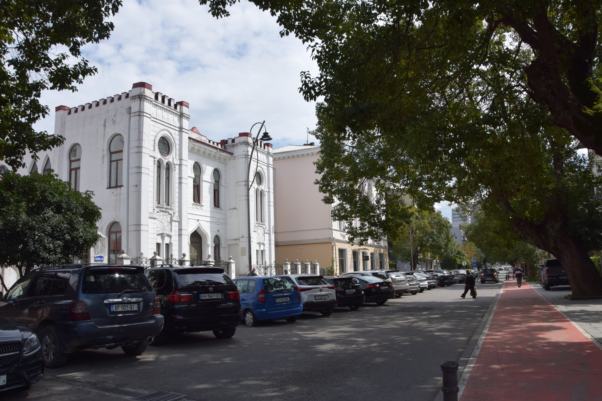
  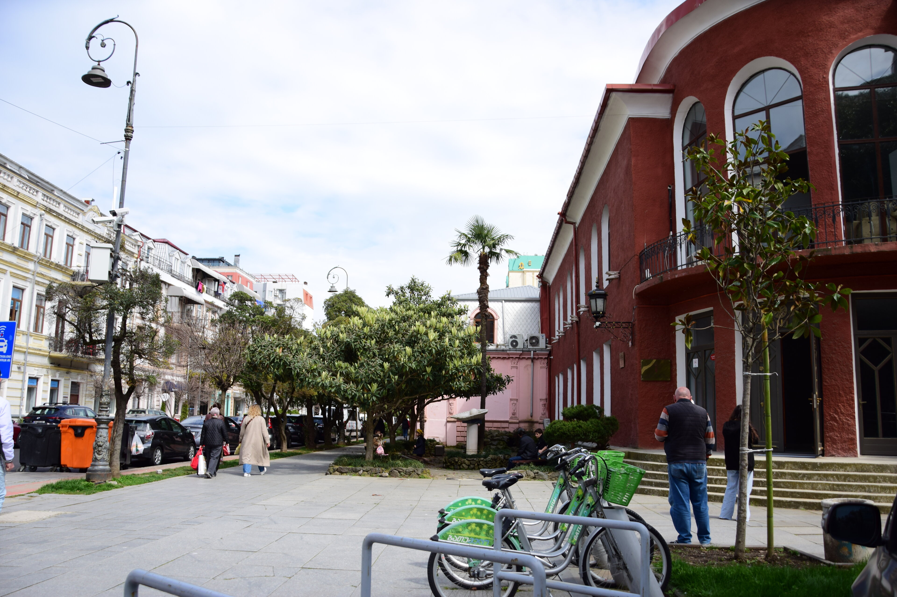
  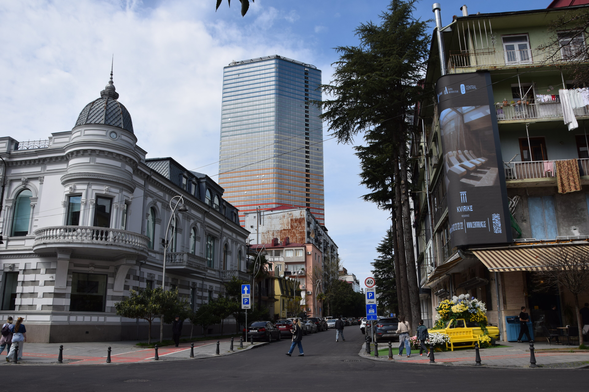
  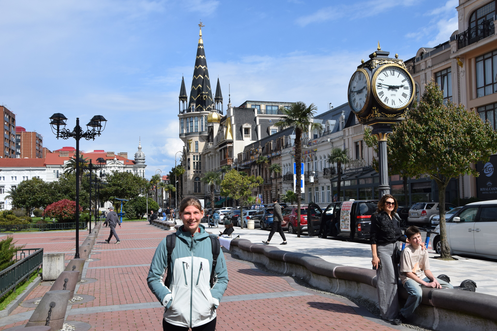
  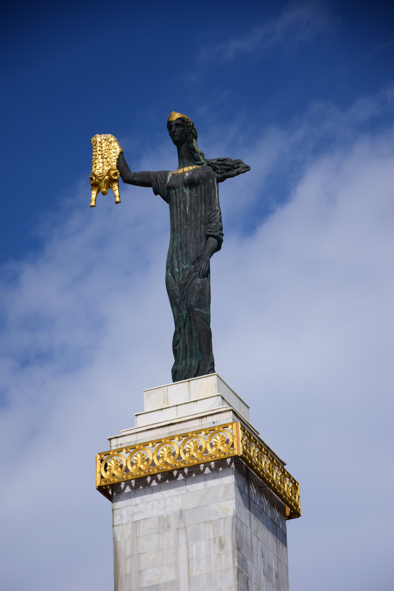
  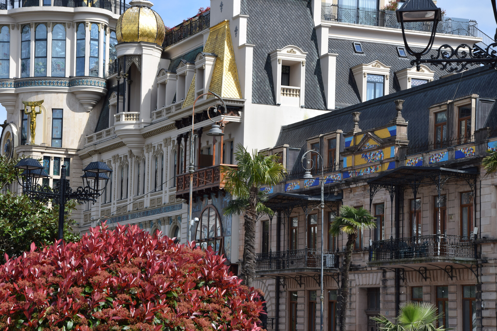
  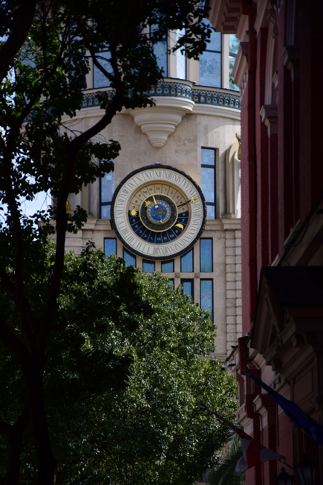
  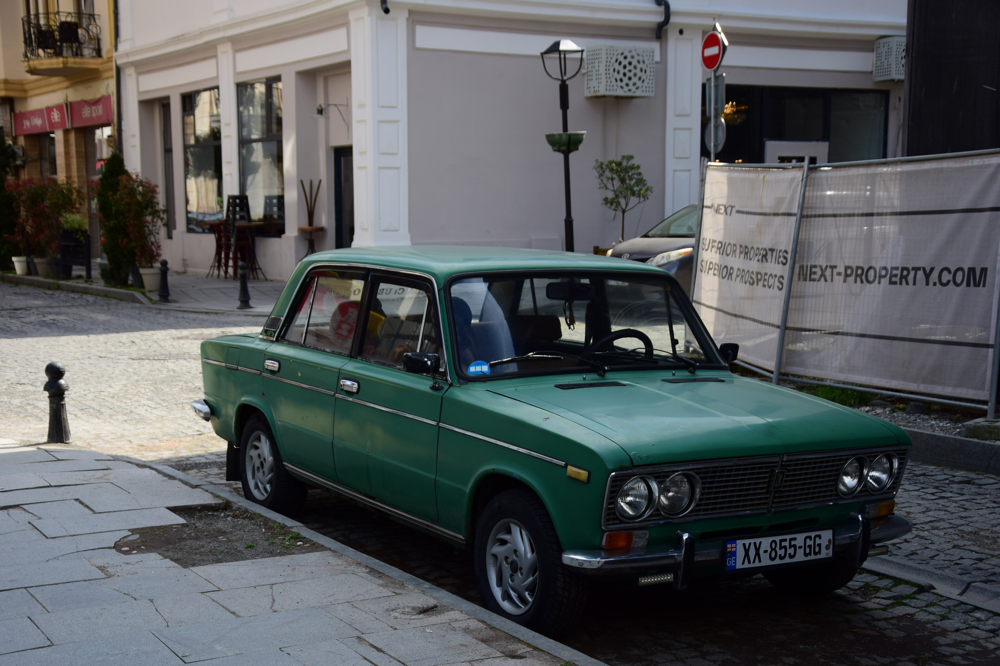
  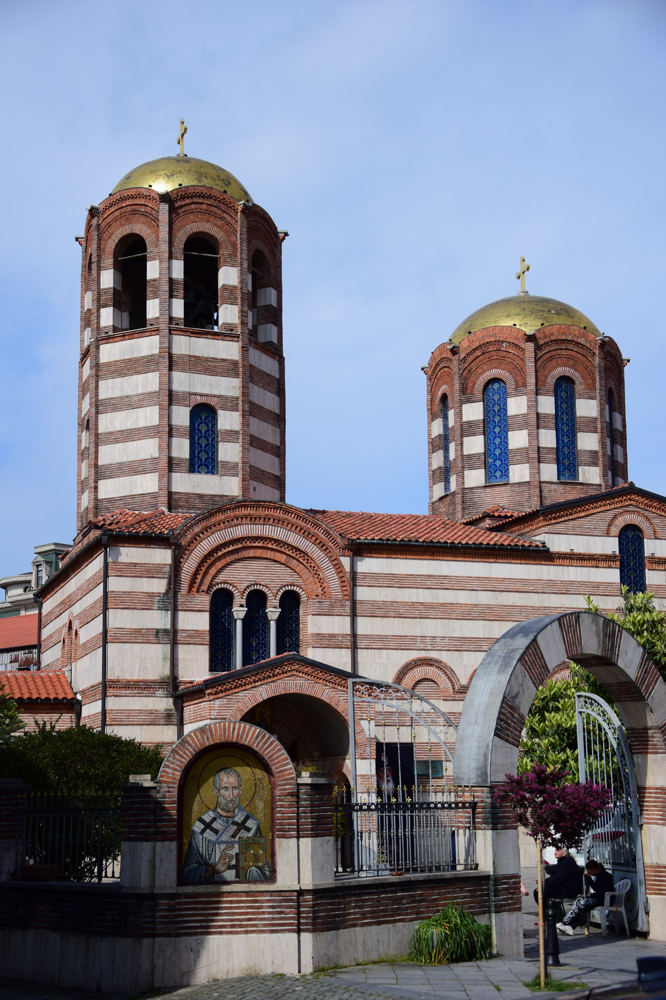
  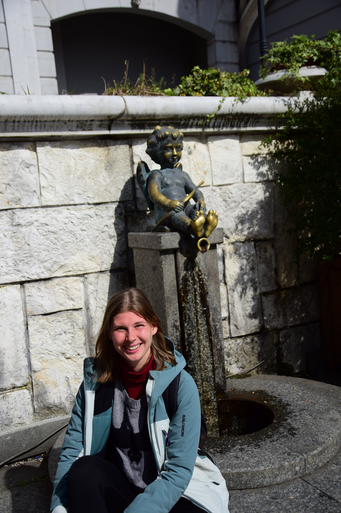
  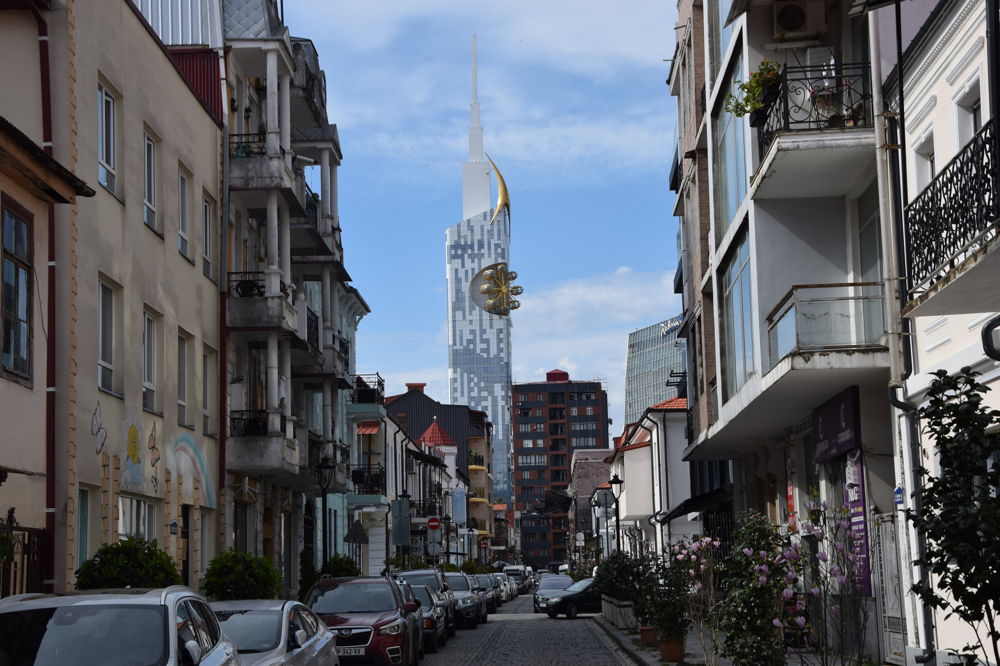


Dominiert wird das Stadtbild Batumis allerdings durch eine große kilometerlange Promenade am Schwarzen Meer mit einer Vielzahl abwechslungsreicher, gläserner, brandneuer, schick-moderner Hochhäuser. Dazu gibt es einige Kunstwerke, Sportgeräte und allerlei kleinere Attraktionen, wie ein Delphinarium oder einem Mini-Freizeirpark, sodass es einem nicht langweilig werden kann. Da wir noch deutlich in der Vorsaison waren, hielt sich das Touristenaufkommen in Grenzen und man konnte alles in Ruhe ohne großen Rummel besichtigen. Die Regentage nutzten wir um mal wieder etwas mit unserem Blog hinterherzukommen, aber auch einfach um uns zu organisieren.



### Idylle jenseits des Stadtrandes
Startet man von unserer Herberge aus in die entgegengesetzte Richtung, begann sobald der Übergang zur hügeligen Natur. Zunächst stießen wir auf eine zugewucherte ehemalige sovietische Militäranlage, die zu unserer Überaschung frei zugänglich war und mittlerweile zahlreichen Fröschen Heimat, und so mancher Kuh einen Futterplatz bietet. Natürlich erkundeten wir jeden Winkel und ein bisschen mulmig wird einem bei den langen, unterirdischen, kalten Betontunneln schon. Anschließend setzten wir unseren Ausflug ins lose besiedelte Hinterland über einen praktisch nicht vorhandenen Pfad fort, vorbei an Dornen und - sobald wir diese überwunden hatten - Bächen, kleinen (Fried)Höfen und Kirchen. Von einer Anhöhe aus, erblickten wir in so manchem Tal auch jeweils eine beeindruckende Kirche und ein burgartiges Kloster, wobei uns bei keinem von beidem Einlass gewährt wurde. Einen schönen ersten Vorgeschmack auf die üppige Natur Georgiens bildeten diese Eindrücke allemal. 




__Werbung:__ Für unsere Wegplanung nutzen wir [Organic Maps](https://organicmaps.app/) eine App basierend auf [Open Street Map](https://www.openstreetmap.org/about) Kartenmaterial. Dieses zeichnet sich dadurch aus, dass jeder Informationen hinzufügen kann. In wirtschaftlich _uninteressanten_ Ländern sind die Karten dadurch deutlich besser. Aber manchmal fügen Überenthusiasten mindestens fragliche Wege hinzu.


## Zwischenstopp Kutaisi
Eine kleine Verschiebung unseres ersten _Workaways_ in Georgien erlaubte uns, spontan auch Kutaisi zu besichtigen. Die Anreise mit dem Bus war kurzweilig und obwohl wir eine der Hauptachsen des Landes zwischen zwei der größten Städte entlang fuhren, gab es nie mehr als eine Spur pro Richtung. Es ging vorbei an immergrünen Landschaften, in der Ferne schneebedekte Berge und neben (und manchmal auf) den Straßen viele freie Kühe und Schweine.

Diesmal war Dima unser Host und am nächsten Morgen nach gutem Schlaf führte er uns durch seine Wahlheimat. Ähnlich zu Batumi ging es erst einmal durch einige Viertel von Blockbauten, bevor die Innenstadt zum Vorschein trat. Diesmal fielen die Hochhäuser weg, dafür gab es aber umso mehr alte Gebäude und die Atomsphäre ähnelte eher eine altehrwürdigen Stadt, welches wahrscheinlich auch damit zusammen hing, dass Kutaisi zeitweise die Hauptstadt Georgiens war.

Am Nachmittag fuhren wir ein Stück aus der Stadt heraus und machten noch eine knapp 15 km lange Wanderung. Selbst so nah an der Stadt gab es einen wilden Fluss und sagenhafte Natur. 
Abends ging es in ein Georgisch-Deutsches Brauhaus. Wir ließen das Bier links liegen und genossen umso mehr ein paar georgische Spezialitäten. Aber diesen widmen wir uns ein andermal im Detail. 😛 Am nächsten Tag ging es dann auch schon wieder weiter zu unserem ersten georgischen Projektstopp in Zugdidi. 



