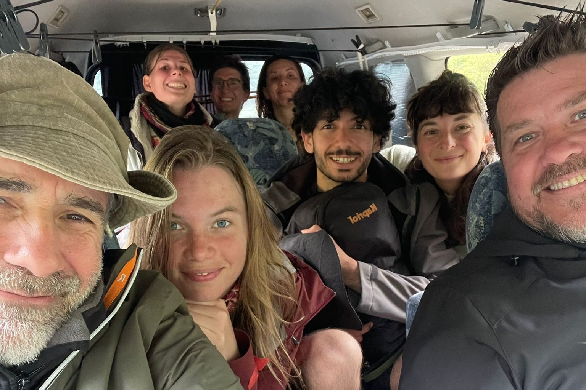
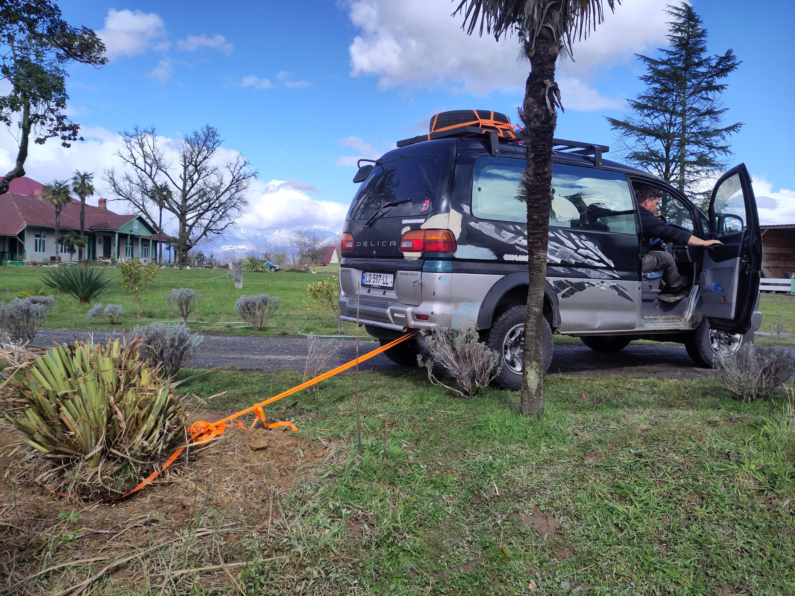
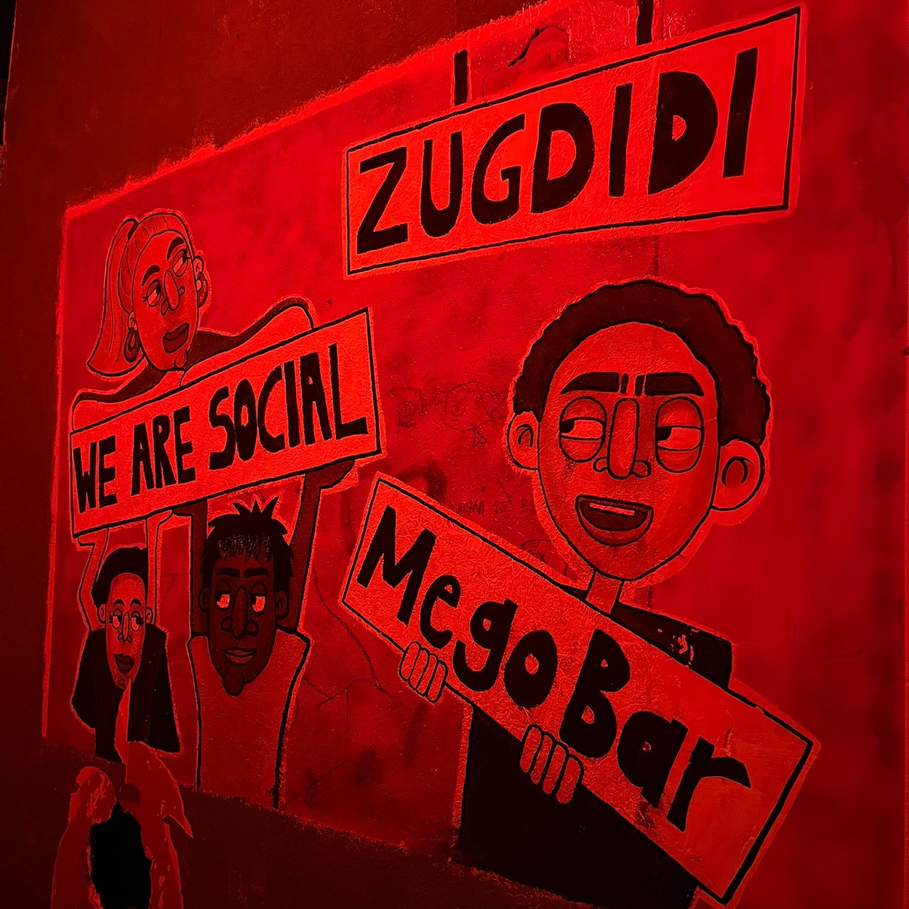

Oh wow, wo soll man beim Artikel über diesen im besten Sinne des Wortes schrägen Stopp bloß anfangen. Viel zu viel gibt es hier zu erzählen. 

Denkbar gut bedient waren wir bei unserem zweiwöchigem Projektaufenthalt in Zugdidi alleine schon mit unserem mächtig gut gelaunten Workaway-Team, das keine Gelegenheit ausgelassen hat, die Stimmung krachen zu lassen. Unser Repertoire spiritueller Praktiken hat sich ebenfalls erweitert, der georgische Prinz hat uns seine Toilette benutzen lassen, unser Projektauto wurde in Einzelteile verscherbelt und die netten georgischen Vermieter, deren Wohnung wir eigentlich jeden Moment hätten räumen müssen, luden uns gastfreundlich zu Wein und Schweinebauchfett aus eigener Produktion ein. Bei alledem durfte französischer Camembert natürlich nicht fehlen. Aber mal der Reihe nach.

## Geschichtenzeit im Team 2🧀1🌭
Um mit dem Projekt voran zu kommen, rekrutiert Laurent jedes Jahr, sobald das Wetter besser wird, ein Team von Freiwilligen. So lernten sich Alberic und Laurent vor zwei Tagen kennen. Kaja, eine junge Serbin, stieß einen Tag später zu den beiden. Wir können nicht genau rekonstruieren was sich in den ersten 36 Stunden abgespielt hat, aber die gut gelaunte Rasselbande, die uns, sowie Sérenna eine weitere Freiwillige, am folgenden Tag abholte, war so eingespielt im Umgang miteinander, dass wir das Gefühl hatten, sie würden sich bereits seit Jahren kennen; und uns wurde klar, dieses Abenteuer wird einmalig.

Kurze Zeit später waren wir in Alberic’s 4-Rad-Antrieb-7-Sitz-Delica auf dem Weg zu unserer Unterkunft. Hier richteten wir uns kurz ein, und lauschten dann bei heiterster Atmosphäre, leckerem Essen, Wein und Camembert - wie das nunmal so ist, wenn man in einer fast ausschließlich französischen Runde landet - allerhand Hintergrundgeschichten zu Georgien und diesem Projekt. 



### Das Auto
So zum Beispiel, dass Laurents georgischer Freund – der gute alte Henry – unser Projektauto zu, sagen wir mal, ungünstigen Konditionen über das georgische Land verteilt hat. Welch eine passende Koinzidenz, dass in all den Jahre seitdem das Projekt läuft, Alberic nun der erste Freiwillige ist, der mit einem eigenen Auto da ist und auf unbestimmte Zeit in Georgien bleiben möchte; und zwar nicht irgendeinem Auto, sondern einen geländetauglichen Siebensitzer, wie praktisch!


  
Wie so viele Geschichten begann auch diese in Frankreich. Genauer, Henry - gebürtiger Georgier und, wenn auch unwissend, ein zukünftiger Freund Laurents -  erhielt viele Anrufe einer georgischen Nummer, die er allerdings unbeantwortet ließ. Doch diese Verbindung wurde ihm kurz später zum Verhängnis und brachte ihn für zwei Jahre hinter Gitter. Immerhin konnte er die Zeit nutzen um französisch zu lernen, was Jahre später in einer wundervollen Freundschaft mit Laurent, neu in Georgien und fest entschlossen ein Zome zu bauen, mündete. Wie dem auch sei, die Autosituation mit eben diesem Henry ereignete sich in etwa wie folgt: Wenige Wochen vor Projektstart erhielt Laurent, der den Winter in Paris verbrachte, von Henry einen Anruf mit der Information, dass sein Auto nicht mehr funktioniere und mit der Frage, ob irgendetwas gemacht werden solle, worauf Laurent dies verneinend erwiderte, dass er bald da sei und Henry einfach abwarten solle. Als Laurent und Alberic, Henry dann zum Abholen des Autos besuchten, heißt es "_Welches Auto? Kein Auto. Nur Teile. Verkauft._" und bei Nachfrage wo denn denn immerhin das verdiente Geld sei, "_Kein Geld. Kommt noch, scheibchenweise. Später, später, irgendwann... zota zota_".
  




### Die Wohnung
Das Mieten der Wohnung für diese Saison mittels Henry hat immerhin gut geklappt, schließlich sitzen wir ja alle in netter Runde hier (die vorherige Wohnung ist wieder eine andere Geschichte 😉). Allerdings stellte sich die nächsten Tage heraus, nachdem unsere - immerhin mit neun Schlafplätzen ausgestattete - Wohnung jeden Tag mit mehr und mehr neuen Gesichtern bevölkert wurde, dass die direkt über uns wohnenden Vermieter eigentlich nur mit 4 bis 5 Bewohnern gerechnet hatten. Mehr Leute seien zwar in Ordnung, aber nur gegen einen Aufpreis, den Laurent nicht zu zahlen bereit war. Schließlich hätte von vornherein klar sein müssen, dass mehr Personen kommen – dafür wurde die große Wohnung mit vielen Betten ja angemietet. Zur Not, so erfuhren wir, würden wir vielleicht jeder Zeit rausgeschmissen werden können. Aber kein Problem, Henry hat uns schon versichert, dass es nur einen Tag braucht, um uns eine neue super Wohnung zu organisieren. Also alles unter Kontrolle. 😎

 

### Die Aufnahmebedingung
Doch Zeit unseres Aufenthalts hat uns keiner herausgeschmissen und der Käsevorrat stellte sich als deutlich größeres Problem heraus. Dieser ging schon am ersten Abend schnell zu Neige - ihr könnt euch vlt. denken, dass Sandrine dazu einen nicht unerheblichen Beitrag geleistet hat - und es musste natürlich für Nachschub gesorgt werden. Wie praktisch, dass die Ankunft weiterer Franzosen für die kommenden Tage vorprogrammiert war und so wurde der Eintritt in den Projekt-Club an folgende Mitbringsel geknüpft: zwei Camemberts und ein Saucisson (eine französische luftgetrocknete Schweinswurst). Ohne diese Mitbringsel kein Zugang für die Neuankömmlinge. Welcher Name hätte sich für unsere neu gegründete Whatsapp-Gruppe also besser eignen können als 2🧀1🌭?! Passendere Emojis gab es leider nicht. Über unsere Aufenthaltszeit hinweg bereicherten dann auch noch die drei weiteren Franzosen Marceau, Dhom und Olivier, die Türkin Derya und die Argentinierin Milena unsere stolze 2🧀1🌭-Gruppe, was gerade so ausreichte um nicht auf dem Trockenen zu sitzen. Ebenfalls Teil der Rasselbande waren Chatscha, Alberic’s Hund, und Louis Vuitton, der Welpe unseres Vermieters, der uns eines jeden Morgens mit einem fröhlich schwanzwedelnden Handschlecker am Fenstersims begrüßte und, wann immer die Gelegenheit bestand, in unser Zimmer schoss, um unsere Socken zu entführen.
So viel also zur guten Gesellschaft, die uns diese zwei Wochen umgab. Aber wofür sind wir eigentlich hier? 

## Geometrie zum Aktivieren der Chakren 
### Tägliche Dosis Spiritualität
Am nächsten Morgen bescherte uns das Wetter feinsten georgischen Dauerregen, also begann unser Tag statt unmittelbar mit der Projektarbeit, zunächst mit einer 1.5 stündigen Kundalini-Yoga-Einheit. Denn Laurent, unser Projektleiter, ist Kundalinilehrer. Was schon gleich am ersten Tag begann, wurde auch für die meisten nächsten Morgende, bzw. manchmal auch Abende zum Ritual: Meist eine mehr oder weniger ausführliche Yoga-Einheit, manchmal aber auch Meditationen oder _Sound healing_, also das Arbeiten mit Klangschalen. Nichts davon war verpflichtend, aber - ihr kennt uns ja - natürlich waren wir voller Eifer dabei. Vor allem die Erkenntnis, welche Wirkung eine bestimmte sehr bewusste Atmung in Kombination mit An- und Entspannung gewisser Muskelgruppen auf mentale Zustände haben kann, war sehr interessant. Und vor allem die letzteren beiden Ansätze haben es uns schon angetan.




__Randbemerkung: Kundalini Yoga__ Was einfach aussieht, ist manchmal gar nicht so leicht. Diese Yoga-Strömung besteht aus langen Halteübungen. Ein Satz, der uns bestens in Erinnerung bleiben wird und der auch immer wieder seinen Weg in unsere Alltagskonversationen fand ist “_Mula Bandha! Squeeze your anus and sexual organs._ 🧘😖”




### Das Projekt
Sobald sich der Regen ein bisschen gelegt hatte, ging es dann mit 30-minütiger Anfahrt zur Arbeit, die diesen spirituellen Charakter widerspiegelt. Ziel unserer hiesigen Anstrengungen ist nämlich das Errichten eines _Holz-Zomes_ nach den _Prinzipien der heiligen Geometrie_, das nach Fertigstellung als Yoga-Retreat dienen soll. Tatsächlich traf Spiritualität im weitesten Sinne auch ganz generell ein bisschen den Nerv der Gruppe als Ganzes. So meldete eine Freiwillige in Gerogien gerade ihr Startup zu einem AI-Astrologie-Service an, immer mal wieder konnte man Gesprächen zu _Human Design_, Astrologie oder Numerologie lauschen und so mancher verkrümelte sich für eine _Distant Healing_ Session.


__Info: Was ist eigentlich ein Zome?__ Ein Zome (Kofferwort aus Zonoeder und Dome) ist eine harmonische, kuppelartige Bauform, die sich von klassischen Rundkuppeln durch ihre spiralförmig angeordneten, rautenförmigen Flächen unterscheidet. Da die Proportionen meist auf dem Goldenen Schnitt und Prinzipien der Heiligen Geometrie basieren, wird den Räumen eine besonders beruhigende, energetische Atmosphäre nachgesagt. Aufgrund dieser speziellen Ästhetik und Akustik werden hölzerne Zomes weltweit besonders gerne für ökologische Wohnprojekte, Meditationsräume oder Retreats genutzt.


### Arbeit am Zome
Die Zome-Projektarbeit selbst, war allerdings sehr handfest. So musste nach den Wintermonaten, das Grundstück zunächst wieder auf Vordermann gebracht und für Permakultur vorbereitet werden. die Wände mussten geschmirgelt und anschließend ordentlich gestrichen, das Dach gedeckt und ein Weg gelegt werden. Außerdem gab es neben dem Zome noch ein Gewächshausgerüst. Dieses weckte vor allem Alberic’s Kreativität und Ehrgeiz, es zusammen mit den restlichen vorhandenen Baumaterialien in ein nützliches Tiny-Apartment zu verwandeln.



### Und was hat es mit dem Prinzen auf sich?
Tatsächlich gibt es bei diesem Projekt noch ein anderes nettes Detail. Denn das Zome-Grundstück ist nicht etwa einfach irgendwo, sondern war früher Teil des Anwesens des georgischen Prinzen. Dieser freut sich, aufgrund seiner französsichen Abstammung und seiner Exilzeit in Frankreich, ganz besonders über französsichen Besuch - völlig ungeachtet seines ohnehin äußerst charismatischen Charakters. Somit war er immer für eine spannende Anekdote aus seiner bewegten Vergangenheit, sowie für eine Führung über sein Anwesen zu haben. Natürlich tragen wir in bester französischer Manier auch über die netten Gespräche hinaus mit einem Mitbringsel zu einer guten Beziehung bei: mit vollen und leeren Camembert-Packungen. Letztere sind für seine Camembert-Packungs-Sammlung bestimmt, die er in der Küche zur Schau stellt. Im Gegenzug gab er uns seine Nummer. Wer kann schon behaupten, im Besitz der Visitenkarte des georgischen Prinzenpaars zu sein? Spoiler: Na wir natürlich. 🙂 



Um unseren Arbeitspflichten dann aber doch noch nachzukommen, hat sich meist einer um den freundlich gesprächigen Prinzen “gekümmert”, damit sich die Anderen effizient der Arbeit widmen können. Etwas unangenehm war uns dann nur, dass wir beide - wie Laurent uns nannte das _Team Destructeur_ - gerade dabei waren, die riesengroßen Agaven-artigen Pflanzen vor dem Zome voller Inbrunst mit der Machete zu zerstören, als die Prinzessin mit abfällig-verstört-verschnupftem Blick an uns vorbeikam. Denn, wie wir anschließend erfuhren, wuchsen diese Monsterpfalnzen nicht zufällig in schön regelmäßigem Abstand, sondern wurden in Laurents Abwesenheit, auf seinem Grunstück, liebevoll von der Prinzessin angepflanzt und großgezogen. Zu schade nur, dass Laurent davon nichts wusste und das Ergebnis äußerst hässlich fand - woraus er im Übrigen auch kein Geheimnis machte. 

## Work-Life-Balance
Wenn wir nicht gerade mit Arbeit, Yoga, Schlafen oder Essen(machen) beschäftigt waren, war die Stimmung einfach viel zu gut, um sich nicht auch den sonstigen Freizeitaktivitäten anzuschließen. Langweilig wurde es nie. Wenn nicht Gesellschaftsspiele gespielt wurden (Schach, Backgammon, Siedler, u.v.m.) ging es für einen Spaziergang oder Einkäufe zum Basar oder Baumarkt. Während oder nach dem Essen versanken wir in Blackstories. Ein sanft angehender Musikabend wurde - nicht zuletzt aufgrund unseres neu entdeckten DJ-Talentes - zur fetten Partynacht (und das ohne Rücksicht auf Verluste an jenem Tag, an dem wir zuvor erfuhren, dass wir zu viele sind und jederzeit herausgekickt werden könnten). Und die angeregten Gespräche zu den verschiedensten Themen sprangen meist vom Hölzchen aufs Stöckchen. Toll war auch, dass Sérenna vor einigen Jahren bereits schon einmal für viele Monate in Zugdidi war, und somit schon deutlich vertrauter mit der lokalen Kultur, Sprache und Stadt. So lauschten wir häufig gespannt ihren Erzählungen, etwa zur Rolle der Frau, Bedeutung von Tradition und Religion, aber auch, wie sich das als sehr traditionell bekannte Zugdidi, über die letzten Jahre ihrer Wahrnehmung nach verändert hat: Gar nicht?! Naja, nicht ganz, die Straßen seien deutlich besser geworden, aber mehr fiel ihr dann auch nicht ein.



### Ab in die Natur
Auch außerhalb von Wohnung und Arbeitsplatz unternahmen wir viel zusammen. Highlights waren der sonnig-warme Nachmittag am Fluss, nicht weit vom Zome-Grundstück, ein Samstagsausflug in die Berge, bei dem wir einen Stausee und einen Wasserfall nach dem anderen erkundeten und, nicht zuletzt, ein anderer Samstagsausflug zu den heißen Quellen von Nokalakevi. Da wir zu viele für Alberic’s Auto waren, musste eine Alternativlösung her und die da hieß: Hitchhiking-Wettbewerb. Drei Zweierteams wurden gelost und ab ging die Post. Startzeit, Route und Strategie waren komplett frei und wer zuerst bei den Quellen ankommt hat gewonnen. Natürlich war das Sandrine’s Team  😜. Aber es war denkbar knapp, denn ihre Mitfahrgelegenheit für das letzte Stück hatte sich erbarmt auf den letzten Kilometern auch Felix’ Team aufzugabeln. Falls es einen Preis für den besten Namen gegeben hätte, wäre dieser allerdings mit “the TITs” (Tamam in Time) mit Sicherheit an Sérenna und Felix gegangen. Das würde auch für einen Preis für die kürzeste Zeit gelten, da Sandrine’s Team 30 min vorher gestartet war. Der Vollständigkeithalber sei erwähnt, dass das dritte Team sich die Auszeichnung für mutigste Route (a.k.a. kürzeste aber keine Autos), sowie den 5-Studen-Ausdauer-Sonderpreis verdiente.



Die Wartezeit haben wir anderen uns mit einer laaangen schönen Badeeinheit in den Quellen (mit regelmäßiger Abkühlung im eisigen Fluss direkt daneben) versüßt. Was ein toller Tag!



### Kultureller Austausch
An der ein oder anderen Stelle, hatten wir auch die Gelegenheit zu ein bisschen mehr Kontakt mit Einheimischen. Auf dem Zome-Grundstück hatten wir, neben der Interaktion mit Henry, am Rande auch mit ein paar anderen georgischen Freunden und Helfern zu tun und konnten so einen amüsanten Einblick in die lokale Arbeitsweise erhaschen – oder zumindest in die Georgier-Franzosen-Interaktion bei der Arbeit. Beim Einkaufen kommt man meist sehr nett mit Georgiern in Kontakt sobald man seine paar Brocken Georgisch zum Besten gibt. Ein paar Male ging es mit der Gruppe auch in Wirtshäuser und Cafés wobei uns ein, sagen wir mal, überheiterter Georgier auch sehr freundlich angesprochen und darauf beharrt hat, uns - das heißt den Männern der Gruppe - eine Weinflasche zu spendieren. Diese hatte er wohlgemerkt sogar extra in einem anderen Laden besorgt, da er mit der Weinkarte des Cafés offensichtlich nicht zufrieden war.

Auch zu Hause kamen wir in netten Kontakt mit unseren lieben Vermietern. Der unklaren Wohnungssituation zum Trotz begrüßte uns Gogar, der Mann im Hause der Vermieter, stets freundlich. Mehr noch, wenn man sich nicht schnell genug "rettete" wurde man mit einem Ausruf von ბიჭო (gesprochen _Bitcho_, dt. Junge) für Felix und გოგო (gesprochen _Gogo_, dt. Mädchen) für Sandrine hergepfiffen und zum Genuss von selbstgemachtem Wein oder Chacha und sonstigen Leckereien wie Kuchen und eins-durch-vegetarischem Schweinebauchfett (😬) aufgefordert. Dem kamen wir normalerweise braf nach, aber versuchten mit _zota, zota_ gewisse Mengen Alkohol nicht zu schnell zu überschreiten. Auch zum orthodoxen Osterfest, durfte der selbstgemachte Wein im 5-Liter-Kanister natürlich nicht fehlen. Man beachte, dass wir alle an diesem Abend recht KO waren und Gogar, der sich bei uns für den Nachmittag ankündigt hatte, erst in bester an- bis betrunkener Laune gegen 22 Uhr hereinschneite, als wir uns langsam auf die Bettruhe einstellten. Aber kann man machen nichts und da es hier gute Sitte ist, nicht aufzuhören, bis der Kanister leer ist, kam man um den wiederholten Nachguss auch nicht herum.

### Der Felix' Frise Zweiter Teil
Zuguterletzt war es für Felix wieder an der Zeit für einen neuen Haarschnitt, diesmal statt von einem kamerunischen Experten einer von Sandrine. Diese hatte bereits ein paar Haarschneideerfahrungen, alleridngs noch nie mit einer Haarschneidemachine (ohoh). Hinzu kommt, dass der vorherige Schnitt sagen wir mal nicht ganz dem gewohnten Felix-Haarschnitt-Muster entsprach. Also, _challange accepted_, Haarschneidemachine an und mit Felix’ hilfreichen Hinweisen ging es dann doch ganz gut. Zumindest sind anders als zuvor keine wesentlichen Löcher oder Huggel drin.💇‍♂️ Aber seht und urteilt selbst.



### Unter Freunden
An unserem letzten Abend zog es uns in die _MegoBar_, die einzige Bar in Zugdidi – ein gutes Indiz für dessen Größe und auch konservativen Werte, aber auch ein nettes Wortspiel, da მეგობარი (_megobari_) Freund auf georgisch heißt. Dieser Ort ist aber nicht nur eine tolle Bar, mit Tresen, Live-Musik, Tischkicker und Billiard, sondern gewissermaßen ein _dual-use_-Ort. Denn am Tag bietet die, von der EU geförderte,  Megobar jungen Erwachsenen einen Raum zur Entfaltung mit einem eigenen Musikstudio, kostenfreien Arbeitsplätzen, sowie Bildungs- und kulturelles Angebot. Wir hatten auf jeden Fall eine gute Zeit und schafften es, unsere Billiard-Fähigkeiten auf äußerst niedrigem Niveau ein Stückchen zu verbessern; sagen wir mal, man hat gemerkt wer im Raum die theoretischen Wissenschaftler waren und wer die Billiard-Pros. 🎱

## Und das war's... Tschüss!
Da Freiwillige so mittelmäßig zuverlässig sind und dieses Projekt von vielen Händen lebt, gibt es eine gewisse Überbuchung. So konnten wir unser Bett gewissermaßen noch warm an die nächsten übergeben, welche um sechs Uhr morgens eintrafen. Nach einem herzlichen Abschied schulterten wir unsere Rucksäcke und ließen "unsere" Wohnung in Richtung bewährter Hichhikingstelle hinter uns.

