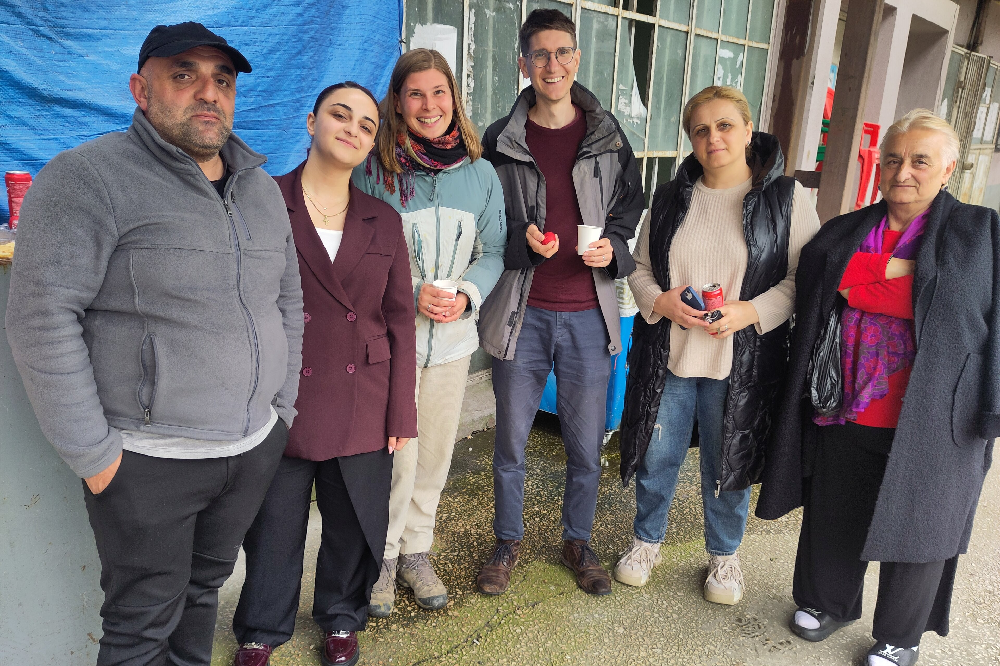

## Anfahrt und Unterkunft
Die Fahrt nach Tbilisi verlief einmal quer durch das Land. Zunächst entlang kleiner Landstraßen rund um Zugdidi, wo wir von einer Familie zu Wein und Khatchapuri eingeladen wurden, dann über die einzige Autobahn, die hinter Kutaisi hauptsächlich aus Tunneln und Brücken besteht, bis man die sanften Hügel rund um Tbilisi erreicht.
Insgesamt verlief alles bestens und nach 5 Stunden Hitchhiken wurden wir im typischen Stau von Großstädten _ausgesetzt_ . Unser erster Eindruck von Tbilisi hätte nicht besser sein können, denn der Bus Richtung unserer Herberge akzeptierte direkt unsere Kreditkarte und wir konnten die _Stadtrundfahrt_ beginnen.
Unsere Unterkunft war diesmal ein kleiner Fehlgriff, denn obwohl überall _Rauchen verboten_ Schilder angebracht waren, hielt sich selbst der Eigentümer nicht im geringsten daran 😮‍💨😮‍💨. Immerhin war alles ansonsten funktional und sauber und sowohl der Eigentümer als auch die Mitbewohner waren sehr lieb. Da wir immerhin mitten im Zentrum waren, hieß es möglichst viel Zeit im Freien verbringen.
 

## Hauptstadtflair
Hier machte es uns Tbilisi leicht, denn im Zentrum gab es viele schöne Parks, eine wirklich schöne nennenswerte Altstadt und sogar ein paar Fußgängerzonen. Auch fielen uns die vielen Plakate, die kulturelle Angebote bewarben, auf. Die vielen künstlerischen Statuen und Gemälde hier und dort ließen uns das erste Mal zu dem Schluss kommen, wie viel Kunst im öffentlichen Raum zur kultivierten Ausstrahlung und wohlbefinden einer Stadt beiträgt. (Nur, falls das nicht deutlich werden sollte, es hat auf uns einen sehr positiven Eindruck hinterlassen). Auch die modernen Gebäude fügen sich schick in das Zentrum ein und insgesamt scheint Tbilisi eine Stadt zu sein, die einen guten Platz in einer Liste lebenswerter Städte weltweit erreichen sollte. Unser physisches Mitbringsel aus der Stadt wird im Übrigen ein Holzperlenarmband in tibetischen Farben sein. Denn, als wir uns für unser _Brunch_ am nächsten Morgen mit allerlei herzhaftem georgischem Gebäck in einen der vielen schönen Parks saßen, kamen zwei buddhistische Mönche auf uns zu und gaben uns jeweils eines dieser Armbänder - natürlich gegen eine kleine Spende. Jetzt sind wir also um zwei Tbilisi-buddhistische-Armänder reicher, und sie um ein bisschen mehr Geld 😇.



## Lab Links: Mit Maya auf den Spuren des Erbe Georgiens
Anschließend wurden wir mit einer exklusiven Tagestour beschenkt. Denn Sandrine’s Dokoratsprofessor brachte uns in Verbindung mit Maya, selber Forscherin und langjährige Kollaborateurin von Sandrines Doktoratsgruppe. Ursprünglich war ein Besuch der Universität mit Laborbesuch und wissenschaftlichem Austausch angedacht, allerdings erwischten wir genau die Woche der orthodoxen Osterferien. Die Universität war also geschlossen.
Daher schlug Maya vor, einfach einen Tag gemeinsam zu verbringen, und überraschte uns mit einem detailliert ausgefeilten Tagesprogramm zur Erkundung der Umgebung Tbilisis. So trafen wir uns nahe des Stadtzentrums mit Maya und ihrem Cousin, der uns für den Tag begleitete und durch die Gegend fuhr. Schnell hatten wir Maya in ihrem roten Blazer entdeckt und auf ging es zum ersten Stopp des Jvari Monastery. Dieses überblickt von einem Berg eine Flussmündung, stammt aus dem 6. Jahrhundert und ist verwoben mit der Geschichte der heiligen Nino, die das Christentum nach Georgien gebracht hat. Als eine der frühen Kirchen der Region gilt sie als Begründung der Form der georgischen Kirchen, die ihr bereits in den ersten georgischen Posts gesehen habt.

Nach dieser wortwörtlich windigen Besichtigung, waren die Wolken vertrieben und wir setzten die Tour zum Städtchen Mtskheta fort. Dieses liegt direkt auf der anderen Seite der Flussmündung und bildet mit einer wirklich beeindruckenden Klosteranlage den zweiten Teil der UNESCO Welt Kultur Erbes. Wie bisher alle geistlichen Sehenswürdigkeiten, war der Eintritt frei und wir besichtigten die Kirche samt traditionell gemauertem Hof und Garten. Die Kirche war, wie im orthodoxen Stil üblich, mit Gemälden von Propheten und Heiligen reich geschmückt. Dafür gibt es nur einen Stuhl, wohl eher ein Thron, und ein abgetrennter Teil ist ausschließlich für Geistliche bestimmt. Besonders finden wir auch die Glocken, die häufig nach wie vor von Hand geläutet werden. Ebenfalls werden die Kleiderordnungen strenger als in Deutschland gehandhabt: Lange Hosen und keine Kopfbedeckung für Männer, Röcke/Kleider (lange Hose scheint langsam auch okay) und bedecktes Haar für Frauen.



Später kamen wir nicht umhin, in der Altstadt - zu beiden Seiten im Hintergrund frühlingsgrüne bewaldete Hügel - Wein-Eis 🍇🍦  zu probieren, welches uns nach anfänglicher Skepsis wirklich überzeugte und eine schön kräftig lilane Farbe hat. Anschließend ging es zu einer weiteren schönen Kirche mit einer Kapelle, bei der Nino gewohnt haben soll. Typisch für das georgische Christentum ist auch das "windmühlenartige" Kreuz, welches einem Original von Nino nachempfunden ist. Am Nachmittag fuhren wir dann auf immer kleiner werdenden Straßen zu einer abgelegenen Klosteranlage, die versteckt und geschützt in einem Tal ihre Schönheit entfaltet.

## Georgische Küche vom Feinsten
Letzter und mit hungrigem Bauch auch herbeiersehnter Stopp war ein schön am Fluss gelegenes Restaurant. Nach georgischer Tradition, bestellte Maya eine Fülle an – unseretwegen hauptsächlich vegetarischen – lokalen Speisen, die wir uns alle teilten. Auch an lokalen Getränken mangelte es nicht und wir probierten natürlich Wein, aber auch Bier und verschiedene der typischen, sehr süßen Limonaden. Inspesondere die Waldmeister-Limonode schmeckte uns super und hat dazu auch noch eine tolle knallgrüne Farbe (man stelle sich einfach den Wachelpudding in flüssig und erfrischend prickelnd vor). Während des Essens, ebenfalls traditionell, war Mayas Cousin unser _Tamada_ und sorgte für gute Toasts und tolle Gespräche. Wir aßen uns wirklich kugelrund, und konnten anschließend sogar noch eine Menge mitnehmen.




__Info: Supra & Tamada__
Wer in Georgien eine traditionelle Festtafel – die sogenannte _Supra_ – erlebt, taucht tief in die Seele des Landes ein. Eine Supra ist kein einfaches Abendessen, sondern ein hochgradig ritualisiertes Fest der Gemeinschaft. Geleitet wird der Abend vom _Tamada_, dem Tischmeister. Er wird zu Beginn bestimmt und ist dafür verantwortlich, den Abend mit philosophischen, emotionalen und tiefgründigen Trinkreden (Toasts) zu strukturieren. Erst nach einem Toast des Tamadas trinken die Gäste – meist auf die Religion, die Freundschaft, die Familie, das Land oder die Verstorbenen. Dabei wir das Glas - je nach vorliebe gefüllt mit Wein oder Chacha - auf einen Zug geleert.


## Reichlich beschenkt
Von der türkischen Gastfreundschaft hatten wir es ja [bereits](/posts/turkey/2026-04-03_Reflexion/#ein-paar-worte-zur-türkischen-gastfreundschaft). Dieser Tag mit Maya und ihrem Cousin ist ein gutes Beispiel dafür, wie sehr die georgische Kultur es auf jeden Fall damit aufnehmen kann. Wir wurden so großzügig beschenkt, dass es uns fast unangenehm war. Es reichte nicht, dass uns so viel gemeinsame Zeit und Aufmerksamkeit geschenkt wurde, diese ganze Tour organisiert und umgesetzt wurde, wir durch die Gegend chauffiert wurden, wir auch noch zu diesem reichen Essen und Trinken eingeladen wurden. Nein, es wurde auch noch darauf bestanden, uns zu dem Eis einzuladen, von dem hausgemachten Klosterwein wurde uns eine Flasche geschenkt, Sandrine durfte - Einsprüche abgelehnt - sich einen Kaschmirschal aussuchen, der ihr spendiert wurde und zu guter Letzt wurde uns beim Abschied auch noch eine riesige Geschenktüte mit lokalen Köstlichkeiten mitgegeben.

Obwohl wir ihre Gastfreundschaft also eigentlich schon lange überansprucht hatten, bestanden sie auch noch darauf uns nach diesem fantastischen Tag durch die quälend lagsamen Staus bis praktisch vor unsere Hosteltür zu fahren. An dieser Stelle also wirklich nochmal tausend und mehr Dank, wir werden diesen Tag sicher nicht mehr vergessen, und falls ihr mal in der Gegend seid, lasst es uns wissen! Wir würden eure Gastfreundschaft wirklich soo soo gerne erwidern wollen. მადლობა დიდი!

