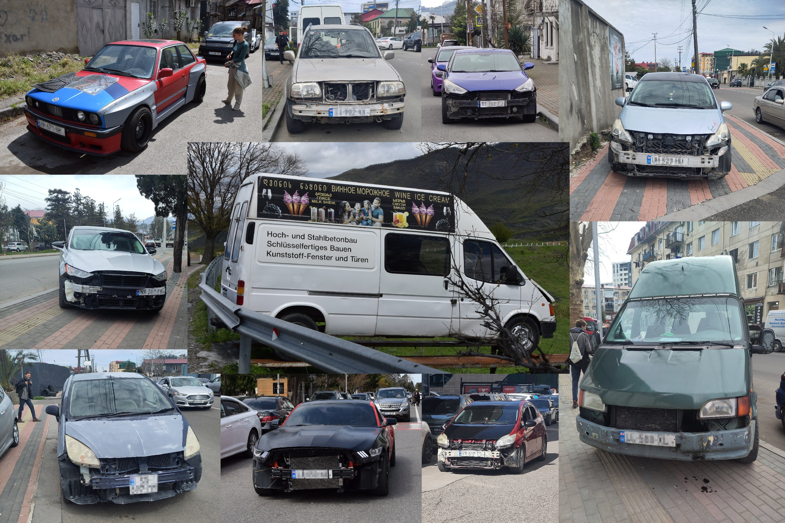

Am Anfang mussten wir uns an die augenscheinlich etwas kühlen Gemüter der Georgier gewöhnen. Schwarze Kleidung ist hier der Standard und damit einhergehend gibt es zunächst häufig eher ernste Blicke. Sobald man aber ins Gespräch kommt, ein paar Worte Georgisch zum besten gibt oder sich z.B. auf dem Markt für gewisse Dinge interessiert, ist man schnell in einem herzlichen Austausch und nicht selten wird man dann von _Giorgi_ - der häufigste Männername -  zu einem garantiert akolohischen Getränk eingeladen.

## Georgischer Wein, eine Tradition
Häufig handelt es sich hierbei um Hauswein aus eigener oder verwandschalftlicher Produktion. Diese neue Art des niederschwellig zugänglichen, legeren Weins des _einfachen Mannes_ war für uns ein durchaus angenehmer Kontrast zum in Westeuropa etwas _versnobbten Weinmilieu_; Insbesondere in Kombination mit  dem kuturellen [_Supra_](/posts/georgia/2026-04-20_Tbilisi/), die den jahrtausende alten Bestandteil von Wein in der hiesigen Kultur und Gesellschaft repräsentiert. So gehört es auf Friedhöfen zum Brauchtum, neben den Grabsteinen, auf denen lebensgroße, bisweilen sogar farbige Fotografien die Erinnerung an die Verstorbenen wachhalten, auf überdachten Bänken anzustoßen und mit den Toten zu trinken. Eine gewisse Kehrseite ist die starke Normalisierung von Alkohol im Alltag und, gerade an Wochenenden, konnte man nicht wenige offensichtlich betrunkene Herren im öffentlichen Raum antreffen. Zudem wird auch hier, ähnlich zur Türkei, sehr viel geraucht.



## Tief im Glauben verwurzelt
Etwas überrascht waren wir doch über die nach wie vor große Rolle von Religion. So bekreuzen sich vor allem, aber nicht nur, auf dem Land viele Leute die an Kirchen vorbeikommen stets drei Mal. Auch die Jugend ist davon nicht ausgenommen. Zudem sind die Regeln für den Besuch der Georgisch Orthodoxen Kirche streng und werden auch kontrolliert. Die Kirchen selbst mit ihrer charakteristischen aufgetürmten Form sind voll mit reich vergoldeten heiligen Gemälden, bei denen Leute beten und auch die auch geküsst werden. In Summe erinnert es fast an ein historisches Kunstmuseum. Es leuchten viele Kerzen und stets gibt es nur einen Thron, nicht aber Bänke oder eine Orgel. Die einzige erlaubte Musik sei wohl Gesang, wobei wir auch davon keinen gehört haben. Erwähnenswert ist auch die Form des Nino Kreuzes, dessen Aussehen eher in Richtung Windrad geht. In jedem Ort fielen uns zudem die großen Banner mit dem kürzlich verstorbenen Patriachen auf, um den die Gesellschaft wohl sehr trauert. Interessant fanden wir insbesondere nach der Türkei (in der wir kaum jemanden haben betteln sehen) auch, dass vor praktisch jeder Kirche mindestens eine Frau mittleren bis höheren Alters um Almosen bat.



## Auf der Suche nach Identität
Die Geschichte Georgiens ist bewegt und vielfach beeinflusst vom Erblühen und Erlöschen benachbarter Großreiche. So ist in der moderneren Geschichte eine der prägenden Fragen das Verhältnis zu Russland. Hier merkt man einen deutlichen Wechsel: Sprechen alle Leute älter als vielleicht 30 Jahre vorwiegend Russisch als Zweitsprache, wurden spätestens seit der Teilannektion durch Russlad 2008 alle öffentlichen Beschilderungen etc. auf Georgisch + Englisch umgestellt und die nächste Generation wächst klar mit Englisch auf. Auf der anderen Seite gibt es russischstämmige Bevölkerung und Auswanderer, die gerade in den modernen Stadtzentren einen beachtlichen Anteil ausmachen. Ganz im Kontrast dazu, fielen uns die vielen EU Flaggen auf, die zumindest an allen offiziellen Gebäuden wehen, ebenfalls wie die vielen _Gefördert durch die EU_ Aufkleber. Wann immer man auf eine Georgische Flagge traf, war auch die der EU daneben. Allerdings gibt es in dieser Hinsicht mit der neuen eher russlandnahen Regierung ggf. bald wieder einen Wechsel. Ebenfalls dominierten in der zugegebenermaßen ziemlich guten Musik, die wir beim Hitchhiken oder mit unserem freundlich betrunkenen Nachbarn in [Zugdidi](/posts/georgia/2026-04-15_Zugdidi) zu hören bekamen, russische Lieder.

## Autos ganz nackisch
Wenn ihr euch versucht, die Autos, die uns mitgenommen haben vorzustellen, ist ist es wichtig zu wissen, dass Georgien diese häufig als Unfallwagen importiert und wieder flott gemacht hat. Dies scheint zu einem chronischen Mangel and Verkleidung zu führen und da diese nicht allzu wichtig ist, fehlt diese einfach. Aus dem gleichen Grund fährt man, trotz Rechtsverkehr, häufig mit Rechtslenkern. Böse Zungen würden behaupten, dass die erfahrene Fahrweise allerdings auch nahelegt, dass einige der Wagen auch lokal verunfallt werden; Im Übrigen sind wir als Hitchhiker selbst Zeuge eines solchen Unfalls geworden, als unser Fahrer, der non-stop auf seine Handynavigation schaute, in der Kreuzung von einem Auto von rechts geknutscht wurde. Außerdem ist aufmüpfiges Fahren hier Volkssport, denn ungeachtet der Platz-, Sicht- und Straßenverhältnisse, mit aufheulendem Motor überholen geht eigentlich immer. Das ist hier insbesondere auch deshalb eine hohe Kunst, da hier die Freiheit der heimischen Nutztiere hoch gehalten wird und Kühe, Schweine, Ziegen,… frei herumlaufen. Das hat im Übrigen auch durchaus seine Vorteile, denn zum Beispiel der Autobahnmittelstreifen muss nie geschnitten werden.

## Lieblich üppige Natur soweit das Auge reicht
Immerhin können die meisten dieser Tiere dadurch die wunderschöne Natur genießen. Die sanften, von Mischwald begrünten Hügel sind stehts von klaren Bächen oder wilden Flüssen durchzogen. Und im Norden, Süden und Osten ist das Land durch schneebedeckte Hohe Berge begrenzt, die bei gutem Wetter stets im Hintergrund zu sehen sind. Im Westen am schwarzen Meer ist es flacher, wärmer und somit auch mehr von Palmen gesäumt. In Summe, ist es vom Landschaftstypus gar nicht so groß anders zu Zentraleuropa, nur eben einfach einen Hauch milder, saftiger, üppiger, lieblicher… Auch in den Städten wird an Begrünung nicht gespart und im Kontrast zur Türkei, strahlen die Parks mit ihren großen, alten Bäumen, stilvollen Kunstwerken und einfach schick und gut geplanten Anlagen.
Daneben prägen auch die sich endlos schlängelnden gelben Gasleitungen an jeder Straße das Landschaftsbild.



## Und sonst so?
Da unser Aufenthalt auch viel durch Projekte geprägt war, fiel uns auf, dass diese ausschließlich von Einwanderern geleitet wurden. Dies war in der Türkei durchaus nicht der Fall. Durch die Anekdoten unserer Gastgeber, sowie dem ein oder anderen Erlebnis mit Einheimischen (Nachbarn, Familienangehörigen, Freunden, Arbeitern, Marktverkäufern, ect.) haben wir auch ein wenig die hiesige Arbeitsmentalität kennengelernt und die _perfektionsversessene Arbeitswut_ scheint in dieser Region nicht gerade das erstrebenswerteste Ziel zu sein. Es scheint eher eine spontane Herangehensweise zu geben mit einer guten Portion des Passt-Schon-Für-Den-Moment-Optimismus. 😉

