## Aktau: Western-Vibe mit Sowjet-Charme
​Nach unserer Überquerung des [Kaspischen Meeres](/posts/azerbaijan/2026-06-30_Baku) wachten wir also in unserer ersten Stadt auf der anderen Seite des Kaspischen Meers in Kasachstan auf: in Aktau. Aktau ist spannend, da es so ganz anders ist als Baku. Ein bisschen erinnerte es uns an eine Stadt aus den 60er-Jahren mit vielen Reihenhausblöcken, weiten Straßen und sehr viel Platz. Überhaupt ist die Stadt sichtlich noch recht jung: Tatsächlich wurde sie erst 1958 als Arbeitersiedlung für den Uranabbau und die Erschließung von Ölquellen aus dem Boden gestampft. Und naja, irgendwie passt das auch zum Eindruck, den wir von der Stadt hatten. ​Während Baku’s Zentrum an allen Ecken und Enden mit Bling-Bling klotzt, ist in Aktau von Schnickschnack keine Spur. Es bleibt der Eindruck einer durch und durch funktionalen Stadt, die einzig und allein für ihre Einwohner und deren Arbeitskraft gemacht ist. Als Tourist ist man hier gänzlich _off the beaten path_. Wie es scheint, wird derzeit auch gar nicht wenig Neues gebaut. Hier und da entsteht ein Einkaufszentrum, eine Statue oder ein Ärztekomplex. Doch alles steht wie einzelne Legoblöcke eher für sich allein, anstatt sich in ein zusammengehöriges Stadtbild einzufügen. 


  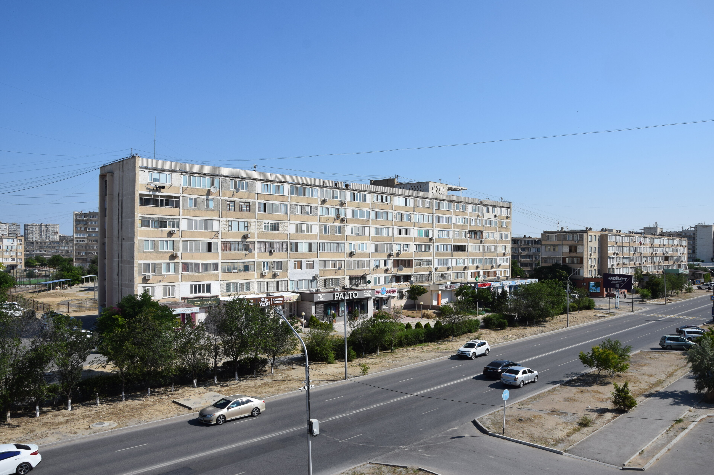
  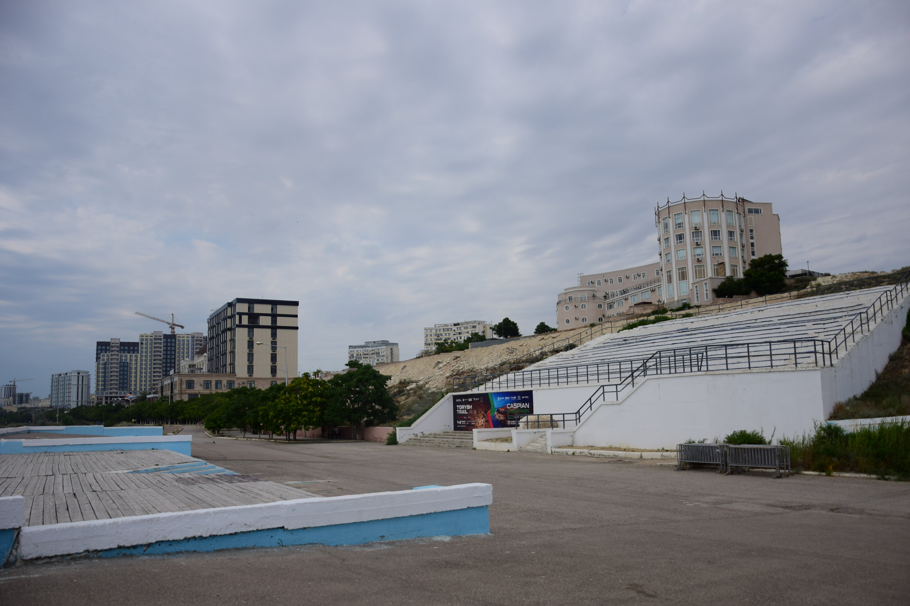
  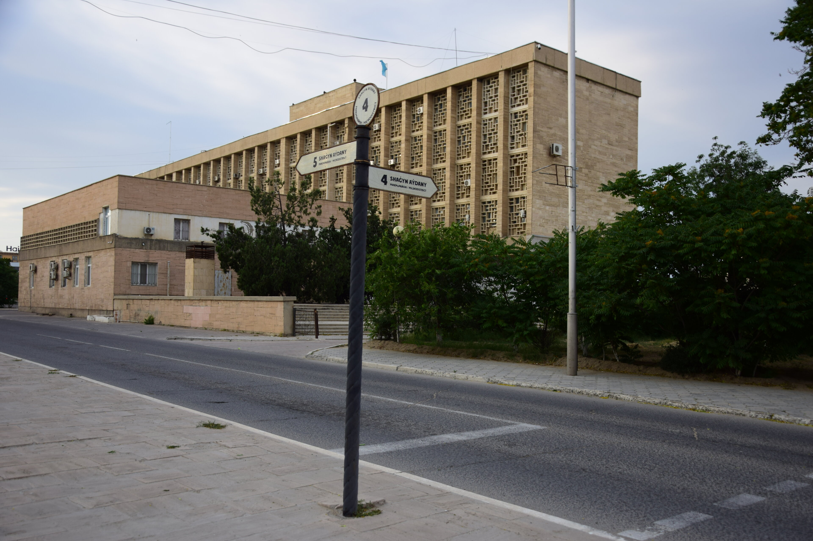
  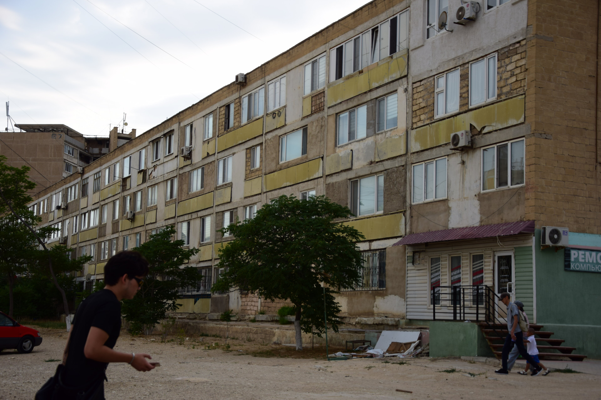


Nett fanden wir den Rummelplatz im Zentrum, der uns an einen antiquierten, etwas verlassenen und im Verfall befindlichen Ostblock-Freizeitpark mit sowjetischem Raumfahrtthema erinnerte. Die beliebteste Freizeitbespaßung scheinen im Zentrum Boxautomaten zu sein, die man regelmäßig antrifft und die von den Jungs freudig genutzt werden. So wie die Stadt als Ganzes im Quadrat gebaut ist, sind es häufig auch die Gebäude: Die Wohnblöcke ohnehin, aber auch die offizielleren Bauten wie etwa die Philharmonie bestehen aus monumentalen Quadern mit – wenn überhaupt – eher geometrisch-heroischen Verzierungen. 
​
Wenn man ein bisschen weiter in die Außenbezirke fuhr, fielen am Straßenrand recht für sich allein stehende Gebäude auf – beispielsweise Restaurants oder Eventlocations mit pompösen Styropor-Stuck-Prunk-Front-Fassaden. Wohlgemerkt, die weiteren drei Seiten dieser Gebäude sind zumeist nicht ganz so prunkvoll, oft noch nicht einmal verputzt und bestehen aus Betonpfeilern, zwischen denen Ziegelwände gemauerst sind. Sie passten derart wenig in ihre Umgebung, dass es schon wieder recht amüsant war. Leider haben wir verpasst, ein Bild eines solchen Prachtexemplars zu machen, weshalb wir eurer Fantasie hierfür einfach freien Lauf lassen müssen. Überhaupt erinnern die weiten, staubigen Straßen mit den jeweils nur vereinzelten Häuserreihen zur Rechten und zur Linken fast ein bisschen an eine Westernkulisse. Dazu die staubige Landschaft mit den alleinstehenden Fassadengebäuden und die Illusion ist perfekt. Wahrscheinlich gibt es irgendwo auch den wohlbekannten _Apachen-Pub_.


  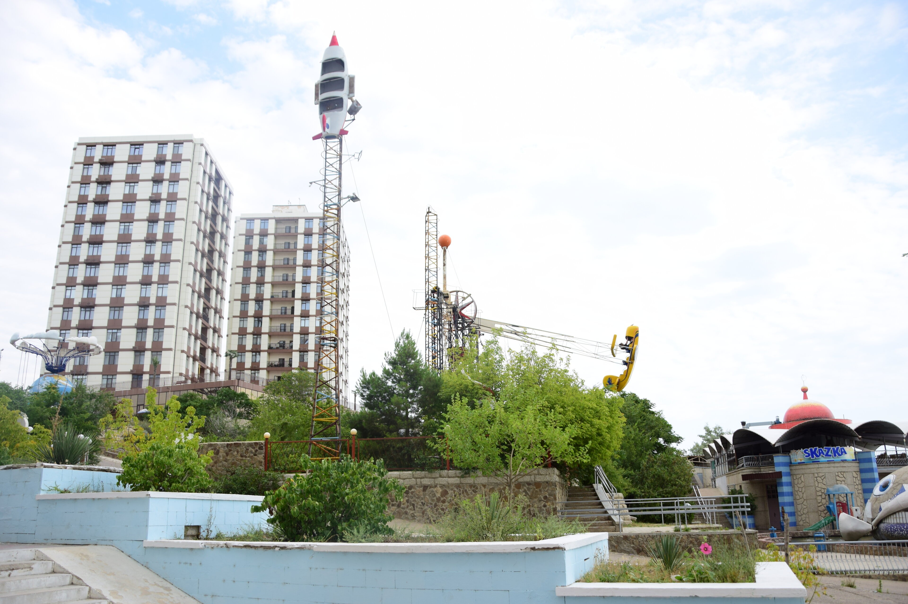
  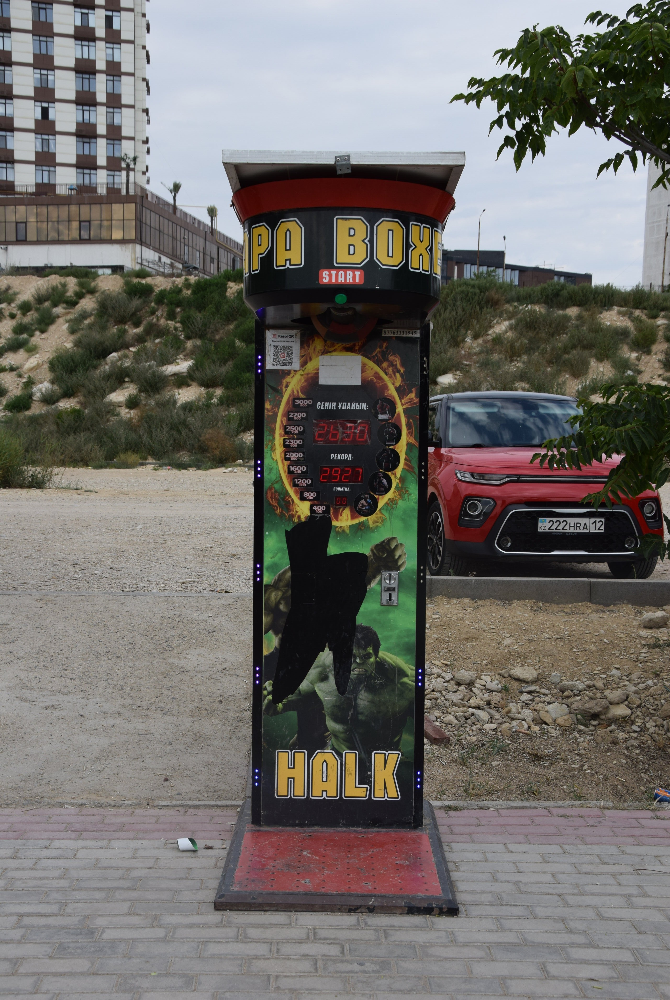
  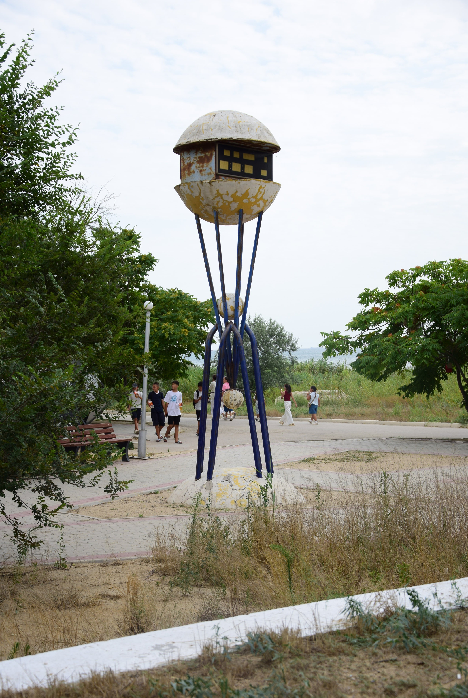
  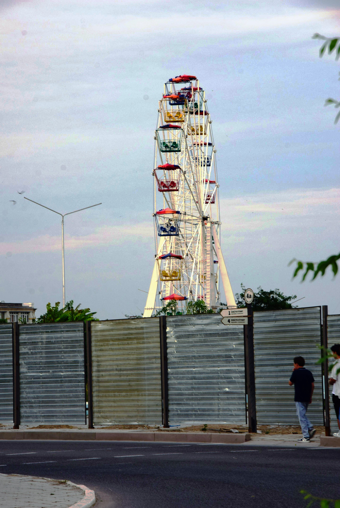


### Vom anderen Ufer ist das Wasser immer blauer
Im schillernden Kontrast zum sonstigen Stadtbild steht der _Скальная тропа_ (dt. Felsenweg): eine etwa 1,5 Kilometer lange, sehr schick ausgebaute Uferpromenade mit kleinen Grotten und prächtiger Beleuchtung bei Nacht. Sie scheint in Aktau definitiv _the place to be_ zu sein und wird auch von den Einheimischen extrem gut besucht. Schwimmen kann man hier wunderbar, und wie wir es schon auf der anderen Seite des Kaspischen Meeres bei Länkäran erlebt hatten, war das Wasser auch hier wieder angenehm schwach salzig – im Gegensatz zu Länkäran dafür aber wunderschön klar! ​Erstaunt waren wir allerdings darüber, wie dermaßen eisig das Wasser hier war. Während das Kaspische Meer auf aserbaidschanischer Seite bei recht kühler Luft noch überraschend warm war, galt in Aktau genau das Gegenteil: Die Luft war brennend heiß, das Wasser dafür eisig – keine Untertreibung! ​Etwas weiter ging der Weg dann in eine "normale" Promenade über, an der es sich ebenfalls ganz nett entlangspazieren ließ. Köstlich amüsiert haben wir uns hier über die plastik Fake-Palmen entlang des Weges – denn das für echte Palmen benötigte warm-trockene Wetter hätten sie hier ja eigentlich gehabt! In der Gesamtschau fiel uns zudem sehr positiv auf, dass in und um Aktau kaum Müll herumlag.

## Ab in die Wüste
Fragt man nach Empfehlungen von Leuten aus der Region oder sucht im Internet, ist dieses Eck Kasachstans, welches sich Mangystau nennt, vor allem für die vielen beeindruckenden Steinformationen im Hinterland bekannt. Öffentliche Busse gibt es dorthin freilich nicht – warum auch, schließlich herrscht da draußen weit und breit gähnende Leere – und ein eigenes Auto besitzen wir bekanntlich nicht. Touren kann man natürlich buchen, aber das ist erstens teuer und zweitens nicht wirklich unser Stil.

​Da auch unsere Fähr-Weggefährten und aktuellen WG-Mitbewohner in Aktau, Klara und Dennis, ohnehin überlegt hatten, die Steppe mit einem Mietwagen auf eigene Faust zu erkunden, beschlossen wir kurzerhand, weiterhin gemeinsame Sache zu machen. Gesagt, getan: Schon tauschten wir unsere gemeinsame kleine Mietwohnung für die nächsten drei Tage gegen das billigste Billo-Zelt und ein geländetüchtiges Allradfahrzeug ein. Wir hatten schließlich aus unserer Erfahrung in Armenien gelernt und einen tiefgelegten Mietwagen diesmal als doppelt untauglich verworfen! 🤓 Zwar gab es diesen nicht über eine der normalen Plattformen, aber im Internet kursierten diverse Whatsapp Nummern für sehr vertrauenserweckende Vermieter!



So waren wir schon bald _on the road_ und mussten rasch feststellen: Was auf der Karte Kasachstans nach überschaubaren Strecken aussieht, entpuppt sich in der Realität als absoluter Tachokiller. In der Türkei hatten wir ja bereits ein Gefühl dafür bekommen, was "da ist wirklich nichts" bedeutet – aber dass das noch gar nichts war, erfährt man erst im Vergleich mit Kasachstan. Das wird einem spätestens dann bewusst, wenn man an Straßenschildern vorbeifährt, die die nächste Tankstelle oder Stadt in geschlagenen 300 Kilometern ankündigen. Und wer glaubt, dass es bis dahin zumindest ab und zu mal ein kleines Dorf gibt, wird schnell eines Besseren belehrt: Die nächste Stadt ist das nächste Dorf – und dazwischen liegt einfach wirklich _NICHTS_.

### Fauna: Überall Kamele!
Naja, das heißt natürlich nicht _nichts_, sondern schlicht nichts Menschengemachtes. Denn Pferde, Kamele und Spinnen gibt es hier zuhauf! Die zotteligen _Kamedare_ hatten allerdings oft nur anderthalb Höcker und waren zumeist auch mit einem dicken Buchstaben mit Farbe "aus dem Baumarkt des Verstrauens" als Nutztiere  gekennzeichnet. Auch tummeln sich in der Steppe Wüstenrennmäuse und kleine (seeehr putzige) Erdmännchen-artige Wesen, die laut unserer Internetrecherche wohl Ziesel oder Steppenmurmeltiere sind. Sogar eine winzige Schildkröte hat unseren Weg gekreuzt. Und sonst?


  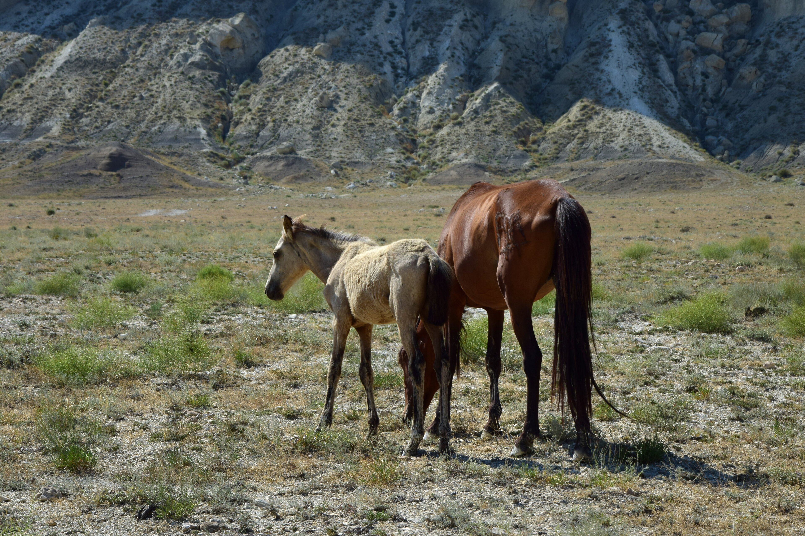
  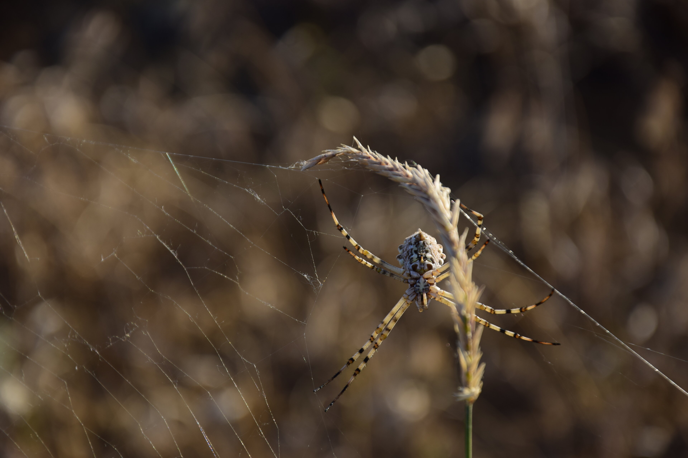
  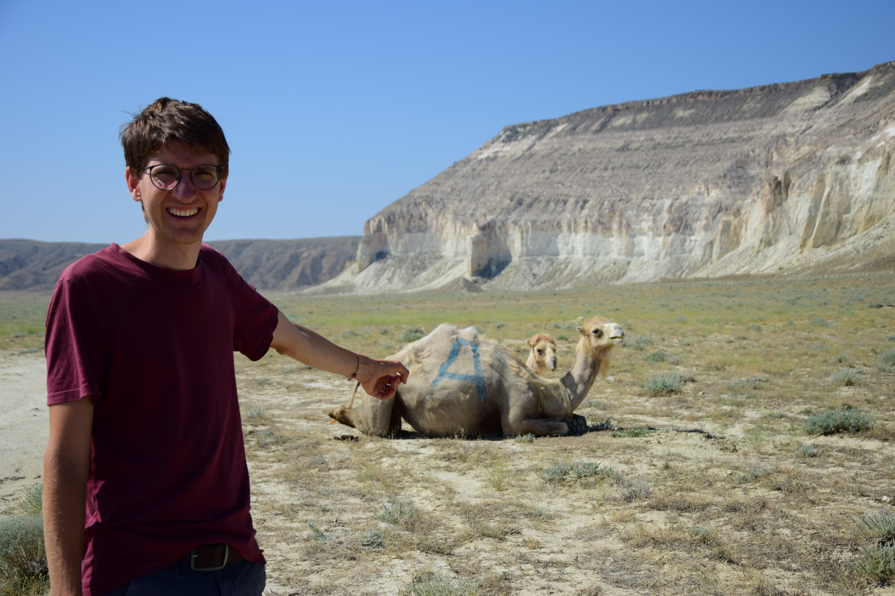
  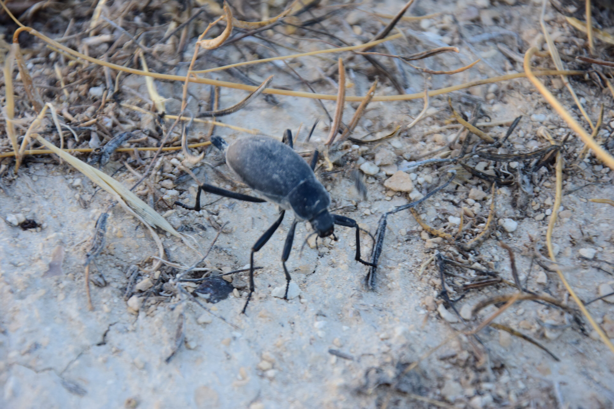
  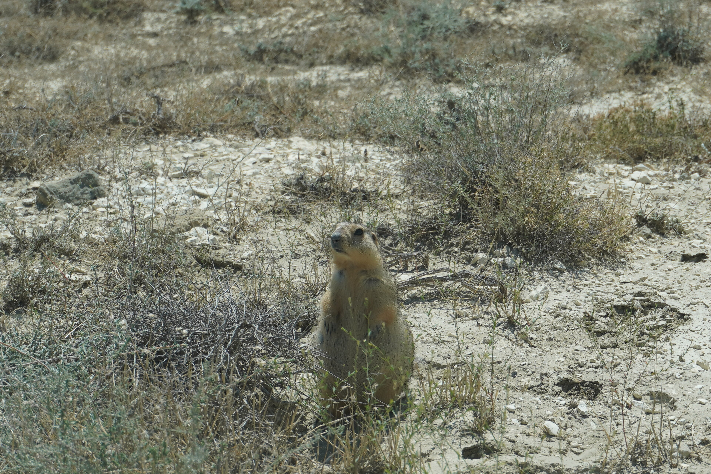
  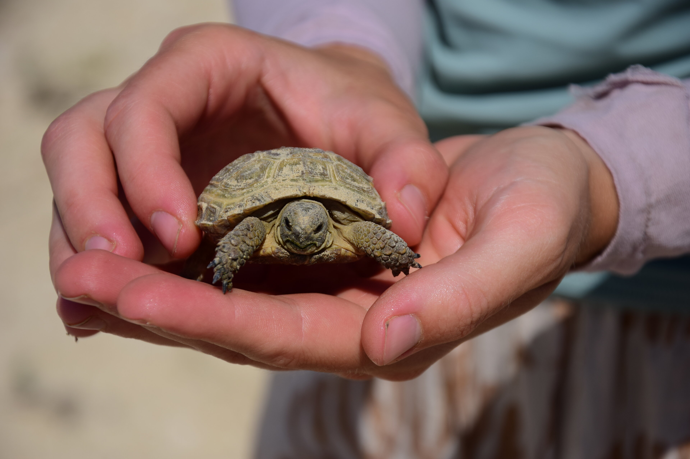


### Und Flora: Nirgendwo Schatten!
Die Landschaft sieht aus, als hätte man einen ehemaligen Meeresboden ausgetrocknet und in eine Wüste verwandelt. Und _guess what_: Es sieht nicht nur so aus, es ist auch so! Das Land ist meist flach, liegt unter dem Meeresspiegel, abgesehen von einigen Bergformationen oder Canyons, die hier und da aus der Landschaft ragen oder sich in den Boden schneiden. Wie ein Gebirge, das sich im absoluten Endstadium des Verfalls befindet, sind die Felsformationen von allen Seiten rund abgeschliffen und spenden somit praktisch nirgendwo Schatten. Danke dafür! 🥵 ​An einigen Stellen gibt es etwas höher gewachsenes, steppenartiges, hartes Gras, doch meist ist der Boden selbst dafür viel zu trocken. Für uns war das stundenlange Durchfahren dieses für uns ganz neuen Landschaftstypus ein neues Abenteuer. Einmal sind wir sogar an einem Kamelkadaver vorbeigekommen, der mit seinem ganz eigenen, makabren Charme auch irgendwie ins Gesamtbild passte.



### Majestätische Camporte
Jeder Tag war von einer völlig neuartigen Kulisse geprägt. Allzu weit wollten wir allerdings nicht fahren, da wir unsere Zeit nicht nur im Auto verbringen wollten. Zudem hatte unser Mietwagen ein Tageslimit von 150 km, ab dem jeder weitere Kilometer extra gekostet hätte. Daher ließen wir entferntere Highlight-Spots wie das berühmte _Bozzhyra-Tal_ aus und suchten uns stattdessen spannend klingende Orte in überschaubarer Distanz. Das führte zu einer genialen Mischung aus unterschiedlichsten, beeindruckenden Schlafplatzkulissen.
Am ersten Tag wanderten wir durch das Kugeltal _Torysh_, das für seine faszinierenden, kugelrunden Steinformationen bekannt ist, und übernachteten am Fuße des nahegelegenen _Valley of Concretions_.



Früh morgens von der Sonne geweckt, die unser Zelt im Nu in eine Instantsauna verwandelte, frühstückten wir im den schnell kürzer werdenden Schatten der erodierten Hänge. Dann ging es auch schon weiter und wir sprangen an beliebigen Spots, die uns anlachten, aus dem Auto. Hierbei wurden wir mit jeder weiteren Minute unter der brennenden Sonne träger und träger und bald schleiften wir uns fast schon zum Auto zurück. Dabei hätte es bei dem ein oder anderen Felsen doch schöne Kletterwege gegeben, doch unausgesprochen waren wir uns alle einig, dass es dafür einfach doch irgendwie ein bisschen zu erbärmlich wärmlich ist. Wie passend, dass wir bei einer kleinen öffentlich zugänglichen Oase vorbeikamen, an der wir dann auch prompt ein Weilchen faulenzten.

Für die nächste Nacht schlugen wir unser Zelt knapp am Rande einer Steilklippe mit majestätischem Blick auf den Salzsee _Sor Tuzbair_ auf. Leider war diese Klippe auf ca. 100 km komplett durchgängig, und wir hätten, um an den See selbst zu kommen, einen ebenso langen Querfeldein-Umweg in Kauf nehmen müssen, sodass wir uns dieses Abendteuer für ein Andermal aufheben. Doch der erhabene Ausblick auf den zur Dämmerung rosa schimmernden See hat sich auf jeden Fall gelohnt.


  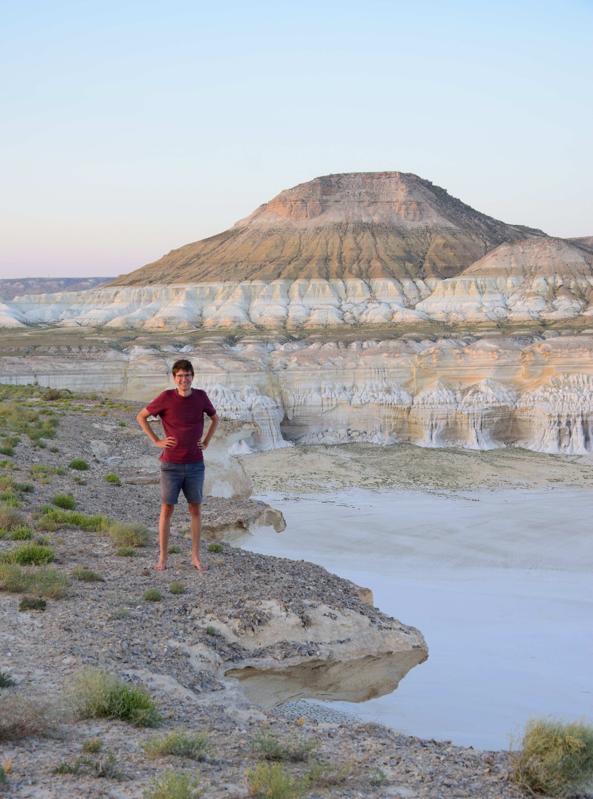
  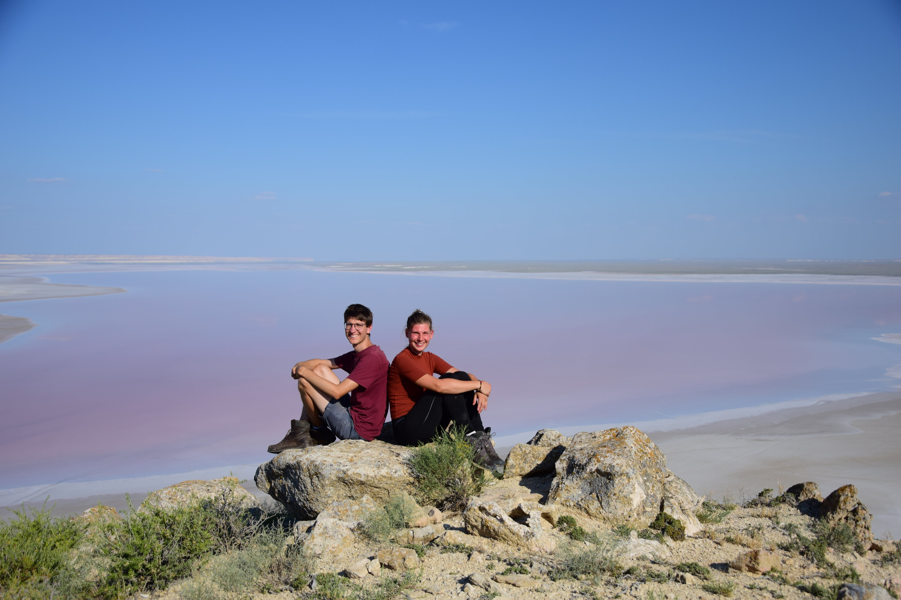
  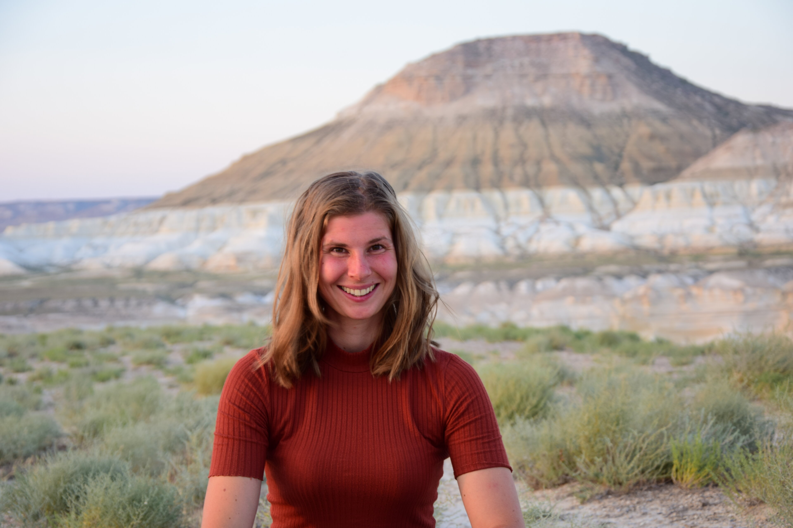
  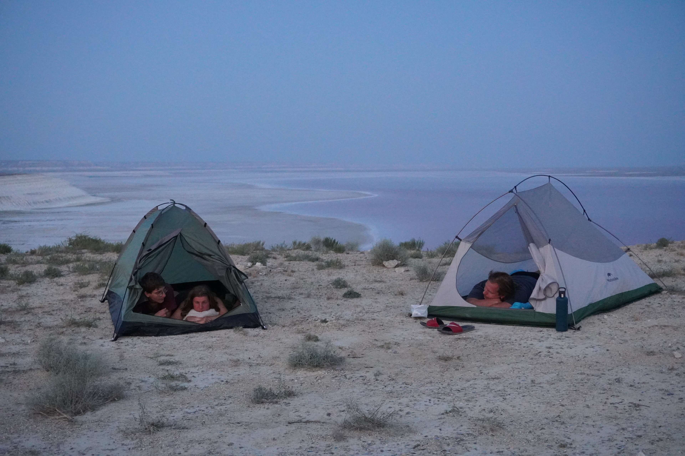


Zu guter Letzt suchten wir uns für die dritte Nacht einen Schlafplatz nahe einer engen Schlucht aus, die sich fernab von der geteerten Straße etwas unerwartet die Steppe durchzieht. Diese fiel durch ihre beeindruckenden Überhänge und feinen, fast schon künstlerisch gemusterten, schwammartigen Aushöhlungen auf.


  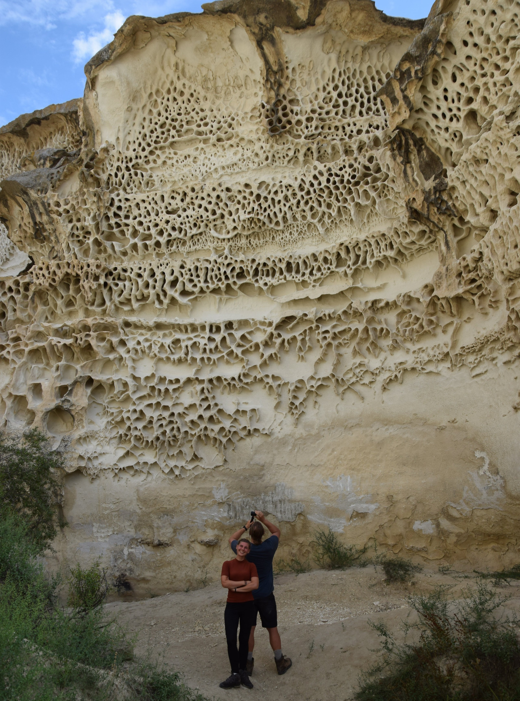
  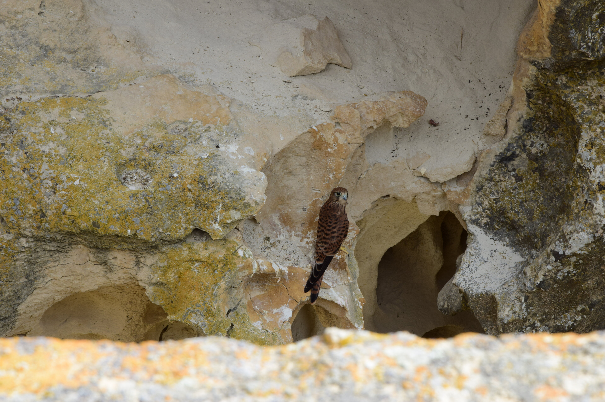
  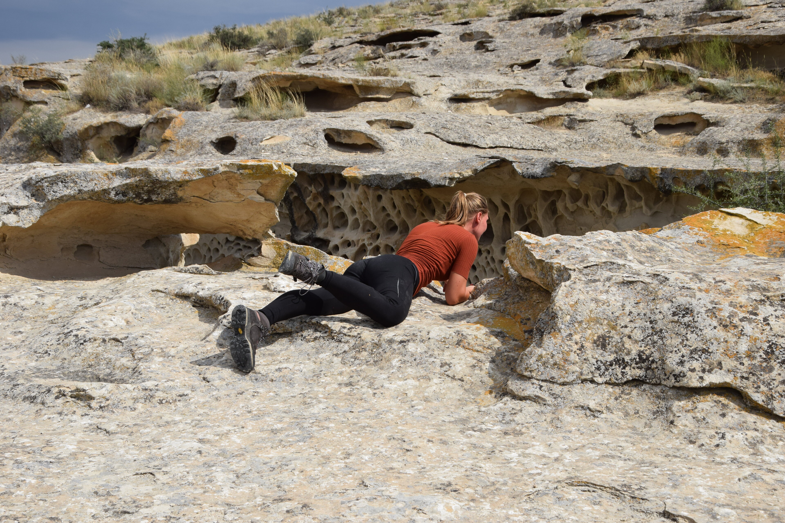
  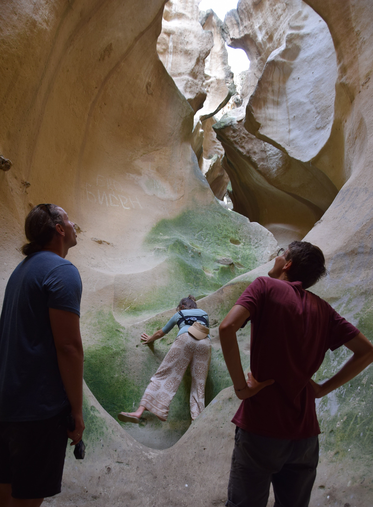
  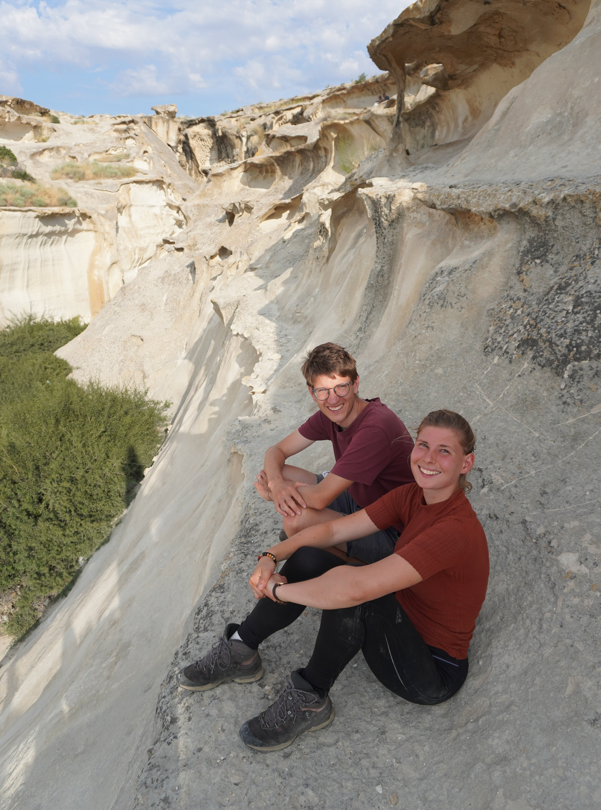
  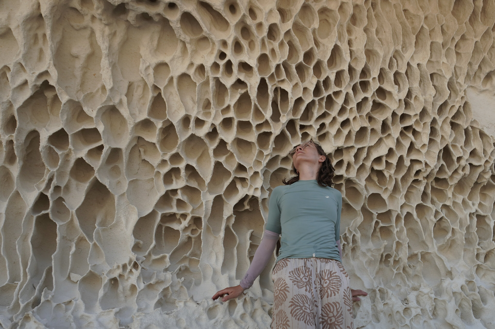


Bei all diesen Fahrten lernten wir unser Auto mit Unterbodenfreiheit und 4-Rad-Antrieb schnell zu schätzen. Umso mehr, da wir gutenteils abseits geteerter Straße durch das _Nichts_ unterwegs waren. Hier entpuppten sich viele Wege als doch seeehr abenteuerlich, sodass wir abschnittsweise sogar auf reines Querfeldein-fahren umstellten. Insbesondere Klara, die fast die vollständige Strecke fuhr, hatte bald einen Profiblick für Schlaglöcher, Schwellen, Seitenneigung und was sonst noch so zum Problem werden könnte, und navigierte uns sicher an jedes gewünschte Ziel.

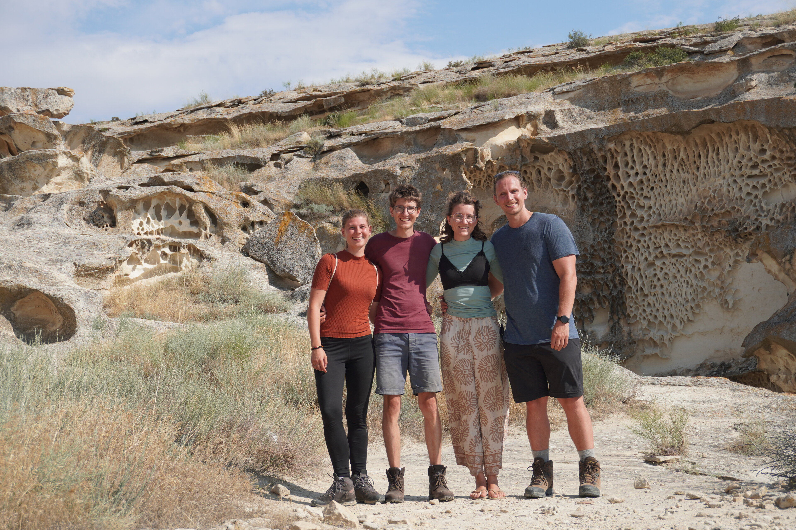

Was wir aus diesen Tagen mitnehmen? Dass auch _Nichts_ in Mangystau vielfältiges zu bieten hat und in Wirklichkeit noch viel größer und heißer ist als es die Karten zeigen.

