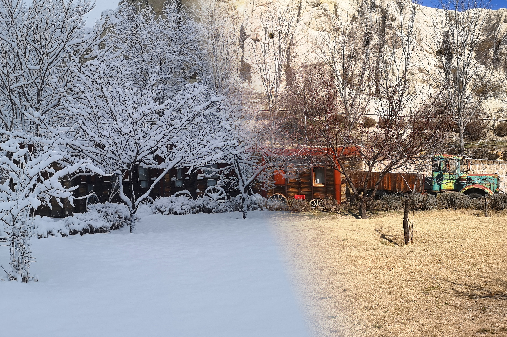
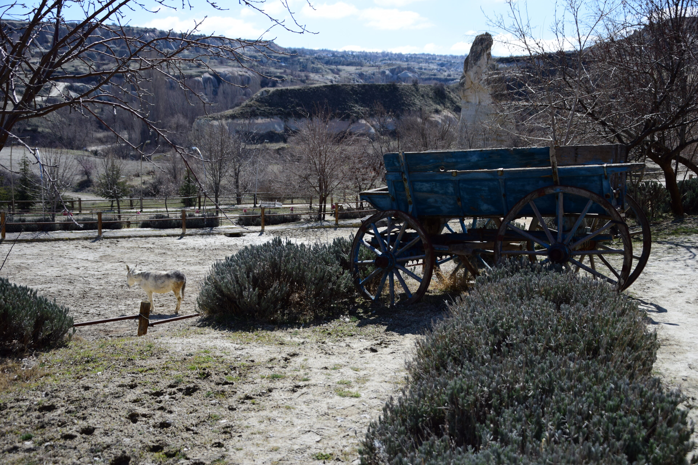
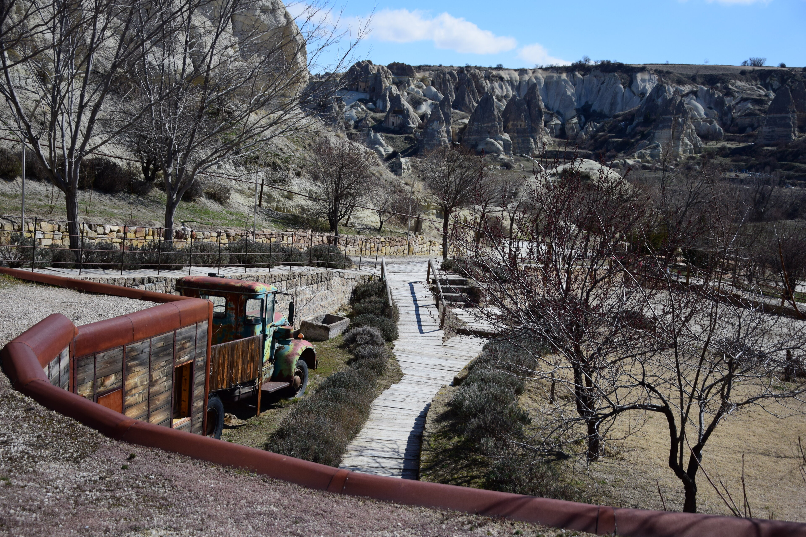
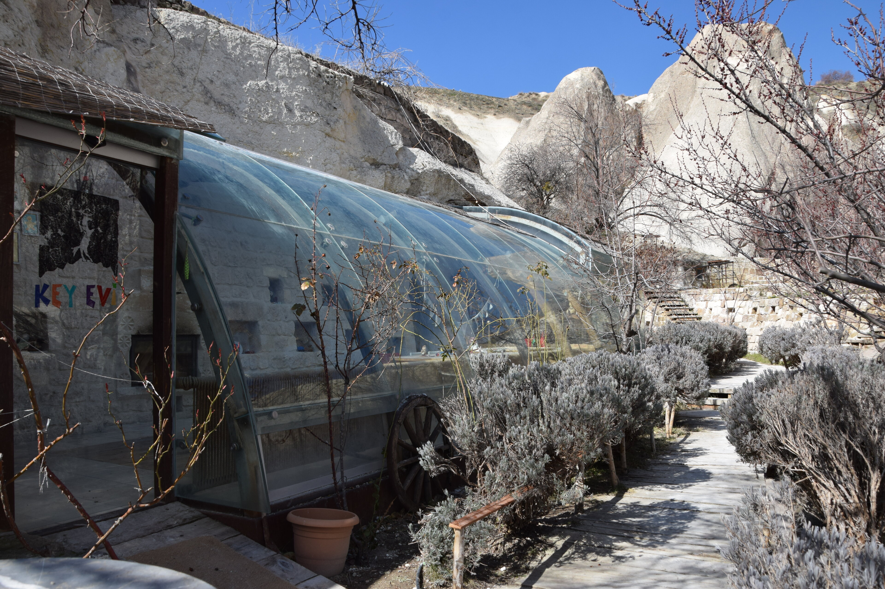
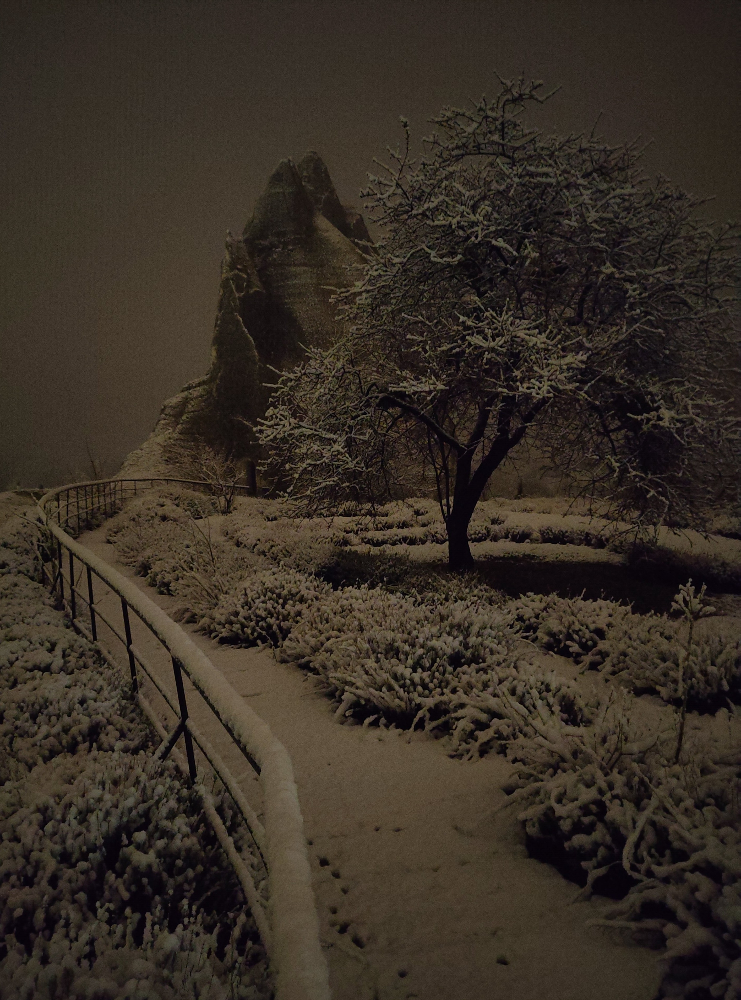
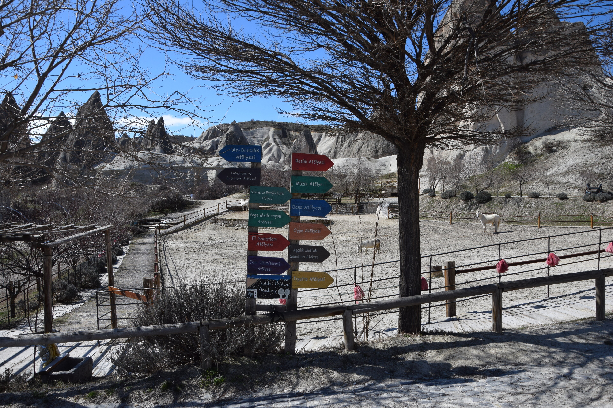
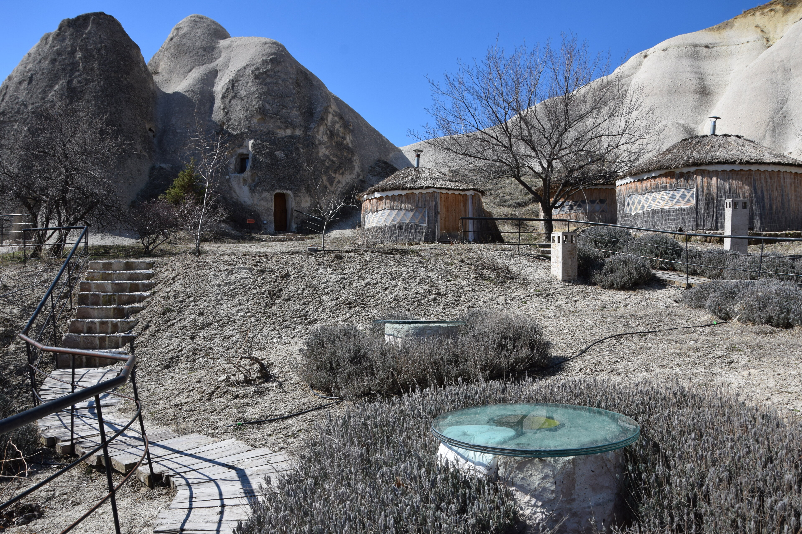
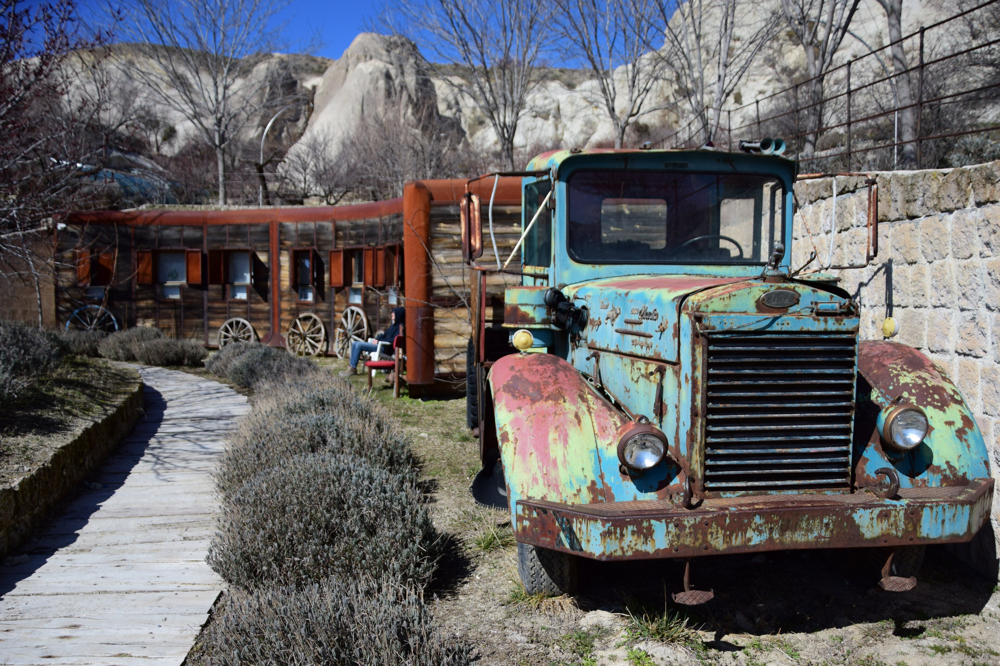
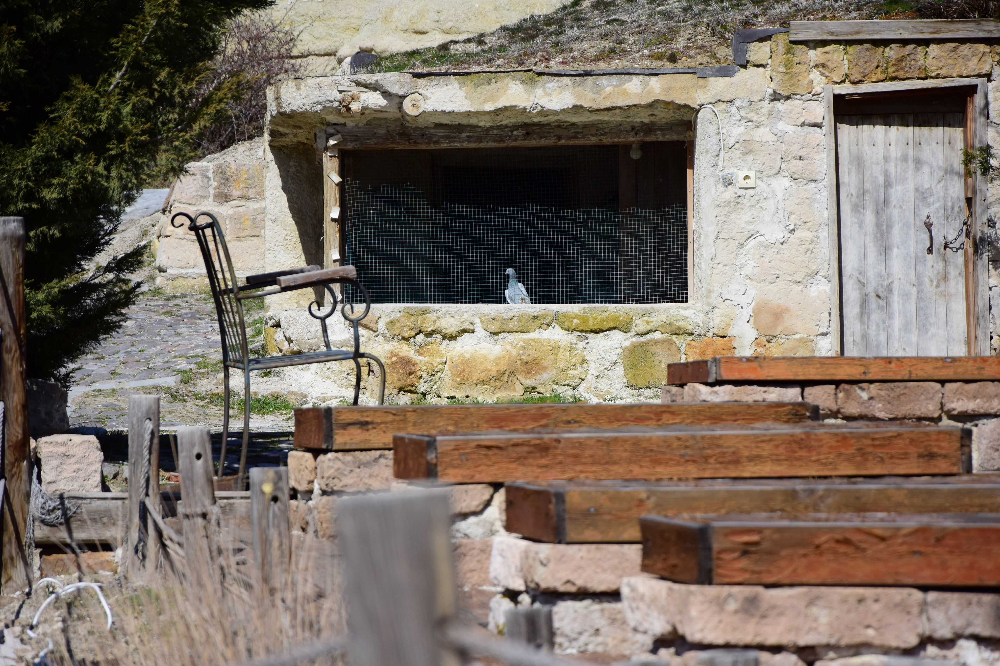

## Auf dem Weg nach Kapadokya
Noch vor Sonnenaufgang packten wir unsere sieben Sachen, um uns auf den Weg nach Kappadokien zu machen. Nach einem kurzen, aber herzlichen Abschied von Ali, der extra für uns so früh aufgestanden war, brachen wir gegen 06:30 Uhr in Richtung Dorfbushaltestelle auf. Wir waren uns nicht sicher, ob es mit dem Bus klappen würde. Umso überraschter – und nicht weniger erleichtert – waren wir, als der Bus, nur kurz nach uns, tatsächlich auftauchte, auf die Minute genau nach Plan abfuhr, und wir so überpünktlich am interregionalen Busbahnhof von Antalya ankamen. Auch in diesem lokalen Bus konnte man wieder problemlos seine Kreditkarte „antappen“, wie praktisch!
​
Von Antalya aus brachte uns ein Fernbus von _Kamil Koç_ (gekauft von Flixbus, über deren Website wir den Spaß auch buchen konnten) in einer neuneinhalbstündigen, doch sehr szenischen und kurzweiligen Fahrt ins aktuell kalte Herz der Türkei. Die Route selbst ist eine Erwähnung wert: Zunächst windet sie sich durch verschneite Bergpässe und winzige, verschlafene Dörfer mitten im Nirgendwo bis auf eine leere Hochebene, wo plötzlich komplett neu erbaute und scheinbar noch kaum belebte „Copy-Paste-Städte“ aufpoppen. Nach dieser Kulisse kamen wir ziemlich pünktlich um 18:30 Uhr in Göreme an.



## Welch ein Trubel
Göreme ist winzig, dafür aber umso wuseliger. Ein bisschen wirkt es wie die Heidelberger Altstadt zur Weihnachtszeit in kappadokischer Landschaft. Wir stiegen aus dem Bus, und in der Abenddämmerung blinkten überall warmweiße Lichterketten an den Häusern und Bäumen. Souvenirshops gibt es zuhauf, und an Restaurants und Cafés mangelt es wahrlich nicht. Zudem springt einem die offensichtlich große asiatische Zielgruppe ins Auge: So finden sich auf diesem kleinen Fleck unter anderem chinesische, koreanische und indische Küche; Aufschriften sind nicht selten auch auf Chinesisch oder Korianisch, passend dazu hatten die meisten Besucher, die uns entgegenkamen, asiatische Gesichtszüge.



​Der Weg zu unserer Unterkunft war nicht weit. Wir mussten lediglich der hell beleuchteten Hauptstraße folgen, dreimal um die Ecke biegen und standen nach 15 Minuten im dunklen Nationalpark vor der _Little Prince Academy_  – unserer Unterkunft und Arbeitsstelle für die nächsten drei Wochen. Da Montag, unser Ankunftstag, der einzige freie Tag für Mitarbeiter und _Volunteers_ ist, war zum Zeitpunkt unserer Ankunft keiner zu Hause. So ließen wir unsere Taschen stehen und zogen, auf der Suche nach Abendessen, noch einmal los ins Städtchen. In der Zwischenzeit erhielten wir die Information, wo wir Bettwäsche finden würden, und so kehrten wir zwei Stunden später mit vollem Bauch in die noch immer leere Akademie zurück und fielen vom Reisetag k.o. ins Bett.

## Besonderer Ort für besondere Menschen
Schon am Abend unserer Ankunft war die Einzigartigkeit dieses Orts nicht zu übersehen. Das Ausmaß, wurde aufgrund der Kombination aus Dunkelheit und Müdigkeit erst am nächsten Morgen deutlich. Mitten im Nationalpark, zwischen den für diese Region charakteristischen Steinformationen und zumeist verlassenen Höhlenhäuschen, wurde hier ein Ort des Wohlbefindens und Entfaltens gegründet. Dieser Ort besteht nicht etwa aus einem „normalen“ Haus, das man in diese Umgebung „geklotzt“ hat, im Gegenteil: Die Architektur fügt sich organisch und kreativ in die Landschaft ein und ist eine sehenswerte Ergänzung, wenn nicht gar Aufwertung der Umgebung. ​Die meisten Räume liegen traditionell in in den porösen Stein getriebene Höhlen, wobei vor einigen ein moderner Wintergarten aus Glas angebaut wurde. Unser Volunteer-Schlafbereich war davon ausgenommen, schmiegt  sich aber in Form eines Zuges an eine Felswand an. Von dort blicken wir direkt auf die Reitebene, die ebenfalls zur Akademie gehört – wie wir später lernten, war das Gelände zuvor ein Reiterhof. Zur rechten und linken Seite der Reitebene beherbergt die Akademie Hühner, sowie Tauben. Steigt man eine Ebene höher (quasi auf's Dach der Höhlen), geht es zu weiteren Höhlenhäusern und Jurten; verbunden wird alles durch liebevoll angelegte Lavendel-gesäumte kleine Wege.


  
  
  
  
  
  
  
  
  
  


Erfrischenderweise ist dieser Ort nicht für zahlende Gäste, sondern für Kinder und Erwachsene mit Behinderung gedacht. Sie kommen, meist einmal in der Woche, aus der Region hierher, um so zu sein, wie sie es sonst nicht unbedingt dürfen. Für die Betroffenen ist das Angebot kostenlos; der Gründer, ein Geschäftsmann und Philanthrop aus der Region, finanziert es aus Überzeugung. Der Anspruch der Akademie besteht darin einen Ort zu geben an dem sich seine Besucher entfalten, austoben und ihre Stärken frei entdecken können. Unser Aufgabe war es sie individuell zu betreuen, wenn sie zur Akademie kamen.



## Alltag in der Akademie
Die Woche ist unterteilt in sechs Arbeitstage und den freien Montag. Ein voller Tag besteht für uns aus jeweils drei Betreuungseinheiten: eine von 10:30 bis 12:00 Uhr und zwei aufeinanderfolgende am Nachmittag. Diese werden eingerahmt von drei gemeinsamen Mahlzeiten. Dies ergibt eine für _Workaway_-Verhältnisse vergleichsweise intensive Präsenzzeit.
Die tägliche Zuteilung der Kinder zu den _Volenteers_ bekamen wir jeweils beim Frühstück. Falls Kinder abgesagt hatten, betreuten wir manchmal auch zu zweit ein Kind, oder halfen bei anfallenden Haushalts- und Gartenarbeiten.

In den Einheiten galt es weniger die Kinder zu lenken, sondern mehr dem _Flow_ des Kindes zu folgen, ggf. zu inspirieren und beobachtete Interessenpunkte aufzugreifen. Während manche Kinder genaue Vorstellungen davon hatten, womit sie ihre Zeit füllen wollten – in der Regel die autonomeren unter ihnen –, gab es andere, die deutlich mehr _Guidance_ brauchten. Hier war es schön, wie fast schon natürlich man in völlig andere (in anderen Kontexten hin und wieder ggf. albern wirkende) Formen der Kommunikation abtauchte und wie kreativ man in der Verständigung mit den Kindern wird. Zum Beispiel beruhigten, belustigten und faszinierten Geräusche, wie das Klopfen auf allerhand Gegenstände, einen Jugendlichen. Ein anderes Kind hatte eine Vorliebe für Gerüche und wir "entwickelten" gemeinsam ein Geruchsidentifikationsspiel.
Nach jeder Einheit folgt das Verfassen eines Berichtes, der den Familien helfen soll, bestimmte Stärken und Interessengebiete zu identifizieren und die Kinder entsprechend zu unterstützen.



## Unsere Eindrücke
Die Zeit mit den Kindern war sehr abwechslungsreich. Je nach Charakter und Behinderungsgrad gab es ruhige Stunden, z.B. mit viel Malen, Herumlaufen, _geordnetes_ Spielen oder Reiten, aber dann auch sehr turbulente Stunden mit Rennen, Ticks, Emotionen u.a. auch Stress / Agression. Jedes Kind hatte seine eigenen Bedürftnisse und es dauerte ein wenig bis man diese und einen guten Zugang gefunden hatte. Daher war die Kinderzuteilung für uns nicht immer nachvollziehbar. Statt wiederholte Paarungen bei gutem Fit, sowie Kontingenz z.B. durch "Übergabe" von Volunteer zu Volunteer, schien die Zuteilung jeden Morgen eher spontan und ohne Einordnung zu erfolgen.

Neben der Kinderbetreuung, kamen zweimal in der Woche auch Erwachsenengruppen (eine Männer- und einer Frauengruppe) mit ~10 Personen zu uns. Für diese Vormittage bereiteten wir spezielle Workshops mit konkreten Bastel-, Musik- oder Tanzeinheiten vor und betreuten diese. Die Teilnehmer waren stets mit Engagement dabeo, die Stimmung war super und die Ergebnisse stimmten alle sichtlich stolz.

Dieses Projekt wird uns ohne Zweifel als sehr besonders und erfüllend in Erinnerung bleiben. Auch ist es ein schönes Gefühl, dass man hier wirklich gebraucht wird, denn ohne die zahlreichen Volunteers aus aller Welt, die diese Arbeit unentgeltlich verrichten, wäre dieses Projekt nicht möglich.

