## Vorsicht Steinschlag
Die Einzigartigkeit der Felslandschaft, welche die Akademie umgibt, hatten wir ja bereits im [letzten Artikel](/posts/turkey/2026-03-09_LPA) beschrieben. Der dort vorherschende weiche Stein der die Höhlenhäuser ermöglicht, hat allerdings auch seine Tücken. Zunächst gibt es viel, viel, viel sandigen Staub, da die Rüume die Tendenz haben sich selbst zu vergrößern. Dann können wir zweifelsfrei eine Perkulation von Wasser durch den Stein bestätigen 🤓. So beginnen sich einige Stunden nach Regen manche Räume eher wie Tropfsteinhöhlen zu verhalten. Zu guter letzt löste sich bei nächtlichen Frost etwa eine Kubikmeter Stein und krachte auf unseren Wintergarten. Glücklicherweise hielt sich zu diesem Zeitpunkt keiner dort auf und es ging nur eine Scheibe zu Bruch. Mit wenig Aufwand ließ sich der Abraum verkleinern - ein Vorteil des weichen Steins - und recht einfach abtransportieren. Der Schaden wurde dann vom Besitzer begutachtet und von Mitarbeitern seines Tourismusunternehmens übergangsweise behoben.
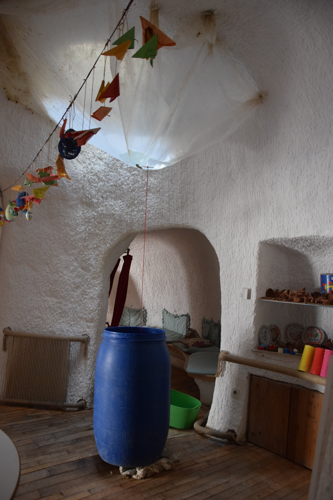

## Grottig, aber echt!
In mitten dieser löchrigen, fröhlich vor sich hin bröselnden Felsenlandschaft, bot die Akademie also den perfekten Ausgangspunkt für kürzere oder längere Ausflüge.
Die freien Abendstunden bis zur Dämmerung verbrachten wir oft damit, den Traum eines jeden Klaustrophobikers wahr werden zu lassen. Wir liefen einfach los, lugten und krabbelten alle naslang in alle möglichen Höhlenhäuser in gutem sowie schlechtem Zustand. Manche beherbergten noch Möbel und ließen darauf schließen, dass sie erst vor kurzem verlassen wurden; andere schienen älter und waren zum Großteil zerfallen sodass nur noch einzelne Wände standen. Wieder andere wiesen Malereien, griechische Inschriften und Ziersäulen an den Wänden auf, was sie als Kirchen identifizerbar machte.
Eine weitere Attraktion waren die mystischen, pflanzenreichen Schluchten in der sonst kargen Landschaft, die das Wasser in den weichen Stein spült. Diese variierten von U-förmigen breiten Tälern, über enge hohe Passagen mit Leitern, bis hin zu natürlichen Tunneln.
Im Gegenzug bildeten die härteren Steine Säulen, pilzförmige Strukturen und Aussichtsplattformen.
Durch die spärliche Vegetation galt wortwörtlich "wo ein Wille ist, da ist auch ein Weg" und die gesamte Gegend glich einem Erkundungsspielplatz für Erwachsene. Auf unseren Touren begegenten wir wieder vielen freilaufenden Hunden, Quad- und Pferdetouren, sowie dem heimlichen Star: Truthähnen, deren ausßergewöhnliches Aussehen gut in die Landschaft passt.



## Unterirdische Städte
Unseren ersten freien Montag besichtigten wir die Tunnelsysteme in - oder besser: _unter_ - Derinkuyu. Hier wurden 10% einer ehemals ca. 20.000 Einwohnern umfassenden unterirdischen Stadt bis 8 Stockwerke tief für Touristen zugänglich gemacht. Die Räume und Tunnel sind großenteils sehr minimalistisch, dienten wohl aber sowohl als Wohnräume als auch zur Viehhaltung und konnten wenn nötig mit großen Rundsteinen abgeriegelt werden. 



Ein ausgeklügeltes System von Lüftungsschächten ermöglichte eine ausreichende Luftzirkulation. Am unteren zugänglichen Ende befindet sich eine kreuzförmige Kirche. Es wird vermutet, dass es etwa 100 solcher unterirdischen Städte in der Region gibt, auch wenn die meisten deutlich kleiner sein dürften. Hut ab: was man damals alles aus dem Stein klopfen musste, um diese unterirdischen Welten zu erschaffen!



## Überall fliegende Dickies 🧺🔥🎈
Die fast ein wenig surreal wirkende Landschaft ist an sich schon sehenswert, doch damit nicht genug. Kleine, dicke „fliegende Klimasünder“ machen diesen Ort erst so richtig magisch: nicht ein Heißluftballon, nicht zehn, sondern viele – richtig viele! Aber der Reihe nach: Wir kamen an, als der Ramadan (oder hier: _Ramazan_) gerade begonnen hatte. Normalerweise hätte die türkische Crew der _Little Prince Academy_ mit uns _Volunteers_ gegessen, doch da Fastenzeit war, saßen die Mitarbeiter, inklusive Köchin, während aller drei Mahlzeiten mit uns am Tisch, aßen und tranken selbst aber nichts. Für eine Woche schlossen wir uns dem Fasten an. Das hieß konkret: Aufstehen um kurz vor 5 Uhr morgens, um sich noch vor Morgendämmerung (laut Fastenkalender ca. 05:40 Uhr) den Bauch vollzuschlagen, einen Satz auf Türkisch zu sagen, in dem man darum bittet, dass Allah das Fasten annimmt, und dann entweder weiterzuschlafen oder die ruhigen Morgenstunden zu genießen. Gegen 18:40 Uhr durfte das Fasten dann gebrochen werden.


__Info:__ Die Fastenzeiten haben bei uns zuächst für Verwirrung gesorgt. Wir dachten die Zeit von Sonnenauf- bis -untergang definiert die Fastenzeit. Tatsächlich beginnt das Fasten am Morgen aber bereits mit der Morgendämmerung, genauer: sobald man einen weißen und schwarzen Faden voneinander unterscheiden kann (~1.5h vor Sonnenaufgang). Die Bestimmung dessen ist bei Mondschein und mit moderner Lichtverschmutzung nicht trivial. Somit überließen wir dies den Experten hinter der App.
Für das Fastenbrechen am Abend reicht dagegen der Sonnenuntergang, obwohl es noch lange hell blieb.


Eines Morgens begrüßte uns nach einer bewölkten Woche des Schneetreibens eine sternenklare Nacht und, siehe da: Beim Blick aus dem Fenster zeichnete sich am noch dunklen Horizont auf dem gegenüberliegenden Grat ein sich aufblasender Heißluftballon ab. Einige Jeeps fuhren am Rand der Klippe auf den Ballon zu und kurze Zeit später taten sich daneben weitere auf. _Intrigued_ und neugierig verließen wir unserere Höhle (im wahrsten Sinne des Wortes), um überrascht festzustellen, dass sogar direkt vor unserer Akademie ein Heißluftballon startete. Drehten wir uns nach hinten, waren da noch weitere. So stiegen wir in keinen fünf Minuten auf den Grat direkt oberhalb unserer Akademie hinauf, und mit jedem zurückgelegten Meter füllte sich unser Sichtfeld mit mehr und mehr und noch mehr bunten Ballons.


  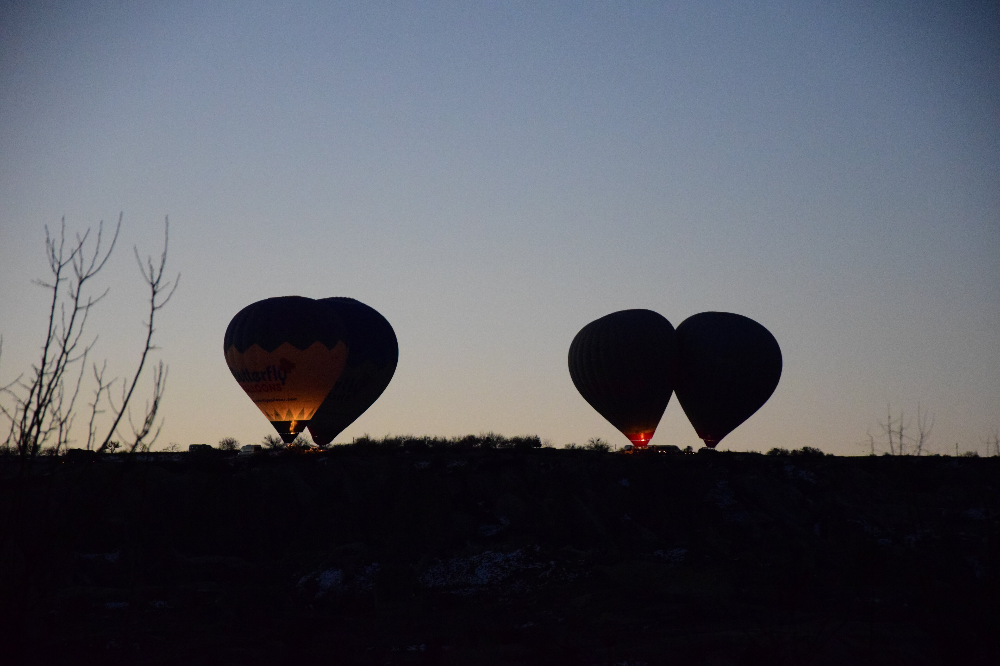
  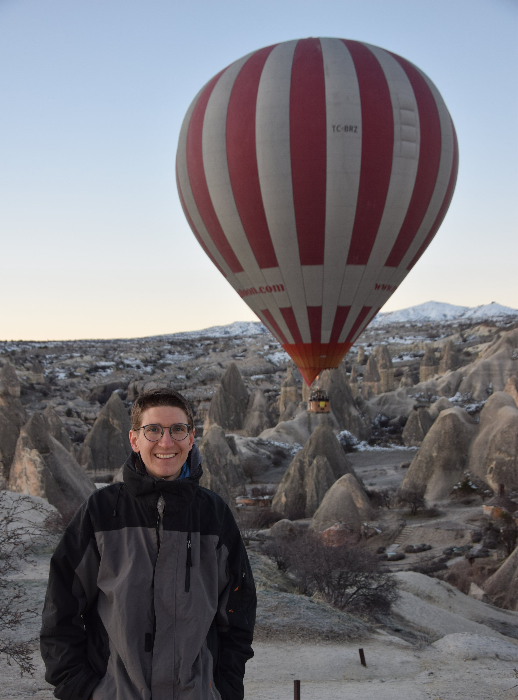
  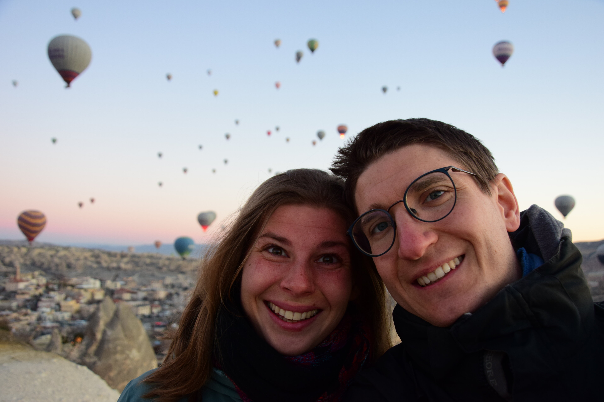
  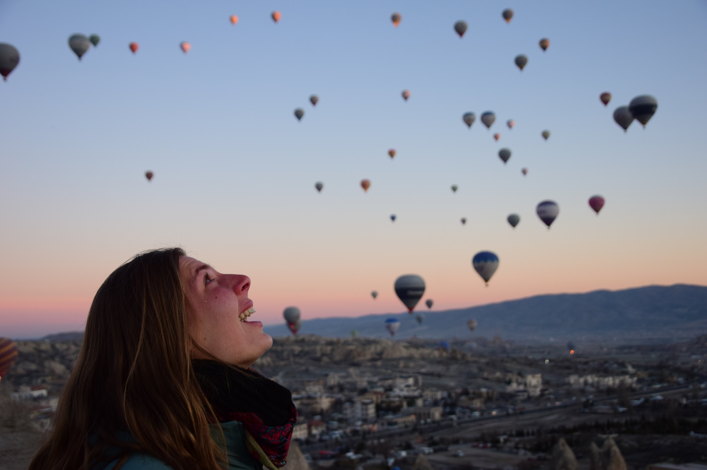
  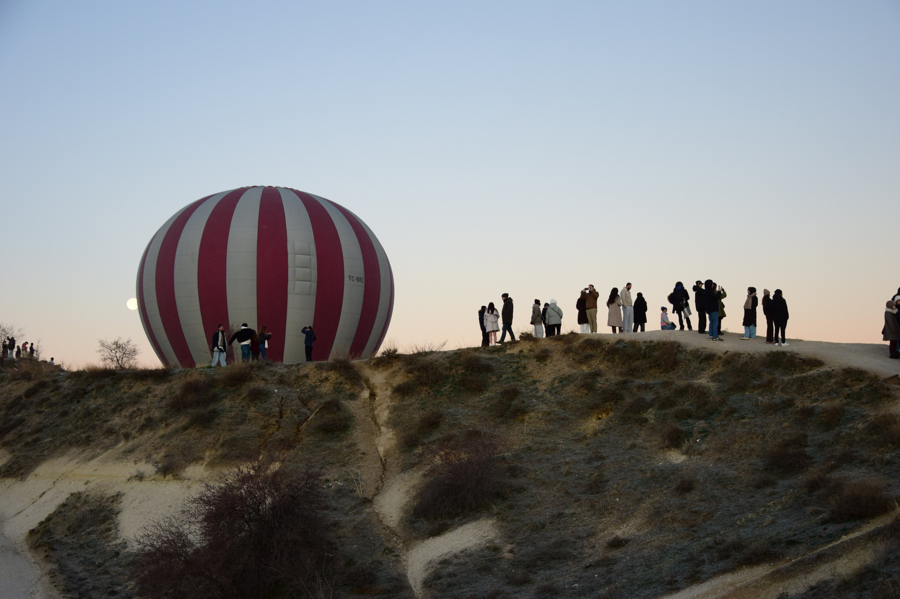
  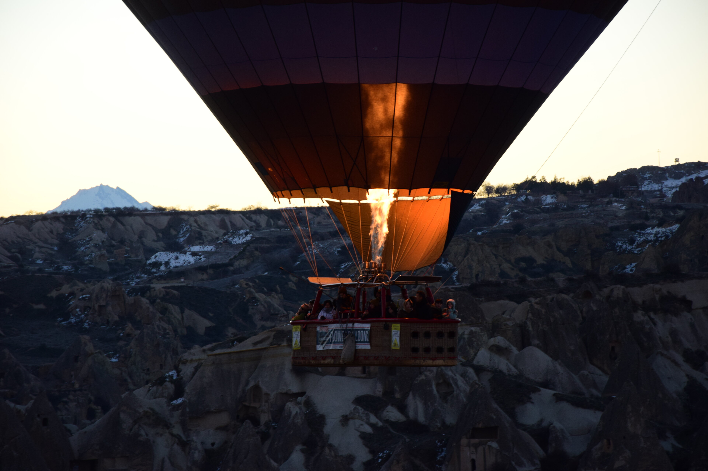
  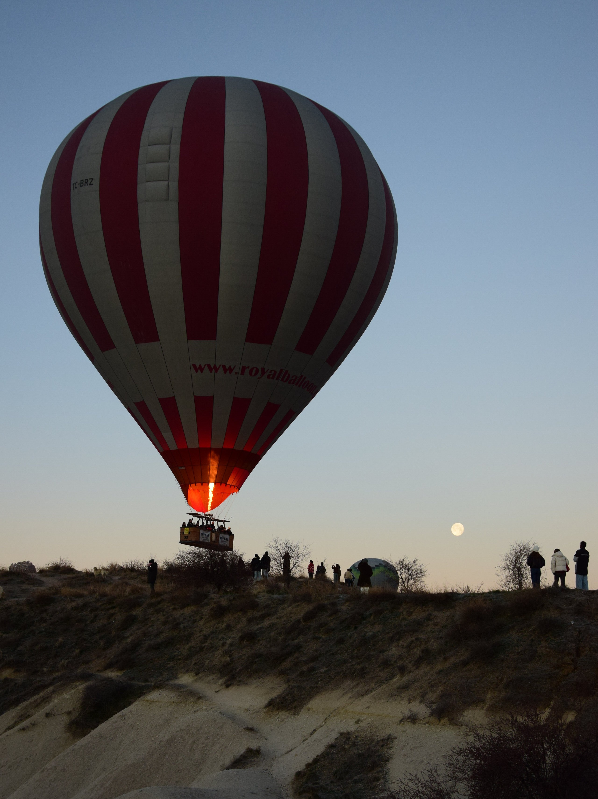
  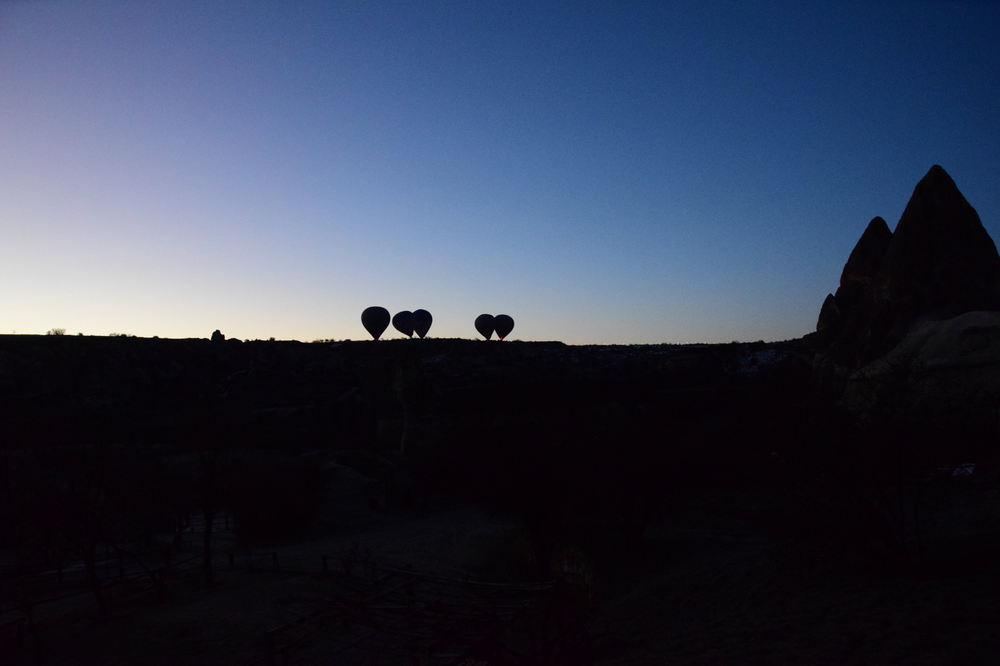
  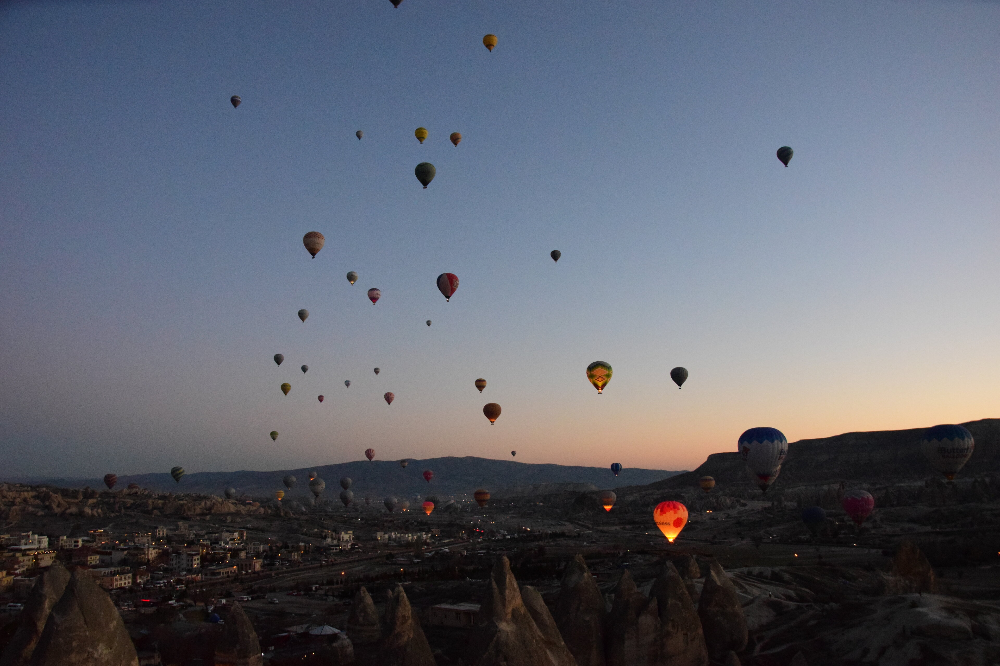


Da standen wir oben also, sprachlos in den Himmel starrend. Gehört hatte man das natürlich schon mal, dass dieser Ort für Heißluftballons bekannt ist. Und man dachte sich schon, dass man das, wenn man denn schon mal hier mitten im Herzen des Geschehens ist, gerne mal sehen wollen und, dass das sicher ganz nett werden würde. Doch wie atemberaubend das tatsächlich ist, darauf hat einen keiner vorbereitet. Das kann man nicht beschreiben, das muss man gesehen haben. Auch Bilder fangen den Moment nicht ein: Diesen Moment des sprachlosen Bezaubertseins, der einen staunend mit offenem Mund und mit noch viel weiter geöffneten Augen nach oben starren lässt, haben wir komplett unterschätzt – wie Disneyland für Erwachsene, nur viel besser.
​Im Anschluss fiel uns bei unserem morgendlichen Klogang an Tagen mit besserem Wetter hin und wieder auf, dass beim Blick aus dem Fenster ein, zwei, drei, manchmal sogar mehr „Heißluftdickies“ direkt vor unserem Fenster aufgingen oder landeten. Wie cool ist das denn!? Da kommen Touristen direkt für diesen Moment hierher und wir tapern verschlafen zum Klo und sehen das aus dem Fenster. Dekadenter Scheiß!💩

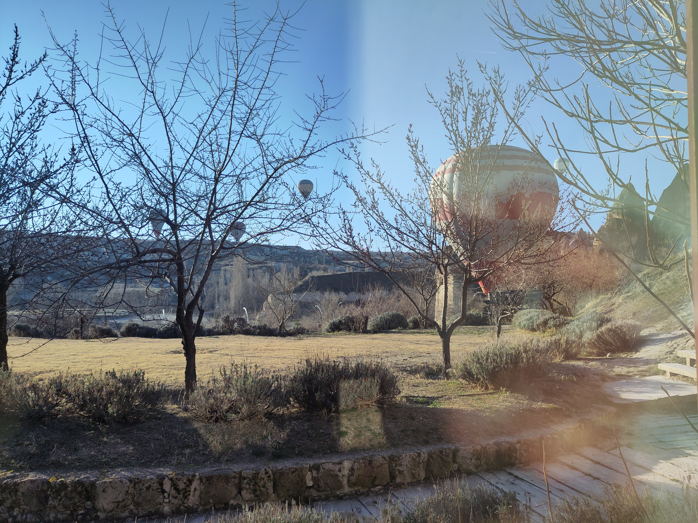

## Schnipp, Schnapp, Haare ab!
Was eine Großen Beitrag zu der besonderen Zeit in Göreme leistete, war die gemeinsam verbrachte Zeit mit der türkischen _Crew_ sowie unsere _Volunteer_-WG. Zum einen war es toll, noch ein bisschen intensiver in die türkische Kultur einzutauchen, als dies an den vorherigen Orten der Fall war.
So wurden wir vom einheimischen Team – bestehend aus Esmanur und Şeyda, sowie Fatma, die uns liebevoll bekochte, und Necip, der sich um die Tiere und das Handwerkliche kümmerte – eines Abends z.B. zum gemeinsamen Fastenbrechen mit Familienangehörigen im großen Workshop der Akademie eingeladen. Zwar hatten wir zu diesem Zeitpunkt selbst noch gar nicht gefastet, schön und lecker war es allemal! Toll war auch, dass man durch die vielen Interaktionen mit Einheimischen, die kein oder wenig Englisch sprechen, sowie mit den Kindern und Erwachsenen die wir betreuten, doch auch ein bisschen in die türkische Sprache eintauchen und sich sogar ein paar Brocken davon ermächtigen konnte. Mal sehen, wie lange das im Gedächtnis bleibt – den sozialen Interaktionen hat es auf jeden Fall einen Schub verliehen. 



Zum anderen _vibte_ es mit den anderen _Volunteers_ einfach ziemlich gut. Bálint aus Ungarn, Ana aus Mexiko, Savannah aus England und Loong aus Malaysia waren eine denkbar passende Kombi und die gemeinsame Zeit verflog wenn wir in Multi-Kulti-Abendessen mit entsprechender Musik, sehr langen Gesprächen über Gesellschaft, Politik, Geschichte, einfach Gott und die Welt, gemeinsamen Spaziergängen und Filmabenden versackten. 



Auch ist unsere Filmliste an Bildungslücken durch den gemeinsamen Austausch nochmal ein gutes Stückchen länger geworden und gemeinsame Ausflüge wie etwa in die Töpferstadt Avanos oder nach Uçhisar bleiben uns dadurch nochmal besonders schön in Erinnerung. ​Nachdem Felix seinen frechen Haarschnitt aus Kamerun erhielt, hat nun auch Sandrine die Gelegenheit für ein wenig Anpassung beim Schopfe ergriffen, als Savannah sie um einen neuen Haarschnitt bat. Gesagt, getan – und beide schnitten sich gegenseitig die Haare. Eine Bastelschere, gute Musik und Stimmung: Was braucht es mehr für einen gelungenen Haarschnitt? :D



